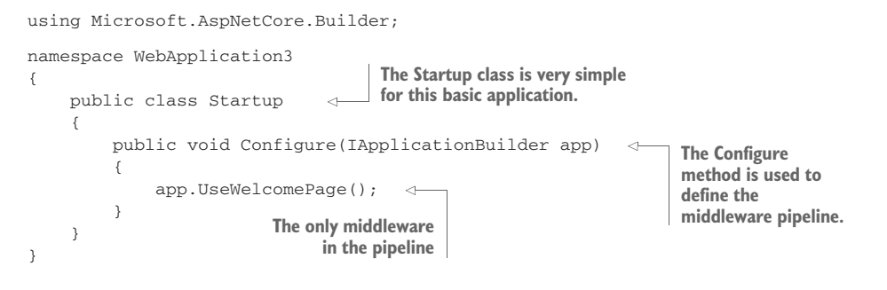
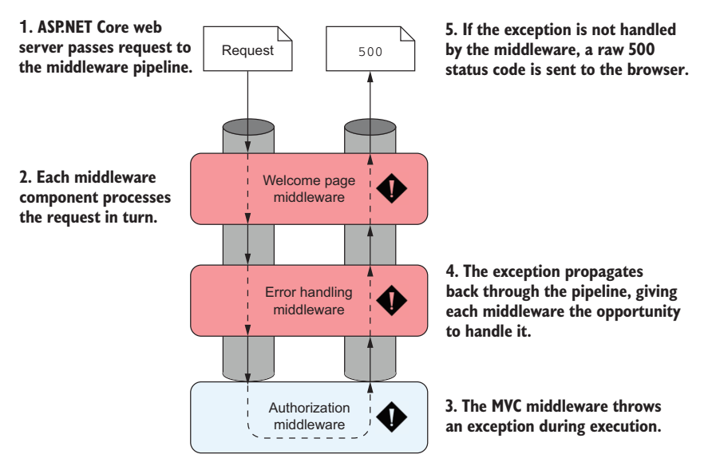
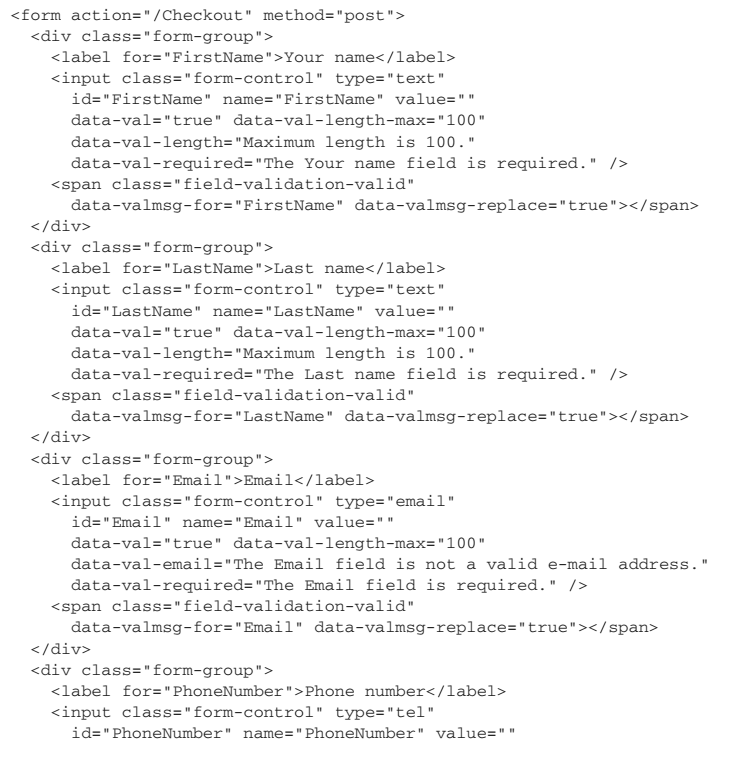

# How does ASP.NET core process a request?


Kestrel takes the raw incoming request and uses it to generate an HttpContext object the rest of the application can use

The HttpContext constructed by the ASP.NET Core web server is used by the application as a sort of storage box for a single request. Anything that’s specific to this particular request and the subsequent response can be associated with it and stored in it. This could include properties of the request, request-specific services, data that’s been loaded, or errors that have occurred. The web server fills the initial HttpContext with details of the original HTTP request and other configuration details and passes it on to the rest of the  application.


A reverse proxy is software responsible for receiving requests and forwarding them to the appropriate web server. The reverse proxy is exposed directly to the internet, whereas the underlying web server is exposed only to the proxy. This setup has several benefits, primarily security and performance for the web servers


# Program and Startup class


In .NET 6, Startup.cs and Program.cs are unified into one Program.cs


Within the context of ASP.Net Core, service refers to any class that provides functionality to an application and could be classes exposed by a library or code you’ve written for your application


Middleware consists of small components that execute in sequence when the application receives an HTTP request. They can perform a whole host of functions, such as logging, identifying the current user for a request, serving static files, and handling errors


The IApplicationBuilder that’s passed to the Configure method is used to define the order in which middleware executes. The order of the calls in this method is important, as the order they’re added to the builder in is the order they’ll execute in the final pipeline. Middleware can only use objects created by previous middleware in the pipeline—it can’t access objects created by later middleware


# Middlewares

## What is middleware?


Middleware is C# classes that can handle an HTTP request or response. Middleware can:
- Handle an incoming HTTP request by generating an HTTP response
- Process an incoming HTTP request, modify it, and pass it on to another piece of middleware
- Process an outgoing HTTP response, modify it, and pass it on to either another piece of middleware, or the ASP.NET Core web server


One of the most common use cases for middleware is for the cross-cutting concerns of your application. These include things like:
- Logging each request
- Adding standard security headers to the response
- Associating a request with the relevant user
- Setting the language for the current request


Requests are passed to the middleware pipeline as HttpContext objects.

All middleware has access to the HttpContext for a request. It can use this, for example, to determine whether the request contained any user credentials, which page the request was attempting to access, and to fetch any posted data. It can then use these details to determine how to handle the request. 

Once the application has finished processing the request, it will update the HttpContext with an appropriate response and return it through the middleware pipeline to the web server. The ASP.NET Core web server will then convert the representation into a raw HTTP response and send it back to the reverse proxy, which will forward it to the user’s browser.

Middleware complies with SRP


## Create middleware pinelines

### Simple middleware




### Handling static files


If no middleware generates a response for a request, the pipeline will automatically return a simple 404 error response to the browser


### MVC App


## Handling errors using middleware




### DeveloperExceptionPageMiddleware


### ExceptionHandlerMiddleware


The sequence of events when an exception occurs somewhere in the middleware pipeline after ExceptionHandlerMiddleware is as follows:
1. A piece of middleware throws an exception.
2. ExceptionHandlerMiddleware catches the exception.
3. Any partial response that has been defined is cleared.
4. The middleware overwrites the request path with the provided error handling path.
5. The middleware sends the request back down the pipeline, as though the original request had been for the error handling path.
6. The middleware pipeline generates a new response as normal.
7. When the response gets back to ExceptionHandlerMiddleware, it modifies the status code to a 500 error and continues to pass the response up the pipeline to the web server.


It’s better to use a static error page, rather than a dynamic page that risks throwing more errors


### StatusCodePagesMiddleware


StatusCodePagesMiddleware will only modify the response if no response body has been written. So if another component, for example ExceptionHandlerMiddleware, returns a message body along with an error code, it won’t be modified


### Disabling error handling middleware for Web APIs


Features define which capabilities the ASP.NET Core web server provides. Each feature is represented as an interface in the Features collection property on HttpContext. Middleware is free to add or replace features in the collection as part of the request, thereby extending the features available to an application


By adding a feature to the HttpContext collection, StatusCodePagesMiddleware broadcasts its presence to the rest of the application. This allows other parts of the application to disable StatusCodePagesMiddleware if required


# MVC Design Pattern

## An introduction to MVC


In general, three components make up the MVC design pattern:
- Model—The data that needs to be displayed, the state of the application.
- View—The template that displays the data provided by the model.
- Controller—Updates the model and selects the appropriate view.


## MVC in ASP.NET Core


**When not to use MvcMiddleware**
For typical apps, the productivity gains from using MVC strongly outweigh any performance impact. But if you’re building small, lightweight apps for the cloud, then you might consider using custom middleware directly. You might want to also consider Microservices in .NET Core 
Alternatively, if you’re building an app with real-time functionality, you’ll probably want to consider using WebSockets instead of traditional HTTP requests ([Details](http://mng.bz/Ol13))


The domain model encapsulates complex business logic in a series of classes that don’t depend on any infrastructure and can be easily tested


A view model is a simple object that contains data required by the view to render a UI. It’s typically some transformation of the data contained in the application model, plus extra info NOTErmation required to render the page, for example the page’s title


The key benefit throughout the above process is the separation of concerns:
- The view is responsible only for taking some data and generating HTML.
- The application model is responsible only for executing the required business logic.
- The controller is responsible only for validating the incoming request and selecting the appropriate view to display, based on the output of the application model

By having clearly defined boundaries, it’s easier to update and test each of the components without depending on any of the others. If your UI logic changes, you won’t necessarily have to modify any of your business logic classes


**Options for configurating**


**POST, REDIRECT, GET flow through a website**


# Routing (Global Routing)


## Routing using conventions

```cs
public class Startup
{

    public void ConfigureServices(IServiceCollection services)
    {
        services.AddControllers();
    }


    public void Configure(IApplicationBuilder app, IWebHostEnvironment env)
    {
        app.UseRouting();

        app.UseEndpoints(endpoints =>
        {
            endpoints.MapControllerRoute(
              name: "default",
              pattern: "{controller=Home}/{action=Index}/{id?}");
        });
    }
}
```


Route values are the values extracted from a URL based on a given route template. Each route parameter in a template will have an associated route value and is stored as a string pair in a dictionary. They can be used during model binding.


## Route Constraints
[Route Constraints](https://learn.microsoft.com/en-us/aspnet/core/fundamentals/routing?view=aspnetcore-7.0#route-constraint-reference)

```cs
name: "r1", 
template: "{controller=Home}/{action=Index}/{id:alpha:minlength(4)}?");

name: "r2", 
template: "{controller}/{action}/{id}?", 
defaults: new { controller = "Home", action = "Index" },
constraints: new 
{  
  id = new CompositeRouteConstraint(
    new IRouteConstraint[] 
    {
      new AlphaRouteConstraint(),
      new MinLengthRouteConstraint(4)
    }
  )
}
```


## Defining default values and constraints using anonymous objects


### Using catch-all parameters to include slashes in a route parameter


## Generating URLs from route parameters


Ambient values are the route values for the current request. They always include controller and action but can also include any additional route values set when the action was initially located using routing. The helper uses ambient values from the current request and overrides these with any specific values you provide


# Model Binding

Each of the models in ASP.NET Core MVC is responsible for handling a different aspect of the overall request:
- Binding model: includes info NOTErmation explicitly provided by the user when making a request, as well as additional contextual data. This includes things like route parameters parsed from the URL, the query string, and form or JSON data in the request body. The binding model itself is one or more .NET objects that you define. They’re passed to a controller’s action method as parameters when it’s executed. The MvcMiddleware inspects the binding model before the action method executes to check whether the provided values are valid, though the method will execute even if they’re not
- Application model: is typically a whole group of different services and classes—anything needed to perform some sort of business action in your application. It may include the domain model (which represents the thing your app is trying to describe) and database models (which represent the data stored in a database), as well as any other additional services
- View model: contains the data needed by the view to generate a response.
- API model: A variation on the view model, in which the whole model represents the data to return. Web API controllers use this to generate the final response to return to the caller, normally in the form of a JSON or XML response


Model binding extracts values from a request and uses them to create .NET objects that are passed as method parameters to the action being executed.

By default, MVC will use three different binding sources when creating your binding models. It will look through each of these **in order** and will take the first value it finds (if any) that matches the name of the parameter:
- Form values: sent in the body of an HTTP request when a form is sent to the server using a POST.
- Route values: obtained from URL segments or through default values after matching a route.
- Query string values: passed at the end of the URL, not used during routing.


Some method parameters can also be created using dependency injection, instead of from the request.


If none of the binding sources contain the required value, then the method parameter receives a new instance of the type instead. The exact value the method parameter will have in this case depends on the type of the variable: 
- For value types, the value will be default(T).
- For reference types, the type is created using the default constructor.
- For string types, the value will be null.


## Binding Complex Types


### Binding Complex Objects
For a class to be model-bound, it must have a default public constructor. You can only bind properties which are public and settable.


### Binding Collection and Dictionaries
You could then POST data to this method by providing values in a number of different formats:
- currencies[index]: Where currencies is the name of the parameter to bind and index is the index of the item to bind, for example, currencies[0]=GBR&currencies[1]=USD.
- [index]: If there’s only a single list, you can omit the name of the parameter, for example, [0]=GBR&[1]=USD.
- currencies: Alternatively, you can omit the index and send currencies as the key value for every value, for example, currencies=GBR&currencies=USD


### Binding File Uploads

```cs
public class ProductModel
{
  public Product product { get; set; }
  [ValidateNever]
  public IFormFile File { get; set; }
}
```
```cs
[HttpPost]
[ValidateAntiForgeryToken]
public IActionResult Edit(ProductModel productModel)
{
    
  if (ModelState.IsValid)
  {
      Product product = productModel.product;
      IFormFile file = productModel.File;
      string rootPath = _webHostEnvironment.WebRootPath;
      if (file != null)
      {
          string fileFullname = Guid.NewGuid().ToString() + Path.GetExtension(file.FileName);
          string folderPath = Path.Combine(rootPath, "admin", "images", "products");
          string filePath = Path.Combine(folderPath, fileFullname);
          using (var fileStream = new FileStream(filePath, FileMode.Create))
          {
              file.CopyTo(fileStream);
          }
          product.ImageUrl = Path.Combine("admin", "images", "products", fileFullname);
      }
      _db.ProductRepository.Update(product);
      _db.Commit();
      return RedirectToAction("Index");
  }
  ViewData["CategoryList"] = _db.CategoryRepository.GetAll()
      .Select(c => new SelectListItem() { Text = c.Name, Value = c.Id.ToString() }).ToList();
  return View(productModel);
}
```


## Choosing a binding source


- [FromHeader]: Bind to a header value
- [FromQuery]: Bind to a query string value
- [FromRoute]: Bind to route parameters
- [FromForm]: Bind to form data posted in the body of the request
- [FromBody]: Bind to the request’s body content. **Only one parameter may be decorated with the this attribute**
- [BindNever]: The model binder will skip this parameter completely.
- [BindRequired]: If the parameter was not provided, or was empty, the binder will add a validation error.
- [FromServices]: Used to indicate the parameter should be provided using dependency injection
- [ModelBinder]: Specify the exact binding source, override the name of the parameter to bind to, and specify the type of binding to perform

## Handling user input with model validation


We can use:
- Data Annotations
- FluentValidation library 


### Validating on the server
The MvcMiddleware stores the output of the validation attempt in a property on the ControllerBase base class called ModelState. This object is a ModelStateDictionary, which contains a list of all the validation errors that occurred after model binding, as well as some utility properties for working with it


**The pattern of returning a redirect response after a success NOTEful POST is called the POST-REDIRECT-GET pattern**


POST-REDIRECT-GET
The POST-REDIRECT-GET design pattern is a web development pattern that prevents users from accidently submitting the same form multiple times. Users typically submit a form using the standard browser POST mechanism, sending data to the server.

If a server takes the naive approach and responds with a 200 OK response and some HTML to display, then the user will still be on the same URL. If the user refreshes their browser, they will be making an additional POST to the server, potentially making another payment! 

The POST-REDIRECT-GET pattern says that in response to a success NOTEful POST, you should return a REDIRECT response to a new URL, which will be followed by the browser making a GET to the URL. If the user refreshes their browser now, then they’ll be refreshing the final GET call. No additional POST is made, so no additional payments or side effects should occur.


### Validating on the client for user experience
- HTML5
- Javascript


# Razor Views


## Passing data to Views

- View model: The view model should be used to encapsulate any data that needs to be displayed, which is specific to that view. It’s a strongly typed class that can be any sort of object you like. The view model is available in the view when it’s rendered.
- ViewData: This is a dictionary of objects with string keys that can be used to pass arbitrary data from the controller to the view.
- ViewBag: A version of the ViewData that uses C# dynamic objects instead of string keys. It’s a wrapper around the ViewData object.
- HttpContext: Technically the HttpContext object is available in both the controller and view, so you could use it to transfer data between them. But don’t!

## Layout - Avoid Duplicate Code


It’s common to have an optional section called Scripts in your layout pages. This can be used to render additional JavaScript that’s required by some views, but that isn’t needed on every view. A common example is the jQuery Unobtrusive Validation scripts for client-side validation. If a view requires the scripts, it adds the appropriate @section Scripts to the Razor markup.


## Partial Views - Reuse part of a View


**Add Partial View to a View**

```html
@model List<ToDoItemViewModel>
@foreach(var item in Model)
{
  @await Html.PartialAsync("_ToDo", item);
  <!-- <partial name="_ToDo"/> -->
}
```


The Razor code contained in a partial view is almost identical to a standard view. The main difference is the fact that partial views are typically called from other views rather than as the result of an action method. The only other difference is that partial views don’t run _ViewStart.cshtml when they execute.


## Importing Common Directives with _ViewImports


The _ViewImports.cshtml file can be placed in any folder, and it will apply to all views and sub-folders in that folder. Typically, it’s placed in the root Views folder so that it applies to every view in your app.


## Running code for every View with _ViewStart


ViewStart.cshtml is called before the execution of each main view and can be used to execute code common to all views, such as a default layout page. Any code in the _ViewStart.cshtml file runs before the view executes. colorpanel that _ViewStart.cshtml only runs for full views—it doesn’t run for layouts or partials views.


You must use the names _ViewStart.cshtml and _ViewImports.cshtml for the Razor engine to locate and execute them correctly. To apply them to all your app’s views, add them to the root of the Views folder, not to the Shared subfolder.


ViewImports.cshtml and _ViewStart.cshtml are hierarchical—files in the root folder execute first, followed by files in controller-specific view folders.


# Tag Helpers - The success NOTEor of HTML Helpers




## Form Tag Helper

```html
<form asp-action="View" asp-controller="Product" asp-route-id="5">

<!-- result -->
<form action="/Product/View/5" method="post">

<form asp-route="view_posts" asp-route-username="@Model.Username" asp-antiforgery="false"> 
```

The main job of the Form Tag Helper is to generate the action attribute, but it performs one additional, important function: generating a hidden input field needed to prevent cross-site request forgery (CSRF) attacks.

## Label Tag Helper

The Label Tag Helper uses the **Display** DataAnnotations attribute to determine the appropriate value to display.

```cs
public class UserBindingModel
{
  [Display(Name = "Your name")]
  public string FirstName { get; set; }
  public string Email { get; set; }
}
```

```html
<label asp-for="FirstName"></label>
<label asp-for="Email"></label>
<!-- result -->
<label for="FirstName">Your Name</label>
<label for="Email">Email</label>
```

## Input and Textarea Tag Helpers

```html
<input asp-for="Email" />
<!-- result -->
<input type="email" id="Email" name="Email"
value="test@example.com" data-val="true"
data-val-email="The Email Address field is not a valid e-mail address."
data-val-required="The Email Address field is required."/>
<!--
be used by client-side JavaScript libraries such as jQuery 
to provide client-side validation of DataAnnotations constraints
-->
```


In order to enable client-side validation in your application, you need to add more
jQuery libraries to your HTML pages. In particular, you need to include the jQuery,
jQuery-validation, and jQuery-validation-unobtrusive JavaScript libraries


```html
<input asp-for="Dec" asp-format="0.000" />
<!-- result -->
<input type="text" id="Dec" name="Dec" value="1.200">

<textarea asp-for="Multiline"></textarea>
<!-- result -->
<textarea data-val="true" id="Multiline" name="Multiline"
data-val-length="Maximum length 200." data-val-length-max="200"
data-val-required="The Multiline field is required.">This is some text</textarea>
```

## Select Tag Helper


It’s common to want to display a list of enum options in a select list. This is so common that ASP.NET Core ships with a helper for generating a SelectListItem for any enum. If you have an enum of the TEnum type, you can generate the available options in your View using asp-items="Html.GetEnumSelectList<TEnum>()"


The asp-for attribute must not include the Model prefix. The asp-items attribute, on the other hand, must include it if referencing a property on the view model. The asp-items attribute can also reference other C# items, such as objects stored in ViewData, but using the view model is the best approach


## Validation Message and Validation Summary Tag Helpers

```html
<span asp-validation-for="Email"></span>
<div asp-validation-summary="All"></div>
```

```cs
ModelState.AddModelError(string.Empty, "Error message");
```

## Generating links with the Anchor Tag Helper

```html
<ul class="nav navbar-nav">
  <li>
    <a asp-host="" asp-area="" asp-controller="Home" asp-action="Index">Home</a>
  </li>
  <li>
    <a asp-area="" asp-controller="Home" asp-action="About">About</a>
  </li>
  <li>
    <a asp-area="" asp-controller="Home" asp-action="Contact">Contact</a>
  </li>
</ul>
```

## Cache-busting with the Append Version Tag Helper

A cache-busting query string adds a query parameter to a URL, such as ?v=1. Browsers will cache the response and use it for subsequent requests to the URL. When the resource changes, the query string is also changed, for example to ?v=2. Browsers will see this is a request for a new resource, and will make a fresh request

```html
<script src="~/js/site.js" asp-append-version="true"></script>
```

## Using conditional markup with the Environment Tag Helper

```html
<environment include="Testing,Staging">
  <div class="warning NOTE">You are currently on a testing environment</div>
</environment>
```

# Service configuration with dependency injection

```cs
public class EmailSender
{
  public void SendEmail(string username)
  {
    Console.WriteLine($"Email sent to {username}!");
  }
}

public class UserController : Controller
{
  public IActionResult RegisterUser(string username)
  {
    var emailSender = new EmailSender();
    emailSender.SendEmail(username);
    return View();
  }
}
```


```cs
public class NetworkClient
{
  private readonly EmailServerSettings _settings;
  public NetworkClient(EmailServerSettings settings)
  {
    _settings = settings;
  }
}

public class EmailSender
{
  private readonly NetworkClient _client;
  private readonly MessageFactory _factory;
  public EmailSender(MessageFactory factory, NetworkClient client)
  {
    _factory = factory;
    _client = client;
  }
  public void SendEmail(string username)
  {
    var email = _factory.Create(username);
    _client.SendEmail(email);
    Console.WriteLine($"Email sent to {username}!");
  }
}

// Not obeying the single responsibility principle
// Considerable ceremony - only the last two are doing anything useful
// Tied to the implementation
public IActionResult RegisterUser(string username)
{
  var emailSender = new EmailSender(new MessageFactory(), 
    new NetworkClient(
      new EmailServerSettings
      (
        host: "smtp.server.com",
        port: 25
      )
    ));
  emailSender.SendEmail(username);
  return View();
}
```


Any dependencies in your code should be explicit, not implicit


Dependency injection aims to solve the problem of building a dependency graph by inverting the chain of dependencies. Instead of the UserController creating its dependencies manually, deep inside the implementation details of the code, an already-created instance of EmailSender is injected via the constructor.


The DI container or IoC container is responsible for creating instances of services. It knows how to construct an instance of a service by creating all of its dependencies and passing these to the constructor.


```cs
public class UserController : Controller
{
  private readonly EmailSender _emailSender;
  public UserController(EmailSender emailSender)
  {
    _emailSender = emailSender;
  }
  public IActionResult RegisterUser(string username)
  {
    _emailSender.SendEmail(username);
    return View();
  }
}
```

## Creating loosely coupled code

One issue that remains is that UserController is still tied to an implementation rather than an interface


```cs
public interface IEmailSender
{
  public void SendEmail(string username);
}

public class UserController : Controller
{
  private readonly IEmailSender _emailSender;
  public UserController(IEmailSender emailSender)
  {
    _emailSender = emailSender;
  }
  public IActionResult RegisterUser(string username)
  {
    _emailSender.SendEmail(username);
    return View();
  }
}
```


You register services with a DI container so that it knows which implementation to use for each requested service. This typically takes the form of, for interface X, use implementation Y.


## Dependency injection in ASP.NET Core


## Using the dependency injection container


In order to completely configure the application, you need to register EmailSender and all of its dependencies with the DI container


Under the hood, the built-in ASP.NET Core DI container uses reflection to create dependencies, but different DI containers may use other approaches


**Registering services using objects and lambdas**


The container makes a number of assumptions that you have to adhere to:
- The class must be a concrete type.
- The class must have only a single valid constructor that the container can use.
- For a constructor to be valid, all constructor arguments must be registered with the container, or must be an argument with a default value.


```cs
public void ConfigureServices(IServiceCollection services)
{
  services.AddMvc();
  services.AddScoped<IEmailSender, EmailSender>();
  services.AddSingleton<NetworkClient>();
  services.AddScoped<MessageFactory>();
  services.AddSingleton(
  new EmailServerSettings
  (
    host: "smtp.server.com",
    port: 25
  ));
}
```


If you create an object and pass it to the container, it’s always registered as a singleton. You can also register any arbitrary class as a singleton and the container will only use one instance throughout your application


**Group services into logical collections and create extension methods for them to create an equivalent of the AddMvc() extension method**


**Registering a service in the container multiple times**

```cs
public interface IMessageSender
{
  public void SendMessage(string message);
}
```


```cs
public void ConfigureServices(IServiceCollection services)
{
  services.AddMvc();
  services.AddScoped<IMessageSender, EmailSender>();
  services.AddScoped<IMessageSender, SmsSender>();
  services.AddScoped<IMessageSender, FacebookSender>();
}
```

```cs
public class UserController : Controller
{
  private readonly IEnumerable<IMessageSender> _messageSenders;
  public UserController(
  IEnumerable<IMessageSender> messageSenders)
  {
    _messageSenders = messageSenders;
  }

  public IActionResult RegisterUser(string username)
  {
    foreach (var messageSender in _messageSenders)
    {
      messageSender.SendMessage(username);
    }
    return View();
  }
}
```

**Injecting a single implementation when multiple services are registered**

```cs
public class SingleMessageSender
{
  private readonly IMessageSender _messageSender;
  public SingleMessageSender(IMessageSender messageSender)
  {
    _messageSender = messageSender;
  }
}
```

**Conditionally registering Services using TryAdd**


The DI container will use the last registered implementation of a service when resolving a single instance of the service


## Injecting services into action methods and view templates

**Injecting Services Directly into Action Methods using [FromServices] Attribute**


**Injecting services into View Templates**


## Lifetimes: when are services created


Transient: Every single time a service is requested, a new instance is created. This means you can potentially have different instances of the same class within the same dependency graph. Register services using the AddTransient extension methods
- Scoped: Within a scope, all requests for a service will give you the same object. For different scopes you’ll get different objects. In ASP.NET Core, each web request gets its own scope. Register services using the AddScoped extension methods
- Singleton: You’ll always get the same instance of the service, no matter which scope. Register services using the AddSingleton extension methods


## Keeping an eye out for captured dependencies


A service should only use dependencies with a lifetime longer than or equal to the lifetime of the service. A service registered as a singleton can only use singleton dependencies. A service registered as scoped can use scoped or singleton dependencies. A transient service can use dependencies with any lifetime


# Configuring an ASP.NET Core Application

## Building a configuration object for the application


The ASP.NET Core configuration model centers on two main constructs: **ConfigurationBuilder** and **IConfigurationRoot**
**ConfigurationBuilder** describes how to construct the final configuration representation for your app, and **IConfigurationRoot** holds the configuration values themselves


```cs
var builder = WebApplication.CreateBuilder(args);
builder.WebHost.UseKestrel()
    .UseContentRoot(Directory.GetCurrentDirectory())
    .ConfigureAppConfiguration((hostingContext, config) =>
    {
        // reloadOnChange: cập nhật thay đổi mà không cần restart app
        config.AddJsonFile("appsettings.json", optional: true, reloadOnChange: true);
    })
    .ConfigureLogging((hostingContext, logging) =>
    {
        logging.AddConfiguration(hostingContext.Configuration.GetSection("Logging"));
        logging.AddConsole();
        logging.AddDebug();
    })
    .UseIISIntegration()
    .UseDefaultServiceProvider((context, options) =>
    {
        options.ValidateScopes = context.HostingEnvironment.IsDevelopment();
    });
```

**Retrieve configurations**
```cs
var zoomLevel = builder.Configuration["MapDisplay:DefaultZoomLevel"];
var latitude = builder.Configuration["MapDisplay:DefaultLocation:Latitude"];
// var latitude = builder.Configuration.GetSection("MapDisplay”)["DefaultLocation:Latitude"];
```

### Using multiple providers to override configuration values


### Storing configuration secrets safely

**STORING SECRETS IN ENVIRONMENT VARIABLES IN PRODUCTION**

**STORING SECRETS WITH THE USER SECRETS MANAGER IN DEVELOPMENT**

```xml
<PackageReference
Include="Microsoft.Extensions.Configuration.UserSecrets"
Version="2.0.0" />

<ItemGroup>
<DotNetCliToolReference
Include="Microsoft.Extensions.SecretManager.Tools"
Version="2.0.0" />
</ItemGroup>

Add a unique identifier to the csproj file
<PropertyGroup>
  <UserSecretsId>96eb2a39-1ef9-4d8e-8b20-8e8bd14038aa</UserSecretsId>
</PropertyGroup>

dotnet user-secrets set GoogleMapsApiKey F5RJT9GFHKR7F
```
```cs
if(env.IsDevelopment())
{
  configBuilder.AddUserSecrets<Startup>();
}
```

## Using strongly typed settings with the options pattern


```cs
public class HomeController : Controller
{
  public HomeController(IConfiguration config)
  {
    var title = config["HomePageSettings:Title"];
    var showCopyright = bool.Parse(config["HomePageSettings:ShowCopyright"]);
  }
}
```


### IOptions interface

```cs
public class HomePageSettings
{
  public string Title { get; set; }
  public bool ShowCopyright { get; set; }
}
```


### Reloading strongly typed options with IOptionsSnapshot


### Designing the options classes for automatic binding


## Configuring an application for multiple environments

### Identifying the hosting environment


The WebHostBuilder created in Program.cs looks for a environment variable called ASPNETCORE_ENVIRONMENT and uses it to create an IHostingEnvironment object


```cs
IHostingEnvironment.IsDevelopment()
IHostingEnvironment.IsStaging()
IHostingEnvironment.IsProduction()
IHostingEnvironment.IsEnvironment(string environmentName)
```

### Loading environment-specific configuration files


# Entity Framework Core

```cs

public abstract class DbEntityConfiguration<TEntity> where TEntity : class
{
    public abstract void Configure(EntityTypeBuilder<TEntity> entity);
}
public class TagConfiguration : DbEntityConfiguration<Tag>
{
    public override void Configure(EntityTypeBuilder<Tag> entity)
    {
        entity.Property(c => c.Id)
              .HasMaxLength(50)
              .IsRequired()
              .HasColumnType("varchar(50)");
    }
}

public static class ModelBuilderExtensions
{
    public static void AddConfiguration<TEntity>(this ModelBuilder modelBuilder, DbEntityConfiguration<TEntity> entityConfiguration) where TEntity : class
    {
        modelBuilder.Entity<TEntity>(entityConfiguration.Configure);
    }    
}
```

## Fluent API

- HasMany(): Cấu hình cho phần nhiều của mối quan hệ 1-n hoặc n-n
- HasOne(): Cấu hình cho phần 1 của mối quan hệ 1-1 hoặc 1-n
- OwnsOne(): Cấu hình cho mối quan hệ mà target entity được sở hữu bởi entity này

```cs
public class AppDbContext : DbContext
{       
  public AppDbContext(DbContextOptions<AppDbContext> options) : base(options)
  {
            
  }
  
  // entities

  // base.OnConfiguring(optionsBuilder);
  protected override void OnConfiguring(DbContextOptionsBuilder optionsBuilder)
  {
    optionsBuilder.UseSqlServer("Server=yourserver;Database=yourdatabase;UserId=;Password=;Integrated Security=True;Encrypt=True;TrustServerCertificate=True;");
  }

  protected override void OnModelCreating(ModelBuilder modelBuilder)
  {
      modelBuilder.Entity<Student>()
              .Property(s => s.StudentId)
              .HasColumnName("Id")
              .HasDefaultValue(0)
              .IsRequired();
  }
} 
```

### One-to-Many

```cs
protected override void OnModelCreating(ModelBuilder modelBuilder)
{
  modelBuilder.Entity<Student>()
          .HasOne(s => s.Grade) // a Student includes a Grade property
          .WithMany(g => g.Students) // a Grade includes many Student
          .HasForeignKey(s => s.CurrentGradeId);
}

protected override void OnModelCreating(ModelBuilder modelBuilder)
{
  modelBuilder.Entity<Grade>()
          .HasMany(g => g.Students) // a Student includes a Grade property
          .WithOne(s => s.Grade) // a Grade includes many Student
          .HasForeignKey(s => s.CurrentGradeId);
          .OnDelete(DeleteBehavior.Cascade);
}
```

### One-to-One

```cs
protected override void OnModelCreating(ModelBuilder modelBuilder)
{
  modelBuilder.Entity<Student>()
          .HasOne<Address>(s => s.Address) // a Student includes a Grade property
          .WithOne(a => a.Student) // a Grade includes many Student
          .HasForeignKey<Address>(a => a.StuId);
}
```

### Many-to-Many

```cs
// Step 1
public class StudentCourse
{
  public int StudentId { get; set; }
  public Student Student { get; set; }

  public int CourseId { get; set; }
  public Course Course { get; set; }
}

// Step 2: Define 1-n relationship for Student->StudentCourse and Course->StudentCourse

// Step 3: Configure both foreign keys of StudentCourse as a composite key
protected override void OnModelCreating(ModelBuilder modelBuilder)
{
  modelBuilder.Entity<StudentCourse>().HasKey(sc => new { sc.StudentId, sc.CourseId });
}
```

## Managing changes with migrations

```cs
//creates db if not exists 
context.Database.EnsureCreated();
```

```c
// Package Manager Console

// create a new migration
add-migration InitialSchema
// apply migration to a database
update-database –verbose
// list all migrations
get-migration
// remove a migration
remove-migration
// generate a SQL script
generate-script
```

```c
// .Net CLI
// create a new migration
dotnet ef migrations add InitialSchema
// apply migration to a database
dotnet ef database update
// list all migration
dotnet ef migrations list
// remove a migration
dotnet ef migrations remove
// generate a SQL script
dotnet ef migrations script
```

## Seeding Database

```cs
public class DbInitializer : IDbInitializer
{
  UserManager<AppUser> _userManager;
  RoleManager<IdentityRole> _roleManager;
  AppDbContext _context;

  public DbInitializer(UserManager<AppUser> userManager, RoleManager<IdentityRole> roleManager, AppDbContext context)
  {
    _userManager = userManager;
    _roleManager = roleManager;
    _context = context;
  }

  public async void Initialize()
  {
    try
    {
      if (_context.Database.GetPendingMigrations().Count() > 0)
      {
          _context.Database.Migrate();
      }
    }
    catch (Exception)
    {
      throw;
    }

    var existAdmin = await _roleManager.RoleExistsAsync(WebsiteRole.Admin);
    if (!existAdmin)
    {
      await _roleManager.CreateAsync(new IdentityRole(WebsiteRole.Admin));
      await _roleManager.CreateAsync(new IdentityRole(WebsiteRole.User));

      await _userManager.CreateAsync(new AppUser()
      {
        UserName = "Admin",
        Email = "admin@gmail.com"
      }, "Admin@123");

      var user = _userManager.Users.Where(u => u.Email == "admin@gmail.com").FirstOrDefault();
      if (user != null)
      {
        await _userManager.AddToRoleAsync(user, WebsiteRole.Admin);   
      }
    }
  }
}
```

```cs
// Program.cs
app.UseStaticFiles();

using (var scope = app.Services.CreateScope())
{
  var DbInitializer = scope.ServiceProvider.GetRequiredService<IDbInitializer>();
  DbInitializer.Initialize();
}

app.UseRouting();
```

# The MVC filter pipeline


## Adding Filters Globally

```cs
public class Startup
{
  public void ConfigureServices(IServiceCollection services)
  {
    services.AddMvc(options =>
    {
      // options.Filters.Add(new LogResourceFilter());
      // options.Filters.Add(typeof(LogAsyncResourceFilter));
      options.Filters.Add<LogAsyncResourceFilter>();
    });
  }
}
```

## The order of filter execution


```cs
public interface IOrderedFilter
{
  int Order { get; }
}
```


## Create custom Filters


### Authorization Filters


### Resource Filters


- ConsumesAttribute: Can be used to restrict the allowed formats an action method can accept. If your action is decorated with Consumes("application/json") but the client sends the request as XML, then the resource filter will short-circuit the pipeline and return a 415 Unsupported Media Type response.
- DisableFormValueModelBindingAttribute: This filter prevents model binding from binding to form data in the request body

```cs
public class V1DiscontinueResourceFilter : IResourceFilter, Attribute  
{
  public override void OnResourceExecuting(ResourceExecutingContext context)
  {
    
  }
  public override void OnResourceExecuted(ResourceExecutedContext context)
  {
    if (!context.HttpContext.Request.Path.Value.ToLower.Contains("v2"))
    {
      context.Result = new NewBadRequestObjectResult(
        new
        {
          Versioning = new[] { "This version of this API is expired" }
        }
      );
    }
  }
}
```


### Action Filters

```cs
public class EnsureEnteredDateAtribute : ActionFilterAttribute  
{
  public override void OnActionExecuting(ActionExecutingContext context)
  {
    var service = (RecipeService) context.HttpContext.RequestServices.GetService(typeof(RecipeService));
    var product = context.ActionArguments["product"] as Product;
    if (product != null && !string.IsNullOrEmpty(product.Owner)
                        && !product.EnteredDate.HasValue)
    {
      context.ModelState.AddModelError("EnteredDate", "Entered Date is required")
      context.Result = new NewBadRequestObjectResult(context.ModelState);
    }
  }
}
```

**Overriding action filter methods directly on a Controller**

```cs
public class HomeController : Controller
{
  // Runs before any other action filters for every action in the controller
  public override void OnActionExecuting(ActionExecutingContext context)
  { 
  }

  // Runs after all other action filters for every action in the controller
  public override void OnActionExecuted(ActionExecutedContext context)
  { 
  }
}
```

### Exception Filters


Exception Filters won’t catch exceptions thrown in any filters other than action filters


### Result Filters


If the pipeline is short-circuited by setting context.Result, the Result Filters stage won’t be run, but IActionResult will still be executed to generate the response. The one exception to this rule is Action Filters — these only short-circuit the action execution and so Result Filters run as normal, as though the action itself generated the response


- ProducesAttribute: This forces the Web API result to be serialized to a
specific output format. For example, decorating your action method with Produces("application/xml") forces the formatters to try to format the response as XML, even if the client doesn’t list XML in its Accept header.
- FormatFilterAttribute: Decorating an action method with this filter tells the formatter to look for a route value or query string parameter called format, and to use that to determine the output format. For example, you could call /api/recipe/11?format=json and FormatFilter will format the response as JSON.


## Pipeline Short-Circuiting

Short-circuit the Authorization, Resource, Action, and Result Filters by setting context.Result to IActionResult


## Using DI with Filter Attributes


- TypeFilterAttribute: Loads all of the filter’s dependencies from the DI container and uses them to create a new instance of the filter.
- ServiceFilterAttribute: Loads the filter itself from the DI container. The DI container takes care of the service lifetime and building the dependency graph. You also have to explicitly register your filter with the DI container in ConfigureServices in Startup:
services.AddTransient<EnsureRecipeExistsFilter>();


# Authentication

## Users and Claims


## The Authentication Process for Traditional Web Applications


## The Authentication Process for APIs and Distributed Applications


## Claim-based Authentication

```cs
// Add services to the container.
builder.Services.AddAuthentication().AddCookie("CookieAuth", options =>
{
  options.Cookie.Name = "CookieAuth";
  options.LoginPath = "/Account/Login";
  options.AccessDeniedPath = "/Account/AccessDenied";
  options.ExpireTimeSpan = TimeSpan.FromSeconds(5);
});

// Add middlewares
app.UseRouting();
// translate Cookies into Security Context (ClaimsPrinciple) 
app.UseAuthentication(); 
app.UseAuthorization(); 
```

```cs
[HttpPost]
public async Task<IActionResult> Login(Credential model, string returnUrl = null)
{
  ViewData["ReturnUrl"] = returnUrl;
  if (ModelState.IsValid)
  {
    // Verify the credential
    // var result = _signInManager.PasswordSignInAsync(model.UserName, model.Password);
    if (model.UserName == "admin" && model.Password == "123")
    {
      // Creating the security context
      var claims = new List<Claim>()
      {
        new Claim(ClaimTypes.Name, "admin"),
        new Claim(ClaimTypes.Email, "admin@gmail.com"),

      };

      var identity = new ClaimsIdentity(claims, "CookieAuth");
      var claimsPrincipal = new ClaimsPrincipal(identity);

      var authProperties = new AuthenticationProperties()
      {
        IsPersistent = model.RememberMe
      };
      await HttpContext.SignInAsync("CookieAuth", claimsPrincipal, authProperties);
      return Redirect(returnUrl);
    }
    else 
    {
      ModelState.AddModelError("", "Invalid login attempt")
    }
  }
  
  return View(model);
}
```

```cs
[HttpPost]
public async Task<IActionResult> LogoutAsync()
{
  await HttpContext.SignOutAsync("CookieAuth");
  return RedirectToAction("Index", "Home");
}
```


# Authorization

```cs
[Authorize(Policy = "MustBeBelongToHRDepartment")]
public IActionResult Index()
{
  return View();
}
```


## Creating custom policies for authorization


```cs
// Creating Requirements
public class HRManagerProbationRequirement : IAuthorizationRequirement
{
    public int ProbationMonths { get; set; }
    public HRManagerProbationRequirement(int probationMonths)
    {
        ProbationMonths = probationMonths;
    }
}

// Creating Handlers
public class HRManagerProbationRequirementHandler : AuthorizationHandler<HRManagerProbationRequirement>
{
  protected override Task HandleRequirementAsync(AuthorizationHandlerContext context, HRManagerProbationRequirement requirement)
  {
    if (!context.User.HasClaim(x => x.Type == "EmploymentDate"))
    {
      return Task.CompletedTask;
    }
    if (DateTime.TryParse(context.User
        .FindFirst(x => x.Type == "EmploymentDate")?.Value, 
        out DateTime employmentDate ))
    {
      var period = DateTime.Now - employmentDate; 
      if (period.Days > 30 * requirement.ProbationMonths)
      {
        context.Succeed(requirement);
      }    
    }
    return Task.CompletedTask;
  }
}

```cs
// Add services to the container
builder.Services.AddAuthorization(options =>
{
  options.AddPolicy("MustBeBelongToHRDepartment", policy =>
  {
      policy.RequireClaim("Department", "HR");
  });
  options.AddPolicy("HRManagerOnly", policy => {
    policy.RequireClaim("Department", "HR")
          .RequireClaim("Manager")
          .Requirements.Add(new HRManagerProbationRequirement(6));
  });
});

// DI
builder.Services.AddSingleton<IAuthorizationHandler, HRManagerProbationRequirementHandler>();
```

## Controlling access with resource-based authorization

```cs
[Authorize]
public async Task<IActionResult> Edit(int id)
{
  var recipe = _service.GetRecipe(id);
  var authResult = await _authService.AuthorizeAsync(User, recipe, "CanManageRecipe");
  if (!authResult.Succeeded)
  {
    return new ForbidResult();
  }
  return View(recipe);
}
```

```cs
public class IsRecipeOwnerHandler :
AuthorizationHandler<IsRecipeOwnerRequirement, Recipe>
{
  private readonly UserManager<ApplicationUser> _userManager;
  public IsRecipeOwnerHandler(UserManager<ApplicationUser> userManager)
  {
    _userManager = userManager;
  }
  protected override async Task HandleRequirementAsync(AuthorizationHandlerContext context, IsRecipeOwnerRequirement requirement, Recipe resource)
  {
    var appUser = await _userManager.GetUserAsync(context.User);
    if(appUser == null)
    {
      return;
    }
    if(resource.CreatedById == appUser.Id)
    {
      context.Succeed(requirement);
    }
  }
}
```

## Hiding elements in Razor templates from unauthorized users

```cs
public async Task<IActionResult> View(int id)
{
  var recipe = _service.GetRecipe(id);
  var authResult = await _authService.AuthorizeAsync(User, recipe, "CanManageRecipe");
  model.CanEditRecipe = authResult.Succeeded;
  return View(model);
}
```

## Token-based Auth

# ASP.NET Core Identity

### 3 Essential Parts of ASP.NET Core Identity:
- UI (Identity.UI package)
- Functionalities (Identity package)
- Data Store (Identity.EntityFrameworkCore package)
### 2 Core Classes
- SignInManager
- UserManager

```cs
public class ApplicationDbContext : IdentityDbContext
{
  public ApplicationDbContext(DbContextOptions<ApplicationDbContext> options) : base(options)
  {
      
  }
}
```

```cs
// DI
builder.Services.AddDbContext<ApplicationDbContext>(options =>
{
  options.UseSqlServer(builder.Configuration.GetConnectionString("Default"));
});

builder.Services.AddIdentity<IdentityUser, IdentityRole>(options =>
{
  options.Password.RequiredLength = 8;
  options.Password.RequireLowercase = true;
  options.Password.RequireUppercase = true;

  options.Lockout.MaxFailedAccessAttempts = 5;
  options.Lockout.DefaultLockoutTimeSpan = TimeSpan.FromMinutes(15);

  options.User.RequireUniqueEmail = true;

  options.SignIn.RequireConfirmedEmail = true;
})
.AddEntityFrameworkStores<ApplicationDbContext>()
.AddDefaultTokenProviders();

builder.Services.ConfigureApplicationCookie(options =>
{
  options.LoginPath = "/Account/Login";
  options.AccessDeniedPath = "/Account/AccessDenied";
});
```

### Register, Login, Logout

```cs
[HttpPost]
public async Task<IActionResult> Register(RegisterViewModel model, string returnUrl = null)
{
  ViewData["ReturnUrl"] = returnUrl;
  if (ModelState.IsValid)
  {
    // Validate Email Address (optinal)

    // Try to create User
    var user = new IdentityUser()
    {
      Email = model.Email,
      UserName = model.Email
    };

    var result = await _userManager.CreateAsync(user, model.Password);  
    if (result.Succeeded)
    {
      // return RedirectToAction("Index", "Home");

      // Adding new claim to User
      var claim = new Claim("FullName", model.UserName);
      await _userManager.AddClaimAsync(user, claim);


      string confirmationToken = await _userManager.GenerateEmailConfirmationTokenAsync(user);
      await _emailService.SendAsync("monamie1612003@gmail.com", user.Email, "Please confirm your email", "Click this link to confirm: " + confirmationLink);

      return RedirectToAction("Login", "Account");
    }
    else
    {
      foreach (var error in result.Errors)
      {
        ModelState.AddModelError("Register", error.Description);
      }
      return View();
    }
  }
  
  return View(model);
}
```

```cs
public class EmailService : IEmailService
{
  private readonly IOptions<SMTPSetting> _smtpSetting;

  public EmailService(IOptions<SMTPSetting> smtpSetting)
  {
    _smtpSetting = smtpSetting;
  }
  public async Task SendAsync(string from, string to, string subject, string body)
  {
    var message = new MailMessage(from, to, subject, body);
     
    using (var emailClient = new SmtpClient(_smtpSetting.Value.Host, _smtpSetting.Value.Port))
    {
      emailClient.EnableSsl = true;
      emailClient.Credentials = new NetworkCredential(_smtpSetting.Value.User, _smtpSetting.Value.Password);
      await emailClient.SendMailAsync(message);
    }
  }
}
```

```cs
// Program.cs
builder.Services.Configure<SMTPSetting>(builder.Configuration.GetSection("SMTP"));
builder.Services.AddSingleton<IEmailService, EmailService>();
```

```cs
public async Task<IActionResult> ConfirmEmail(string userId, string token)
{
  var user = await _userManager.FindByIdAsync(userId);
  if (user != null) 
  {
    var result = await _userManager.ConfirmEmailAsync(user, token);
    if (result.Succeeded)
    {
      ViewData["Message"] = "Email address is successfully confirmed";
      return View();
    }
  }
  ViewData["Message"] = "Failed to validate email";
  return View();
}
```


```cs
[HttpPost]
public async Task<IActionResult> Login(CredentialViewModel model, string returnUrl = null)
{
  ViewData["ReturnUrl"] = returnUrl;
  if (ModelState.IsValid)
  {
      
    var result = await _signInManager.PasswordSignInAsync(model.Email, model.Password, model.RememberMe, false);
    if (result.Succeeded)
    {
      return RedirectToAction("Index", "Home");
    }
    else
    {
      if (result.IsLockedOut)
      {
        ModelState.AddModelError("Login", "You are locked out");
      }
      else
      {
        ModelState.AddModelError("Login", "Failed to login");
      }
      return View();
    }
  }

  return View(model);
}
```

```cs
public async Task<IActionResult> Logout()
{
  await _signInManager.SignOutAsync();
  return RedirectToAction("Login", "Account");
}
```

### Custom User by Extending Schema of IdentityUser

Replace All IdentityUser with User

```cs
public class User : IdentityUser
{
  public string Department { get; set; }
  public string Position { get; set; }
}
```

```cs
public class ApplicationDbContext : IdentityDbContext<User> {}
```

### Custom User by Using Claim

- Add new Claims to the user

## Roles vs Claims

A Role is just a Claim that has Key = Role and Value = Value of the Role
If the requirement doesn't require complicated logic in order to give permissions to users to access certain resources, then just use Roles

# Security

## Security Misconfiguration
## Cross-Site Request Forgery (CSRF)
## Cross-Site Scripting attacks (XSS)
## Malicious File Upload
## Version Discloser
## SQL Injection
## Sensitive Data Exposure
## Audit Trail
## Broken Authentication and Session Management
## Invalidated Redirects and Forwards
### Open Redirection Attack Process 
## Insecure Direct Object Reference


# Publishing and deploying the application


# Appendix

[Mass assignment or over posting in ASP.NET Core](https://andrewlock.net/preventing-mass-assignment-or-over-posting-in-asp-net-core/)

[Improvements for building Web APIs](https://devblogs.microsoft.com/dotnet/asp-net-core-2-1-web-apis/)

[Martin Fowler's Blog](https://martinfowler.com/)

[Dependency Injection vs Dependency Inversion](https://lostechies.com/derickbailey/2011/09/22/dependency-injection-is-not-the-same-as-the-dependency-inversion-principle/)

[A Guide for Building Software with Clean Architecture](https://www.ezzylearning.net/tutorial/a-guide-for-building-software-with-clean-architecture?fbclid=IwAR28D1q_vOrcvN6tqOSVDzr7_ydWT1cEUr6bRpmDkWb3p9gP8au0iUz9pA0)

[Middleware as Filters](https://andrewlock.net/exploring-middleware-as-mvc-filters-in-asp-net-core-1-1/)

[Configure apps and SPAs to use Identity Server](http://docs.identityserver.io)

[Account Confirmation and Password Recovery](https://learn.microsoft.com/en-us/aspnet/core/security/authentication/accconfirm?view=aspnetcore-7.0&tabs=visual-studio)

# Practice

## Auto Mapper

```cs
public class MapperConfig
{
  public static Mapper InitializeAutomapper()
  {
    //Provide all the Mapping Configuration
    var config = new MapperConfiguration(cfg =>
    {
      cfg.CreateMap<Employee, EmployeeDTO>();
      // When the source and the destination properties's names are diffrent
      cfg.CreateMap<Employee, EmployeeDTO>()
      .ForMember(dest => dest.FullName, act => act.MapFrom(src => src.Name));
    });

    

    var mapper = new Mapper(config);
    return mapper;
  }
}
```

```cs
Employee emp = new Employee() 
{
  // assign value for properties
};

var mapper = MapperConfig.InitializeAutomapper();
var empDTO = mapper.Map<Employee, EmployeeDTO>(emp);
```

## Pagination, Searching and Sorting

```html
<ul class="pagination">
  <li class="paginate_button page-item previous @(pager.CurrentPage == 1 ? "disabled" : "")">
      <a asp-controller="@Model.Controller" asp-action="@Model.Action" asp-route-page="1" asp-route-searchtext="@Model.SearchText" class="page-link">First</a>
  </li>
  <li class="paginate_button page-item previous @(pager.CurrentPage == 1 ? "disabled" : "")">
      <a asp-controller="@Model.Controller" asp-action="@Model.Action" asp-route-page="@(pager.CurrentPage - 1)" asp-route-searchtext="@Model.SearchText" class="page-link">Previous</a>
  </li>
  @for(int p = pager.StartPage; p <= pager.EndPage; p++)
  {
      <li class="paginate_button page-item @(pager.CurrentPage == p ? "active" : "")">
          <a asp-controller="@Model.Controller" asp-action="@Model.Action" asp-route-page="@p" asp-route-searchtext="@Model.SearchText" class="page-link">@p</a>
      </li>
  }
  <li class="paginate_button page-item next @(pager.CurrentPage == pager.TotalPages ? "disabled" : "")">
      <a asp-controller="@Model.Controller" asp-action="@Model.Action" asp-route-page="@(pager.CurrentPage + 1)" asp-route-searchtext="@Model.SearchText" class="page-link">Next</a>
  </li>
  <li class="paginate_button page-item previous @(pager.CurrentPage == pager.TotalPages ? "disabled" : "")">
      <a asp-controller="@Model.Controller" asp-action="@Model.Action" asp-route-page="@pager.TotalPages" asp-route-searchtext="@Model.SearchText" class="page-link">Last</a>
  </li>
</ul>
```

```cs
public class SearchPager
{
  public SearchPager()
  {
      
  }
  public string SearchText { get; set; }
  public string Controller { get; set; }
  public string Action { get; set; }


  public int TotalItems { get; private set; }
  public int PageSize { get; private set; }
  public int CurrentPage { get; private set; }
  public int TotalPages
  {
      get
      {
          return (int)Math.Ceiling(TotalItems / (decimal)PageSize);
      }
  }
  public int StartPage { get; private set; }
  public int EndPage { get; private set; }
  public SearchPager(int totalItems, int page = 1, int pageSize = 10)
  {
    TotalItems = totalItems;
    CurrentPage = page;
    PageSize = pageSize;
    int startPage = CurrentPage - 5;
    int endPage = CurrentPage + 4;

    if (startPage <= 0)
    {
        startPage = 1;
        endPage = endPage - startPage + 1;
    }
    if (endPage > TotalPages)
    {
        endPage = TotalPages;
        if (endPage > 10)
        {
            startPage = endPage - 9;
        }
    }

    StartPage = startPage;
    EndPage = endPage;

  }
}
```

```cs
public async Task<IActionResult> Index(int page, string searchText = "")
{
  var books = await (await _bookService.GetAllBooks()).ToListAsync();
  if (!string.IsNullOrEmpty(searchText))
  {
      books = books.Where(b => b.Title.Contains(searchText)).ToList();
  }

  if (page < 1) page = 1;

  SearchPager searchPager = new SearchPager(books.Count(), page, 3)
  {
    Action = "Index",
    Controller = "Books",
    SearchText = searchText
  };

  var skip = (page - 1) * searchPager.PageSize;
  var bookViewModel = _mapper.Map<IEnumerable<BookViewModel>>(books.Skip(skip).Take(searchPager.PageSize));
  ViewBag.SearchPager = searchPager;
  return View(bookViewModel);
}
```

## AJAX CRUD

### Modal

```html
<!-- Modal -->
<div id="popup-modal" class="modal fade" tabindex="-1">
  <div class="modal-dialog">
    <div class="modal-content">
      <div class="modal-header">
          <h5 class="modal-title"></h5>
          <button type="button" class="btn-close" data-bs-dismiss="modal" aria-label="Close"></button>
      </div>
      <div class="modal-body">
      </div>
    </div>
  </div>
</div>
```

```js
function showPopupAsync(url, title) {
  return new Promise(function (resolve) {
    $.ajax({
      type: "get",
      url: url,
      success: function (response) {
        $('#popup-modal .modal-title').html(title);
        $('#popup-modal .modal-body').html(response);
        $('#popup-modal').modal('show');
        resolve();
      },
      error: function (data) {
        toastr.error('There are some errors!');
      }
    });            
  });           
}

function postData(form, successMessage, errorMessage, modifyUI) {
  $.ajax({
    type: "post",
    url: form.action,
    data: new FormData(form),
    contentType: false,
    processData: false,
    success: function (response) {
      console.log('ok')
      $('#popup-modal .modal-title').empty();
      $('#popup-modal .modal-body').empty();
      $('#popup-modal .submit-btn').empty();
      $('#popup-modal').modal('hide');
      toastr.success(successMessage);
      modifyUI(response);
    },
    error: function () {
      toastr.error(errorMessage);
    }
  });
}
```


**_RowPartialView**

```html
@using DAL.Models;
@model Category

<tr id="row-@Model.Id" data-id="@Model.Id">
  <td>@Model.Id</td>
  <td>@Model.Name</td>
  <td>
    <button type="button" class="btn btn-warning edit-btn" data-id="@Model.Id">Edit</button>
  </td>
  <td>
    <a class="btn btn-primary show-categorydetail" data-id="@Model.Id">Details</a>
  </td>
  <td>
    <button type="button" class="btn btn-danger delete-btn" data-id="@Model.Id">Delete</button>
  </td>
</tr>
```

### Create

```js
$(document).on('click', '.create-btn', function () {
  showPopupAsync('@Url.Action("Create")', 'Create Form')
  .then(function() {
    $('#submit-btn').click(function () {
      let form = $('#submit-btn').closest('form')[0];
      postData(form, 'Created successfully', 'Failed', function (row) {
        $('table tbody').append(row);
      });
    });
  });      
});
```

```html
@model CategoryViewModel

<form class="border rounded p-3" asp-action="Create">
  <div class="mb-3">
    <label asp-for="Name" class="form-label"></label>
    <input class="form-control" asp-for="Name">
    <span asp-validation-for="Name"></span>
  </div>
  <button type="button" class="btn btn-primary" id="submit-btn">Submit</button>
</form>
```

### Delete

```js
$(document).on('click', '.delete-btn', function () {
  let id = $(this).data('id');
  let url = `@Url.Action("Delete")/${id}`;
  showPopupAsync(url, 'Delete Confirm')
  .then(function () {
    $('#submit-btn').click(function () {
      let form = $('#submit-btn').closest('form')[0];
      postData(form, 'Deleted successfully', 'Failed', function () {
        $(`#row-${id}`).remove();
      });
    });
  });
});
```

### Update

```js
$(document).on('click', '.edit-btn', function () {
  let id = $(this).data('id');
  let url = `@Url.Action("Edit")/${id}`;
  showPopupAsync(url, 'Edit Form')
  .then(function () {
    $('#submit-btn').click(function () {
      let form = $('#submit-btn').closest('form')[0];
      postData(form, 'Editted successfully', 'Failed', function () {
        $(`#row-${id}`).replaceWith(row);
      });
    });
  });
});
```

### Details

```js
function toggleView() {
  $('#navigation-view').toggleClass('d-none');
  $('#list-view').toggleClass('d-none');
}


// Details
$(document).on('click', '.show-categorydetail', function () {
  let id = $(this).data('id');

  $.ajax({
    type: "get",
    url: "@Url.Action("Details", "Category")",
    ajaxasync: true,
    data: { id: id },
    success: function (response) {
      toggleView();
      $('#navigation-view').html(response);
      $('.hide-categorydetail').click(function () {
        toggleView();
      });
    },
    error: function () {
      toastr.error('There was a problem!');
    }
  });
});
```


#### Some js plugins: bootbox.js, notify.js, toastr