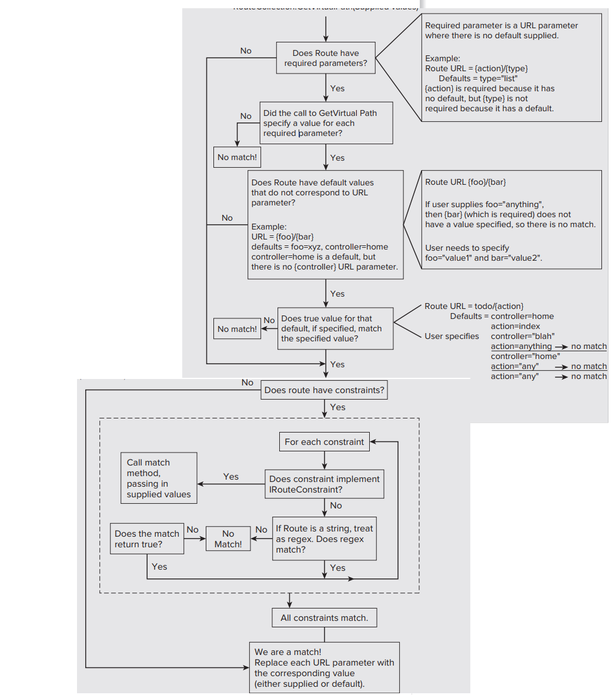

# ViewBag, ViewData and TempData

Data is passed from the controllers to the views via a ViewDataDictionary (a specialized dictionary class) called ViewData. You can set and read values using standard dictionary syntax:
```csharp
ViewData["CurrentTime"] = DateTime.Now;
```
ASP.NET MVC 3 leveraged the C# 4 dynamic keyword to allow for a simpler syntax. The ViewBag is a dynamic wrapper around ViewData. It allows you to set values as follows:
```csharp
ViewBag.CurrentTime = DateTime.Now;
```

> ViewBag and ViewData only transfer data from controller to view, not visa-versa. 
> ViewBag values will be null if redirection occurs. 
> ViewData is valid only during the current request.

- The limitation of both ViewData and ViewBag is they are limited to one HTTP request only. So, if redirection occurs, their values become null.

- TempData is used to transfer data from view to controller, controller to view, or from one action method to another action method of the same or a different controller.

```csharp
public class HomeController : Controller
{
    public ActionResult Index()
    {
        TempData["name"] = "Cuong";
        return RedirectToAction("About");
    }

    public ActionResult About()
    {
        string name;
        if(TempData.ContainsKey("name"))
            name = TempData["name"].ToString(); 
        return View();
    }

    public ActionResult Contact()
    {
        // the following throws exception as TempData["name"] is null 
        // because we already accessed it in the About() action method 
        name = TempData["name"].ToString(); 

        return View();
    }
}
```

> TempData stores the data temporarily and automatically removes it after retrieving a value.
> Although, you can still keep it for the subsequent request by calling TempData.Keep() method.

# Strongly Typed Views

ViewData has an additional Model property to allow for a specific model object to be available to
the view. In order to create a strongly typed view, we need to pass the model object as a parameter to the View() extension method

```csharp
public ActionResult List() {
    var albums = GetAlbums();
    return View(albums);
}
```

Behind the scenes, this sets the value of the ViewData.Model property to the value passed into the View method

The next step is to indicate to the view what type of model is using the @model declaration

```csharp
@using MvcApplication1.Models
@model IEnumerable<Album>
<ul>
    @foreach (Album p in Model) {
        <li>@p.Title</li>
    }
</ul>
```

We can declare the namespace in the web.config file within the Views directory.

```xml
@using MvcApplication1.Models
<system.web.webPages.razor>
…
    <pages pageBaseType="System.Web.Mvc.WebViewPage">
        <namespaces>
            <add namespace="System.Web.Mvc" />
            <add namespace="System.Web.Mvc.Ajax" />
            <add namespace="System.Web.Mvc.Html" />
            <add namespace="System.Web.Routing" />
            <add namespace="MvcApplication1.Models" />
        </namespaces>
    </pages>
</system.web.webPages.razor>
```

# Razor Syntax

**Implicit Code Expression**
```csharp
<span>@model.Message</span>
```

**Explicit Code Expression**
```csharp
<span>ISBN@(isbn)</span>
```

**Unencoded Code Expression**
```csharp
<span>@Html.Raw(model.Message)</span>
```

**Code Block**
```csharp
@{
    int x = 123;
    string y = "because.";
}
```

**Combining Text and Markup**
```csharp
@foreach (var item in items) {
    <span>Item @item.Name.</span>
}
```

**Mixing Code and Plain Text**
```csharp
@if (showMessage) {
    <text>This is plain text</text>
}
```
**or**
```csharp
@if (showMessage) {
    @:This is plain text.
}
```

**Escaping the Code Delimiter**
```csharp
My Twitter Handle is &#64;haacked
```
**or**
```csharp
My Twitter Handle is @@haacked
```
**Server-Side Comment**
```csharp
@*
This is a multiline server side comment.
@if (showMessage) {
 <h1>@ViewBag.Message</h1>
}
All of this is commented out.
*@
```

**Calling a Generic Method**
```csharp
@(Html.SomeMethod<AType>())
```

# Passing Parameters to Controller with the traditional way

```csharp
string value = Request [""];
string value = Request.QueryString [""];
string value = Request.Form [""];
string value = Request.Params [""];
```

```csharp
[HttpPost]
public ActionResult Create(FormCollection formCollection)
{
    if (ModelState.IsValid)
    {
        foreach (string key in formCollection.AllKeys)
        {
            Response.Write("Key = " + key + "  ");
            Response.Write("Value = " + formCollection[key]);
            Response.Write("<br/>");
        }
    }
    return View();
}
```

# Model Binding

> The model binding refers to converting the HTTP request data (from the query string or form collection) to an action method parameters

If you want to retrieve values to update an album, you might choose to pull the values directly from the request:

```csharp
[HttpPost]
public ActionResult Edit()
{
    var album = new Album();
    album.Title = Request.Form["Title"];
    album.Price = Decimal.Parse(Request.Form["Price"]);
    // ... and so on ...
}
```

## The DefaultModelBinder

Instead of digging form values out of the request, the Edit action simply takes an Album object as a parameter:

```csharp
[HttpPost]
public ActionResult Edit(Album album)
{
    // ...
}
```

It will automatically convert the input fields data on the view to the properties of a complex type parameter of an action method in HttpPost request if the properties' names match with the fields on the view.


> You can also include the FormCollection type parameter in the action method instead of a complex type to retrieve all the values from view form fields
> ```csharp
> [HttpPost]
> public ActionResult Edit(FormCollection values)
> {
>       var name = values["Name"];
>       // ...           
> }
> ```

## Bind Attribute

The [Bind] attribute will let you specify the exact properties of a model should include or exclude in binding

```csharp
[HttpPost]
public ActionResult Edit([Bind(Include = "StudentId, StudentName")] Student std)
{
    var name = std.StudentName;    
    //write code to update student         
    return RedirectToAction("Index");
}
```

## Model Binding Process

Model binding is a two-step process. First, it collects values from the incoming HTTP request, and second, it populates primitive type or a complex type with these values.

Value providers are responsible for collecting values from requests, and Model Binders are responsible for populating values.

Default value provider collection evaluates values from the following sources:
1. Previously bound action parameters, when the action is a child action Form fields (Request.Form)
2. The property values in the JSON Request body (Request.InputStream), but only when the request is an AJAX request
3. Route data (RouteData.Values)
4. Querystring parameters (Request.QueryString)
5. Posted files (Request.Files)

## Explicit Model Binding

```csharp
[HttpPost]
public ActionResult Edit()
{
    var album = new Album();
    try
    {
        UpdateModel(album);
        db.Entry(album).State = EntityState.Modified;
        db.SaveChanges();
        return RedirectToAction("Index");
    }
    catch
    {
        ViewBag.GenreId = new SelectList(db.Genres, "GenreId", "Name", album.GenreId);
        ViewBag.ArtistId = new SelectList(db.Artists, "ArtistId", "Name", album.ArtistId);
        return View(album);
    }
}
```

```csharp
[HttpPost]
public ActionResult Edit()
{
    var album = new Album();
    if (TryUpdateModel(album))
    {
        db.Entry(album).State = EntityState.Modified;
        db.SaveChanges();
        return RedirectToAction("Index");
    }
    else
    {
        ViewBag.GenreId = new SelectList(db.Genres, "GenreId", "Name", album.GenreId);
        ViewBag.ArtistId = new SelectList(db.Artists, "ArtistId", "Name", album.ArtistId);
        return View(album);
    }
}
```

A byproduct of model binding is model state. For every value the model binder moves into a model, it records an entry in model state. You can check model state anytime after model binding occurs to see if model binding succeeded:

```csharp
[HttpPost]
public ActionResult Edit()
{
    var album = new Album();
    TryUpdateModel(album);
    if (ModelState.IsValid)
    {
        db.Entry(album).State = EntityState.Modified;
        db.SaveChanges();
        return RedirectToAction("Index");
    }
    else
    {
        ViewBag.GenreId = new SelectList(db.Genres, "GenreId", "Name", album.GenreId);
        ViewBag.ArtistId = new SelectList(db.Artists, "ArtistId", "Name", album.ArtistId);
        return View(album);
    }
}
```

> If any errors occurred during model binding, model state will contain the names of the properties that caused failures, the attempted values, and the error messages.

# HTML Helpers

### Form

```csharp
@using (Html.BeginForm("Search", "Home", FormMethod.Get, new {target = "_blank"})) {
    <input type="text" name="q" />
    <input type="submit" value="Search" />
}

// another approach
@{Html.BeginForm("Search", "Home", FormMethod.Get);}
    <input type="text" name="q" />
    <input type="submit" value="Search" />
@{Html.EndForm();}
``` 

> Dashes are not valid in C# property names, but all HTML helpers convert an underscore in a property name to a dash when rendering the HTML

### TextBox

```csharp
@model Student
@Html.TextBox("StudentName", "123", new { @class = "form-control" })  
```

```html
<input id="StudentName" name="StudentName" type="text" value="123" class="form-control"/>
```

[All Overloads of TextBox()](https://learn.microsoft.com/en-us/previous-versions/aspnet/dd505176(v=vs.100))

```csharp
@model Student
@Html.TextBoxFor(m => m.StudentName) 
```

```html
<input id="StudentName" name="StudentName" type="text" value="" />
```

```csharp
@model Student
@Html.TextBoxFor(m => m.StudentName, new { @class = "form-control" })  
```

```html
<input class="form-control" id="StudentName" name="StudentName" type="text" value="" />
```

[All Overloads of TextBoxFor()](https://learn.microsoft.com/en-us/dotnet/api/system.web.mvc.html.inputextensions.textboxfor?view=aspnet-mvc-5.2)

### TextArea

[All Overloads of TextArea()](https://learn.microsoft.com/en-us/dotnet/api/system.web.mvc.html.textareaextensions?view=aspnet-mvc-5.2)

### Password

[All Overloads of PasswordFor()](https://learn.microsoft.com/en-us/dotnet/api/system.web.mvc.html.inputextensions.passwordfor?view=aspnet-mvc-5.2)

[All Overloads of Password()](https://learn.microsoft.com/en-us/dotnet/api/system.web.mvc.html.inputextensions.password?view=aspnet-mvc-5.2)

### Display

[All Overloads of DisplayFor()](https://learn.microsoft.com/en-us/dotnet/api/system.web.mvc.html.displayextensions.displayfor?view=aspnet-mvc-5.2)

[All Overloads of Display()](https://learn.microsoft.com/en-us/dotnet/api/system.web.mvc.html.displayextensions.display?view=aspnet-mvc-5.2)

### Label

[All Overloads of LabelFor()](https://learn.microsoft.com/en-us/dotnet/api/system.web.mvc.html.labelextensions.labelfor?view=aspnet-mvc-5.2)

[All Overloads of Label()](https://learn.microsoft.com/en-us/dotnet/api/system.web.mvc.html.labelextensions.label?view=aspnet-mvc-5.2)


### CheckBox

```csharp
@model Student
@Html.CheckBoxFor(m => m.isActive)
```

```html
<input data-val="true" 
        data-val-required="The isActive field is required." 
        id="isActive" 
        name="isActive" 
        type="checkbox" 
        value="true" />

<input name="isActive" type="hidden" value="false" />
```

When you submit a form with a checkbox, the value is posted only if a checkbox is checked. So, if you leave the checkbox unchecked, then nothing will be sent to the server. Sometimes, you would want false to be sent to the server. Because, an hidden input has the same name, it will send false to the server if checkbox is unchecked

[All Overloads of CheckBoxFor()](https://learn.microsoft.com/en-us/dotnet/api/system.web.mvc.html.inputextensions.checkbox?view=aspnet-mvc-5.2)

### RadioButton

[All Overloads of RadioButtonFor()](https://learn.microsoft.com/en-us/dotnet/api/system.web.mvc.html.inputextensions.radiobuttonfor?view=aspnet-mvc-5.2)

[All Overloads of RadioButton()](https://learn.microsoft.com/en-us/dotnet/api/system.web.mvc.html.inputextensions.radiobutton?view=aspnet-mvc-5.2)

### Hidden

```csharp
@model Student
@Html.HiddenFor(m => m.StudentId)
```

```html
<input data-val="true" 
            data-val-number="The field StudentId must be a number." 
            data-val-required="The StudentId field is required." 
            id="StudentId" 
            name="StudentId" 
            type="hidden" 
            value="" />
```

> It has created data- HTML5 attribute, which is used for the validation in ASP.NET MVC

[All Overloads of HiddenFor()](https://learn.microsoft.com/en-us/dotnet/api/system.web.mvc.html.inputextensions.hiddenfor?view=aspnet-mvc-5.2)

[All Overloads of Hidden()](https://learn.microsoft.com/en-us/dotnet/api/system.web.mvc.html.inputextensions.hidden?view=aspnet-mvc-5.2)

### DropDownList

```csharp
@using MyMVCApp.Models
@model Student
@Html.DropDownListFor(m => m.StudentGender, new SelectList(Enum.GetValues(typeof(Gender))), "Select Gender")
```

```html
<select class="form-control" id="StudentGender" name="StudentGender">
    <option>Select Gender</option> 
    <option>Male</option> 
    <option>Female</option> 
</select>
```

> The second parameter specifies the items to show into a dropdown list using SelectList object.
> The third parameter is optional, which will be the first item of dropdownlist.

> It has created data- HTML5 attribute, which is used for the validation in ASP.NET MVC

[All Overloads of DropDownListFor()](https://learn.microsoft.com/en-us/dotnet/api/system.web.mvc.html.selectextensions.dropdownlistfor?view=aspnet-mvc-5.2)

[All Overloads of DropDownList()](https://learn.microsoft.com/en-us/dotnet/api/system.web.mvc.html.selectextensions.dropdownlist?view=aspnet-mvc-5.2)


### Editor

> The Html.Editor() or Html.EditorFor() extension methods generate HTML elements based on the data type of the model object's property.

[All Overloads of EditorFor()](https://learn.microsoft.com/en-us/dotnet/api/system.web.mvc.html.editorextensions.editorfor?view=aspnet-mvc-5.2)

[All Overloads of Editor()](https://learn.microsoft.com/en-us/dotnet/api/system.web.mvc.html.editorextensions.editor?view=aspnet-mvc-5.2&redirectedfrom=MSDN)


### Html.ActionLink

> The ActionLink method renders a hyperlink (anchor tag) to another controller action.

```csharp
@Html.ActionLink("Link Text", "AnotherAction")
```

```html
<a href="/Home/AnotherAction">LinkText</a>
```

### Html.RouteLink

> The RouteLink helper follows the same pattern as the ActionLink helper, but also accepts a route name and does not have arguments for controller name and action name

```csharp
@Html.RouteLink("Link Text", new {action="AnotherAction"})
```

## Html.Partial()

> The @Html.Partial() method renders the specified partial view. It accepts partial view name as a string parameter and returns MvcHtmlString

## Html.RenderPartial()

> The @html.RenderPartial() method is the same as the @html.Partial() method except that it writes the resulted HTML of a specified partial view into an HTTP response stream directly.
> The RenderPartial() method returns void, so a semicolon is required at the end, and so it must be enclosed within the @{ }.

## Html.RenderAction()

> The @html.RenderAction() method executes the specified action method and renders the result. The specified action method must be marked with the [ChildActionOnly] attribute (this attribute prevents the runtime from invoking the action directly via a URL) and return the PartialViewResult using the PartialView() method.

## Html.Action()

> Tthe only difference between Action and RenderAction is that RenderAction writes directly to the response


# URL Helpers

The URL helpers are similar to the HTML ActionLink and RouteLink helpers, but instead of returning HTML they build URLs and return the URLs as strings. There are three helpers:
- Action
- Content
- RouteUrl

> The Action URL helper is exactly like ActionLink:
```csharp
<span>
@Url.Action("Browse", "Store", new { genre = "Jazz" }, null)
</span>
```
```html
<span>
/Store/Browse?genre=Jazz
</span>
```

> The Content helper can convert a relative application path to an absolute application path.
```xml
<script src="@Url.Content("~/Scripts/jquery-1.5.1.min.js")" type="text/javascript"></script>
```


# Routing

Guidelines for high-quality URLs:
- A domain name that is easy to remember and easy to spell
- Short URLs
- Easy-to-type URLs
- URLs that reflect the site structure
- URLs that are hackable to allow users to move to higher levels of the information architecture by hacking off the end of the URL
- Persistent URLs, which don’t change

> URL is a useful but informal concept: A URL is a type of URI that identifies a resource via a representation of its primary access mechanism.
> A URI is an identifier for some resource, but a URL gives you specific information as to how to obtain that resource.

## Introduction to Routing

2 main purposes of Routing:
- It matches incoming requests that would not otherwise match a file on the file system and maps the requests to a controller action.
- It constructs outgoing URLs that correspond to controller actions.


The Application_Start method in Global.asax.cs contains a call to a method named the RegisterRoutes method. This method is where all routes for the application are registered and is located in the ~/App_Start/RouteConfig.cs file

When a request comes in, Routing parses the request URL and places the route parameter values into a dictionary (specifically a RouteValueDictionary accessible via the RequestContext), using the URL parameter names as the keys and the corresponding subsections of the URL (based on position) as the values

> You need to put the more specific route first because routes are evaluated in order

```csharp
// RouteConfig.cs
public static void RegisterRoutes(RouteCollection routes)
{
    routes.IgnoreRoute("{resource}.axd/{*pathInfo}");

    /* Route URLs */

    // the simpliest form of MapRoute
    // first, second, third are called URL parameters
    // URL Parameter Value Mapping Examples
    // /albums/display/123 -> first = "albums"; second = "display"; third = "123"
    // this returns a 404 File Not Found error
    routes.MapRoute("simple", "{first}/{second}/{third}");

    //  Replace the above line with this
    routes.MapRoute("simple", "{controller}/{action}/{id}");
    // the request for /albums/display/123 is now a request for a {controller} named albums
    // ASP.NET MVC takes that value and appends the Controller suffix to get a type name, AlbumsController. 
    // If a type with that name exists and implements the IController interface, it is instantiated and used to handle the request.
    // The {action} parameter value is used to indicate which method of the controller to call in order to handle the current request.
    // colorpanel that this method invocation applies only to controller classes that inherit from the System.Web.Mvc.Controller base class.
    // Classes that directly implement IController can implement their own conventions for handling mapping code to handle the request
    // Any route parameters other than {controller} and {action} can be passed as parameters to the action method, if they exist. 


    // It is possible to have URL segments that mix literals with parameters. 
    // {language}-{country}/{controller}/{action} is a valid Route URL
    // {controller}{action}/{id} is not a valid Route URL 


    /* Route Defaults */
    routes.MapRoute(
        "simple", 
        "{controller}/{action}/{id}", 
        new { id = UrlParameter.Optional }
    );


    routes.MapRoute(
        name: "Default",
        url: "{controller}/{action}/{id}",
        defaults: new { controller = "Home", action = "Index", id = UrlParameter.Optional }
    );

    /* Route Constraints */

    // Constraints allow you to apply a regular expression to a URL segment
    // to restrict whether the route will match the request.

    routes.MapRoute(
        "blog", "{year}/{month}/{day}", 
        new {controller="blog", action="index"},
        new {year=@"^\d{4}$", month=@"^\d{2}$", day=@"^\d{2}$"});

    routes.MapRoute("simple", "{controller}/{action}/{id}");
} 
```

```csharp
@Html.RouteLink(
    linkText: "route: Test",
    routeName: "test",
    routeValues: new { controller="section", action="Index", id=123} 
)
```

> Use names for all your routes and always use the route name when generating URLs

## Areas

### Area Route Registration

Area routes are configured by creating classes for each area that derive from the AreaRegistration class, overriding AreaName and RegisterArea members. In the default project templates for ASP.NET MVC, there’s a call to the method AreaRegistration.RegisterAllAreas within the Application_Start method in Global.asax.

### Area Route Conflicts

> Occur when you have two controllers with the same name, one within an area and one in the root of your application

> 2 to prevent this exception
> - Use unique controller names within a project
> - Specify a set of namespaces to use for locating controller classes for a particular route

```csharp
routes.MapRoute(
    "Default",
    "{controller}/{action}/{id}",
    new { controller = "Home", action = "Index", id = "" },
    new [] { "AreasDemoWeb.Controllers" } // an array of namespace names
);
```

## Catch-All Parameter

```csharp
public static void RegisterRoutes(RouteCollection routes)
{
    routes.MapRoute("catchallroute", "query/{query-name}/{*extrastuff}");
}
// /query/select/a/b/c -> extrastuff = "a/b/c"
// /query/select/a/b/c/ -> extrastuff = "a/b/c"
// /query/select/ -> extrastuff = ""
```

## Multiple URL Parameters in a Segment

|ROUTE URL|REQUEST URL|ROUTE DATA RESULT|
|---------|-----------|-----------------|
|{filename}.{ext}| /Foo.xml.aspx| filename="Foo.xml"; ext="aspx"|
|My{title}-{cat}| /MyHouse-dwelling| location="House"; sublocation="dwelling"|
|{foo}xyz{bar}| /xyzxyzxyzblah| foo="xyzxyz"; bar="blah"|

## StopRoutingHandler and IgnoreRoute

```csharp
public static void RegisterRoutes(RouteCollection routes)
{
    routes.Add(new Route
    (
        "{resource}.axd/{*pathInfo}",
        new StopRoutingHandler()
    ));
    routes.Add(new Route
    (
        "reports/{year}/{month}", 
        new SomeRouteHandler()
    ));

    routes.IgnoreRoute("{resource}.axd/{*pathInfo}");
    routes.MapRoute("report-route", "reports/{year}/{month}");
}
```

## Debugging Routes

> Install package RouteDebugger
> Adds a setting to the appSettings section of web.config: 
> ```xml
> <add key="RouteDebugger:Enabled" value="true" />
> ```

## How Routes Generate URLs

```csharp
// This method belongs to RouteCollection
public VirtualPathData GetVirtualPath(RequestContext requestContext, RouteValueDictionary values);
// 1. The route collection loops through each route and asks, “Can you generate a URL given these parameters?” via the Route.GetVirtualPath method.
// 2. If a route answers that question, it returns a VirtualPathData instance containing the URL as well as other information about the match. If not, it returns null, and the Routing system moves on to the next route in the list.
```

1. Developer calls a method such as Html.ActionLink or Url.Action. That method, in turn, calls RouteCollection.GetVirtualPath, passing in a RequestContext, a dictionary of values, and an optional route name used to select the correct route to generate the URL.
2. Routing looks at the required URL parameters of the route and makes sure that a value exists in the supplied dictionary of route values for each required parameter (no default supplied). If any required parameter does not have a value, URL generation stops immediately and returns null.
3. Some routes may contain default values that do not have a corresponding URL parameter. For example, a route might have a default value of pastries for a key named category, but category is not a parameter in the route URL. In this case, if the user-supplied dictionary of values contains a value for category, that value must match the default value for category.
4. Routing then applies the route’s constraints, if any.
5. The route is a match! Now the URL is generated by looking at each URL parameter and attempting to fill it with the corresponding value from the supplied dictionary.




> Overflow parameters used in route generation are appended to the generated URL as query string parameters

## How Routes tie URL to an Action

1. The UrlRoutingModule attempts to match the current request with the routes registered in the RouteTable.
2. If one of the routes in the RouteTable matches, the Routing module grabs the IRouteHandler from that route. 
3. The Routing module calls the GetHandler method of the IRouteHandler, which returns the IHttpHandler that will be used to process the request.
4. ProcessRequest is called on the HTTP handler, thus handing off the request to be handled.
5. In the case of ASP.NET MVC, the IRouteHandler is an instance of MvcRouteHandler,
which, in turn, returns an MvcHandler that implements IHttpHandler. The MvcHandler is responsible for instantiating the controller, which, in turn, calls the action method on that controller

## Custom Route Constraints

```csharp
public interface IRouteConstraint
{
    bool Match(HttpContextBase httpContext, Route route, string parameterName,
    RouteValueDictionary values, RouteDirection routeDirection);
}
```

When Routing evaluates route constraints, and a constraint value implements IRouteConstraint, it will cause the route engine to call the IRouteConstraint.Match method on that route constraint to determine whether or not the constraint is satisfied for a given request

Routing itself provides one implementation of this interface in the form of the HttpMethodConstraint class. This constraint allows you to specify that a route should match only requests that use a specific set of HTTP methods

```csharp
routes.MapRoute("name", "{controller}", null, new {httpMethod = new HttpMethodConstraint("GET")} );
```

# Build Responsive Web Applications with AJAX - Asynchronous JavaScript and XML

## AJAX Request


```js
$.ajax({
    url: "google.com",
    async: true, // false makes it synchronous
    type: "GET", // 'GET' or 'POST' ('GET' is the default)
    done: function(data) { // success handler (status code 200)
        console.log(data);
    },
    fail: function(xhr) { // error handler (status code not 200)
        console.log("Error occurred: ", xhr.statusText);
    }
});
```

Equivalent to

```js
// instantiate XmlHttpRequest object
var xhr = new XMLHttpRequest();
// open a new asynchronous 'GET' request to fetch google.com's home page
xhr.open("GET", "http://www.google.com/", true);
// attach a callback to be called as soon as the request is processed
xhr.onreadystatechange = function (evt) {
    // as the request goes through different stages of processing,
    // the readyState value will change
    // this function will be called every time it changes,
    // so readyState === 4 checks if the processing is completed
    if (xhr.readyState === 4) {
        if (xhr.status === 200) {
            console.log(xhr.responseText)
        }
        else {
            console.log("Error occurred: ", xhr.statusText);
        }
    }
};
// send the request with no content (null)
xhr.send(null);
```

## Partial Rendering

```js
function showAuction(auctionId) {
    $('#main').load('@Url("PartialAuction", "Auctions")/' + auctionId);
}
```

> The action returns a partial view

## Javascript Rendering

```csharp
public ActionResult JsonAuction(long id)
{
    var db = new DataContext();
    var auction = db.Auctions.Find(id);
    return Json(auction, JsonRequestBehavior.AllowGet);
}
```

## Client-Side Template

```js
<script id="auction-template" type="text/x-template">
    <div class="title">{{Title}}</div>
    <div class="overview">
        
        <p>
        <strong>Current Price: </strong>
        <span class="current-bid">{{CurrentPrice}}</span>
        </p>
    </div>
    <h3>Description</h3>
    <div class="description">
        {{Description}}
    </div>
</script>
<script type="text/javascript" src="~/scripts/mustache.js"></script>
<script type="text/javascript">
$(function() {
    var templateSource = $('#auction-template').html();
    var template = Mustache.compile(templateSource);
    $('.auction').click(function() {
        var auctionId = $(this).data("key");
        $.ajax({
            url: '@Url.Action("JsonAuction", "Auctions")/' + auctionId,
            success: function(auction) {
                var html = template(auction);
                $('#auction-details').html(html);
            }
        });
    });
});
</script>
```

## AJAX Helpers

> To use the AJAX helpers, you need to have the jquery.unobtrusive-ajax script present

### Ajax ActionLinks

```csharp
@Ajax.ActionLink("This is link text", "ActionName", new AjaxOptions {
    UpdateTargetId="dailydeal",
    InsertionMode=InsertionMode.Replace,
    HttpMethod="GET"
})

// return a Partial View
// Once the action returns the HTML from a rendered view, the script behind the
// scenes takes the HTML and replaces the existing dailydeal element in the DOM
public ActionResult DailyDeal()
{
    var album = GetDailyDeal();
    return PartialView("_DailyDeal", album);
}

```

### AJAX Forms

```csharp
@using (Ajax.BeginForm("ArtistSearch", "Home", new AjaxOptions {
    InsertionMode=InsertionMode.Replace,
    HttpMethod="GET",
    OnFailure="searchFailed", // catch various client-side events that flow from every Ajax request
    LoadingElementId="ajax-loader", // the element that was automatically shown when async request is in progress
    UpdateTargetId="searchresults"
})) {
<input type="text" name="q" />
<input type="submit" value="search" />

}
```
```js
function searchFailed() {
    $("#searchresults").html("Sorry, there was a problem with the search.");
}
```


## Client-Side Validation

### jQuery Validation

```xml
<!-- web.config -->
<configuration>
    <appSettings>
        <add key="ClientValidationEnabled" value="true"/>
        <add key="UnobtrusiveJavaScriptEnabled" value="true"/>
    </appSettings>
</configuration>
```

```xml
<script src="@Url.Content("~/Scripts/jquery.validate.min.js")"></script>
<script src="@Url.Content("~/Scripts/jquery.validate.unobtrusive.min.js")"></script>
<script src="@Url.Content("~/Scripts/jquery.unobtrusive-ajax.min.js")"></script>
```

```csharp
@Html.TextBoxFor(model => model.Title)
```
```html
<input
data-val="true"
data-val-length="The field Title must be a string with a maximum length of 160."
data-val-length-max="160" data-val-required="An Album Title is required"
id="Title" name="Title" type="text" value="Greatest Hits" />
```

### Custom Validation

> The attribute provides only serverside validation. To support client-side validation, you need your attribute to implement **IClientValidatable** interface
> When the MVC framework finds a validation object with this interface present, it invokes GetClientValidationRules to retrieve a sequence of ModelClientValidationRule objects.

```csharp
public class MaxWordsAttribute : ValidationAttribute, IClientValidatable
{
    // ...
    public IEnumerable<ModelClientValidationRule> GetClientValidationRules(ModelMetadata metadata, ControllerContext context)
    {
        var rule = new ModelClientValidationRule();
        rule.ErrorMessage = FormatErrorMessage(metadata.GetDisplayName());

        // a place to hold parameters on the client
        // the names are significant and have to match names in client script
        rule.ValidationParameters.Add("wordcount", WordCount); 

        // identifies a piece of JavaScript code on the client
        // the validation type and all validation parameter names must be lowercase
        rule.ValidationType = "maxwords";
        
        yield return rule;
    }
}
```
```html
<input
data-val="true"
data-val-length="The field Title must be a string with a maximum length of 160."
data-val-length-max="160"
data-val-maxwords="Too many words in Title"
data-val-maxwords-wordcount="10"
data-val-required="An Album Title is required" id="Title" name="Title"
type="text" value="For Those About To Rock We Salute You" />
```

### Custom Validation Script Code

> You’ll need two pieces of script in place for validation to work:
> - The adapter: The adapter works with the unobtrusive MVC extensions to identify the required metadata. The unobtrusive extensions then take care of retrieving the values from data dash attributes and adapting the data to a format jQuery validation can understand.
> - The validation rule itself: This is called a validator in jQuery parlance

|NAME|DESCRIPTION|
|----|------------|
|addBool| Creates an adapter for a validator rule that is "on" or "off". The rule requires no additional parameters.|
|addSingleVal| Creates an adapter for a validation rule that needs to retrieve a single parameter value from metadata.|
|addMinMax| Creates an adapter that maps to a set of validation rules — one that checks for a minimum value and one that checks for a maximum value. One or both of the rules may run, depending on the data available.|
|add| Creates an adapter that doesn’t fit into the preceding categories because it requires additional parameters or extra setup code.|

```js
/// <reference path="jquery.validate.js" />
/// <reference path="jquery.validate.unobtrusive.js" />

// The first parameter is the name of the adapter, and must match the ValidationProperty value you set on the server-side rule. 
// The second parameter is the name of the single parameter to retrieve from metadata, and must match the name of the parameter you placed into the ValidationParameters collection on the server
$.validator.unobtrusive.adapters.addSingleVal("maxwords", "wordcount");

// The first parameter is the name of the validator
// The second parameter is a function to invoke when validation occurs

// The validation function contains 3 parameters:
// The first parameter will contain the input value
// The second parameter is the input element containing the value to validate
// The third parameter will contain all the validation parameters in an array, or in this case, the single validation parameter (the maximum number of words)
$.validator.addMethod("maxwords", function (value, element, maxwords) {
    if (value) {
        if (value.split(' ').length > maxwords) {
            return false;
        }
    }
    return true;
});
```

## jQuery UI

## Bundling and Minification

> Bundling allows us to load the bunch of static files from the server in a single HTTP request.

> Minification technique optimizes script or CSS file size by removing unnecessary white space and comments and shortening variable names to one character

### Bundle Types

**ScriptBundle**: ScriptBundle is responsible for JavaScript minification of single or multiple script files.

**StyleBundle**: StyleBundle is responsible for CSS minification of single or multiple style sheet files.

**DynamicFolderBundle**: Represents a Bundle object that ASP.NET creates from a folder that contains files of the same type.

```csharp
using System.Web;
using System.Web.Optimization;

public class BundleConfig
{
    public static void RegisterBundles(BundleCollection bundles)
    {   
        bundles.Add(new StyleBundle("~/bundles/css").Include("~/Content/bootstrap.css", "~/Content/site.css"));
        
        bundles.Add(new ScriptBundle("~/bundles/bs-jq-bundle").Include("~/Scripts/bootstrap.js", "~/Scripts/jquery-3.3.1.js"));

        //the following creates bundles in debug mode
        //BundleTable.EnableOptimizations = true;

        // add all the files under a particular directory in a bundle
        bundles.Add(new ScriptBundle("~/bundles/scripts").IncludeDirectory("~/Scripts/", "*.js", true));

        // use Wildcards
        bundles.Add(new ScriptBundle("~/bundles/jquery").Include("~/Scripts/jquery-{version}.js"));

        // use CDN
        bundles.Add(new ScriptBundle("~/bundles/jquery", cdnPath).Include("~/Scripts/jquery-{version}.js"));
    }
}
```

```csharp
<head>
    <meta charset="utf-8" />
    <meta name="viewport" content="width=device-width, initial-scale=1.0">
    <title>@ViewBag.Title</title>
    @Styles.Render("~/bundles/css")
    @Scripts.Render("~/bundles/bs-jq-bundle")
</head>
```


# Data Validation

## Use Data Annotation Attribute

> Use the ModelState.IsValid to check whether the submitted model object satisfies the requirement specified by all the data annotation attributes.

```csharp
public class StudentController : Controller
{
    [HttpPost]
    public ActionResult Edit(Student student)
    {
        if (ModelState.IsValid) { //checking model state
            //update student to db
            return RedirectToAction("Index");
        }
        return View(student);
    }
}
```

> The ValidationMessageFor() displays an error message if an error exists for the specified field in the ModelStateDictionary object

```csharp
@model Student  
@Html.EditorFor(m => m.StudentName) <br />
@Html.ValidationMessageFor(m => m.StudentName, "Custom Error Message", new { @class = "text-danger" })
```

```html
<input id="StudentName" 
        name="StudentName" 
        type="text" 
        value="" />

<span class="field-validation-valid text-danger" 
        data-valmsg-for="StudentName" 
        data-valmsg-replace="true">
        Custom Error Message
</span>
```

[All Overloads of ValidationMessageFor()](https://learn.microsoft.com/en-us/dotnet/api/system.web.mvc.html.validationextensions.validationmessagefor?view=aspnet-mvc-5.2&redirectedfrom=MSDN)

> The ValidationSummary() displays a summary of all validation errors in the **ModelState** dictionary on a web page as an unordered list element. It can also be used to display custom error messages.

```csharp
@model Student  
@Html.ValidationSummary(false, "", new { @class = "text-danger" })
@Html.HiddenFor(model => model.StudentId)    
@Html.EditorFor(m => m.StudentName) <br />
@Html.EditorFor(m => m.Age) <br />
```

```csharp
public class StudentController : Controller
{
    [HttpPost]
    public ActionResult Edit(Student student)
    {
        if (ModelState.IsValid) { //checking model state
            
            //check whether name is already exists in the database or not
            bool nameAlreadyExists = // check database      
            if (nameAlreadyExists)
            {
                //adding error message to ModelState
                ModelState.AddModelError("name", "Student Name Already Exists.");
                return View(student);
            }
            return RedirectToAction("Index");
        }
        return View(student);
    }
}
```


> The first parameter of the ValidationSummary() is false, so it will display the field level errors as a summary.


## Validation Attributes from System.Web.Mvc

### Remote
> The Remote attribute enables you to perform client-side validation with a server callback

No two users should have the same UserName value, but it is difficult to validate the value on the client to ensure the value is unique. With the Remote attribute you can send the UserName value to the server, and compare the value against the values in the database.

```csharp
[Remote("ActionName", "ControllerName")]
public string UserName { get; set; }

public JsonResult ActionName(string username)
{
    var result = Membership.FindUsersByName(username).Count == 0;
    return Json(result, JsonRequestBehavior.AllowGet);
}
```

### Compare
> Compare ensures two properties on a model object have the same value.

```csharp
RegularExpression(@"[A-Za-z0-9._%+-]+@[A-Za-z0-9.-]+\.[A-Za-z]{2,4}")]
public string Email { get; set; }
[Compare("Email")] // EmailConfirm and Email must have the same value
public string EmailConfirm { get; set; }
```

## Looking behind the Annotation

### Validation and Model Binding

By default, the ASP.NET MVC framework executes validation logic during model binding. 
Once the model binder is finished updating the model properties with new values, the model binder uses the current model metadata an ultimately obtains all the validators for the model. The MVC run time provides a validator to work with data annotations (the DataAnnotationsModelValidator). This model validator can find all the validation attributes and execute the validation logic inside. The model binder catches all the failed validation rules and places them into model state.

### Validation and Model State

Not only does model state contain all the values a user attempted to put into model properties, but model state also contains all the errors associated with each property (and any errors associated with the model object itself). **If there are any errors in model state,
ModelState.IsValid returns false.**

## Custom Validation

### Custom Data Annotation
[Read](https://github.com/chicuongk3/EntityFrameworkDocument#implementing-custom-data-annotation-attribute)

### IValidatableObject
[Read](https://github.com/chicuongk3/EntityFrameworkDocument#31-s%E1%BB%AD-d%E1%BB%A5ng-partial-class-methods)

## Display and Edit Annotation

### Display

```csharp
[Required]
[StringLength(160, MinimumLength=3)]
[Display(Name="First Name")] // fix the label for the FirstName field
public string FirstName { get; set; }
```

> You can control the order in which properties will appear in the UI

```csharp
[Required]
[StringLength(160)]
[Display(Name="Last Name", Order = 15001)]
[MaxWords(10, ErrorMessage="There are too many words in {0}")]
public string LastName { get; set; }

[Required]
[StringLength(160, MinimumLength = 3)]
[Display(Name="First Name", Order = 15000)]
public string FirstName { get; set; }
```

### DisplayFormat

The DisplayFormat attribute handles various formatting options for a property via named parameters. You can provide alternate text for display when the property contains a null value, and turn off HTML encoding for properties containing markup. You can also specify a data format string for the run time to apply to the property value. 

```csharp
[DisplayFormat(ApplyFormatInEditMode=true, DataFormatString="{0:c}")]
public decimal Total { get; set; }
```

# Filters

> ASP.NET MVC Filter is a custom class where you can write custom logic to execute before or after an action method executes. Filters can be applied to an action method or controller

|Filter Type|Description|Built-in Filter|Interface
|-----------|-----------|---------------|---------
|Authorization filters|Performs authentication and authorizes before executing an action method.|[Authorize], [RequireHttps]| IAuthorizationFilter
|Action filters|Performs some operation before and after an action method executes.||IActionFilter
|Result filters|Performs some operation before or after the execution of the view.|[OutputCache]|IResultFilter
|Exception filters|Performs some operation if there is an unhandled exception thrown during the execution of the ASP.NET MVC pipeline.|	[HandleError]|IExceptionFilter

## Register Filters

Filters can be applied at three levels:
1. Global Level Filters
> The global filters will be applied to all the controller and action methods of an application.

```csharp
// MvcApplication class contains in Global.asax.cs file 
public class MvcApplication : System.Web.HttpApplication
{
    protected void Application_Start()
    {
        FilterConfig.RegisterGlobalFilters(GlobalFilters.Filters);
    }
}

// FilterConfig.cs located in App_Start folder 
public class FilterConfig
{
    public static void RegisterGlobalFilters(GlobalFilterCollection filters)
    {
        filters.Add(new HandleErrorAttribute());
    }
}
```


# State Management

You can implement state management in an ASP.NET MVC application using one of the following options:
- Cookies
- TempData
- Application State
- Session State

## Cookies

```csharp
HttpCookie userCookie = new HttpCookie("UserInfo");
userCookie.Values["UserName"] = "Tom";
userCookie.Values["Password"] = "";
Response.Cookies.Add(userCookie);
string username = Request.Cookies["UserInfo"]["UserName"]; // get value


Response.Cookies["UserName"].Value = "Tom";
Response.Cookies["UserName"].Expires = DateTime.Now.AddDays(2);

// Access a cookie
if (Request.Cookies["UserName"].Value != null) {
    // ...
}
```

## Application State

- Application state enables storing application-specific information as key-value pairs.
- When a user accesses any URL, application state is created for the first time.
- After that it stores the application-specite information.
- This information can be shared with all the pages and user sessions of the application.
- For this, you need to use the HttpApplicationState class.
- This class is accessed by using the Application property of the HttpContext object.

```csharp
// Global.asax
protected void Application_Start() {
    HttpContext.Application["VisitorsCount"] = 0;
    HttpContext.Application.Remove("VisitorsCount");
}

protected void Application_End() {
    DbContext.Dispose();
    Cache.Clear();
}

protected void Application_Error() {
    Exception ex = Server.GetLastError();
    Log.Error(ex);
    // ...
}
```

## Session State

```xml
<!-- Web.config -->
<!-- cookieless chỉ định cách lưu trữ SessionID, true là dùng URL, false là dùng Cookie -->
<system.web>
    <sessionState mode="InProc" cookieless="false" timeout="20">
</system.web>
```

```csharp
Session["UserName"] = "name";
```

## Output Caching, Data Caching

```csharp
[OutputCache(Duration = 3600, VaryByParam = "none")]
public ActionResult ProductList() {
    // ...
}

// Data Caching can be achieved by using HttpContext.Cache or MemoryCache
```

# Authentication and Authorization

## Forms Authentication

```xml
<!-- web.config -->
<system.web>
    <authentication mode="Forms"> <!-- Forms, Windows, None, Passport -->
        <forms loginUrl="~/Account/Login" timeout="2880" />
    </authentication>
</system.web>
```

```csharp
[HttpPost]
public ActionResult Login(UserModel model) 
{
    
    if (ModelState.IsValid)
    {
        using (EmployeeDBContext context = new EmployeeDBContext())
        {
            bool IsValidUser = context.Users.Any(user => user.UserName == model.UserName && user.UserPassword == model.UserPassword);
            if (IsValidUser)
            {
                FormsAuthentication.SetAuthCookie(model.UserName, false);
                return RedirectToAction("Index", "Home");
            }
            ModelState.AddModelError("", "Invalid username or password");
            
        }
    }
    return View();
}
```

### Using the AuthorizeAttribute to require login

The ASP.NET MVC Internet Application template includes an AccountController that implements support for accounts man aged by both ASP.NET Membership and OAuth authentication.
The AuthorizeAttribute performs its main work in the OnAuthorization method, which is a standard method defined in the IAuthorizationFilter interface.

```csharp
IPrincipal user = httpContext.User;
if (!user.Identity.IsAuthenticated)
{
    return false;
}
```


```csharp
[Authorize(Roles="Administrator,SuperAdmin")]
public class StoreManagerController : Controller {

}

// authorize by a list of users:
[Authorize(Users="Jon,Phil,Scott,Brad")]
public class TopSecretController:Controller {

}
```

## Using a Global Authorization Filter

To register the AuthorizeAttribute as a global filter, add it to the global filters collection in RegisterGlobalFilters:
```csharp
public static void RegisterGlobalFilters(GlobalFilterCollection filters) {
    filters.Add(new System.Web.Mvc.AuthorizeAttribute());
    filters.Add(new HandleErrorAttribute());
}
```
```csharp
// users will be able to access the login action even if you register the AuthorizeAttribute as a global filter
// AccountController
[RequireHttps]
[AllowAnonymous]
public ActionResult Login()
{
    return ContextDependentView();
}
```

## Membership Provider

```xml
<!-- Đặt trong <system.web> -->
<membership defaultProvider="CustomMembershipProvider">
	<providers>
		<clear/>
		<add name="CustomMembershipProvider"
			type="BookShopMVC.Areas.Admin.Models.CustomMembershipProvider"
			connectionStringName="BookShopDbContext"
			enablePasswordRetrieval="false"
			enablePasswordReset="true"
			requiresQuestionAndAnswer="false"
			requiresUniqueEmail="false"
			maxInvalidPasswordAttempts="5"
			minRequiredPasswordLength="6"
			minRequiredNonalphanumericCharacters="0"
			passwordAttemptWindow="10"
			applicationName="/" />
	</providers>
</membership>
```

```csharp
public class CustomMembershipProvider : MembershipProvider
{   
    public override MembershipUser CreateUser(string username, string password, string email, string passwordQuestion, string passwordAnswer, bool isApproved, object providerUserKey, out MembershipCreateStatus status)
    {
        ValidatePasswordEventArgs args = new ValidatePasswordEventArgs(username, password, true);
        OnValidatingPassword(args);

        if (args.Cancel)
        {
            status = MembershipCreateStatus.InvalidPassword;
            return null;
        }

        if (RequiresUniqueEmail && GetUserNameByEmail(email) != string.Empty)
        {
            status = MembershipCreateStatus.DuplicateEmail;
            return null;
        }

        MembershipUser user = GetUser(username, true);

        if (user == null)
        {
            UserObj userObj = new UserObj();
            userObj.UserName = username;
            userObj.Password = GetMD5Hash(password);
            userObj.UserEmailAddress = email;

            User userRep = new User();
            userRep.RegisterUser(userObj);

            status = MembershipCreateStatus.Success;

            return GetUser(username, true);
        }
        else
        {
            status = MembershipCreateStatus.DuplicateUserName;
        }

        return null;
    }

    public override MembershipUser GetUser(string username, bool userIsOnline)
    {
        User userRep = new User();
        UserObj user = userRep.GetAllUsers().SingleOrDefault
				(u => u.UserName == username);
        if (user != null)
        {
            MembershipUser memUser = new MembershipUser("CustomMembershipProvider", 
                                           username, user.UserID, user.UserEmailAddress,
                                           string.Empty, string.Empty,
                                           true, false, DateTime.MinValue,
                                           DateTime.MinValue,
                                           DateTime.MinValue,
                                           DateTime.Now, DateTime.Now);
            return memUser;
        }
        return null;
    }

    public override bool ValidateUser(string username, string password)
    {
        string sha1Pswd = GetMD5Hash(password);
        User user = new User();
        UserObj userObj = user.GetUserObjByUserName(username, sha1Pswd);
        if (userObj != null)
            return true;
        return false;
    }

    public override int MinRequiredPasswordLength
    {
        get { return 6; }
    }

    public override bool RequiresUniqueEmail
    {
        get { return false; }
    }

    public static string GetMD5Hash(string value)
    {
        MD5 md5Hasher = MD5.Create();
        byte[] data = md5Hasher.ComputeHash(Encoding.Default.GetBytes(value));
        StringBuilder sBuilder = new StringBuilder();
        for (int i = 0; i < data.Length; i++)
        {
            sBuilder.Append(data[i].ToString("x2"));
        }
        return sBuilder.ToString();
    }
}
```

```csharp
[HttpPost]
[ValidateAntiForgeryToken]
public ActionResult Index(LoginModel model)
{
    if (ModelState.IsValid)
    {
        if (Membership.ValidateUser(model.UserName, model.Password))
        {
            FormsAuthentication.SetAuthCookie(model.UserName, model.RememberMe);
            return RedirectToAction("Index", "Home");
        }
        else
        {
            ModelState.AddModelError("", "Tên đăng nhập hoặc mật khẩu không đúng");
        }
    }
            
    return View();
}
```


## Role-Based Authentication

```csharp
using System;
using System.Collections.Generic;
using System.Linq;
using System.Web;
using System.Web.Security;

namespace SecurityDemoMVC.Models
{
    public class UsersRoleProvider : RoleProvider
    {
        public override string[] GetRolesForUser(string username)
        {
            using (EmployeeDBContext context = new EmployeeDBContext())
            {
                var userRoles = (from user in context.Users
                                 join roleMapping in context.UserRolesMappings
                                 on user.ID equals roleMapping.UserID
                                 join role in context.RoleMasters
                                 on roleMapping.RoleID equals role.ID
                                 where user.UserName == username
                                 select role.RollName).ToArray();
                return userRoles;
            }
        }
    }
}
```

```xml
<roleManager defaultProvider="usersRoleProvider" enabled="true" >
  <providers>
    <clear/>
    <add name="usersRoleProvider" type="SecurityDemoMVC.Models.UsersRoleProvider"/>
  </providers>
</roleManager>
```

## Login via OAuth and OpenID

```csharp
// App_Start\AuthConfig.cs
public static class AuthConfig
{  
    public static void RegisterAuth()
    {
        // Configuring OAuth Providers
        OAuthWebSecurity.RegisterMicrosoftClient(
            clientId: "",
            clientSecret: "");
        OAuthWebSecurity.RegisterTwitterClient(
            consumerKey: "",
            consumerSecret: "");
        OAuthWebSecurity.RegisterFacebookClient(
            appId: "",
            appSecret: "");
        
        // Configuring OpenID Providers
        OAuthWebSecurity.RegisterGoogleClient();
        OAuthWebSecurity.RegisterYahooClient();
        var MyOpenIdClient = new OpenIdClient("myopenid", WellKnownProviders.MyOpenId);
        OAuthWebSecurity.RegisterClient(MyOpenIdClient, "myOpenID", null);
    }
}
```


# Security

## Cross-Site Scripting (XSS)

XSS is carried out by injecting script code into a site that accepts unsanitized user input

Preventing XSS:
- HTML-Encode All Content: 
  - Html.Encode
  - Html.AttributeEncode
  - Url.Encode
- JavaScript Encoding
  -  Ajax.JavaScriptStringEncode 
  -  AntiXSS library

##  Cross-Site Request Forgery (CSRF)

CSRF = XSS + Confused Deputy 

Confused Deputy là một chương trình máy tính bị một bên khác đánh lừa một cách vô tội để lạm dụng quyền hạn của mình (ở đây là browser)

```cs
public class AccountController : Controller
{
    public ActionResult Logout() 
    {
        FormsAuth.SignOut();
        return RedirectToAction("Index", "Home");
    }
}
```

Giả sử trang web của bạn cho phép limited whitelist HTML(danh sách các tag hoặc ký tự được chấp nhận có thể được mã hóa) để được nhập vào như một phần của hệ thống comment — hầu hết HTML đều bị loại bỏ hoặc làm sạch, nhưng bạn cho phép hình ảnh vì bạn muốn người dùng có thể đăng ảnh

Và 1 người comment như sau
```html

```

Mỗi lần 1 người dùng vào web request sẽ được tự động gửi đi và người dùng sẽ bị đăng xuất

Preventing CSRF:
- Token Verification

```xml
<form action="/account/register" method="post">
    @Html.AntiForgeryToken()
    ...
</form>
```

Html.AntiForgeryToken() will output an encrypted value:
```xml
<input type="hidden" value="012837udny31w90hjhf7u">
```
This value will match another value that is stored as a session cookie in the user’s browser. When the form is posted, these values will be matched using an ActionFilter:
```cs
[ValidateAntiforgeryToken]
public ActionResult Register() {}
```

- Idempotent GETs: If an operation is idempotent, it can be executed multiple times without changing the result. In general, a good rule of thumb is that you can prevent a whole class of CSRF attacks by only changing things in your DB or on your site by using POST

- HttpReferrer Validation

```cs
public class IsPostedFromThisSiteAttribute : AuthorizeAttribute
{
    public override void OnAuthorize(AuthorizationContext filterContext)
    {
        if (filterContext.HttpContext != null)
        {
            if (filterContext.HttpContext.Request.UrlReferrer == null)
                throw new System.Web.HttpException("Invalid submission");
            if (filterContext.HttpContext.Request.UrlReferrer.Host != "mysite.com")
                throw new System.Web.HttpException("This form wasn't submitted from this site!");
        }
    }
}
```
```cs
[IsPostedFromThisSite]
public ActionResult Register() {}
```

## Cookie Stealing

There are two types of cookies:
- Session cookies: Session cookies are stored in the browser’s memory and are transmitted via the header during every request. Session cookies are forgotten when your session end
- Persistent cookies: Persistent cookies are stored in actual text files on your computer’s hard drive and are transmitted the same way

Preventing Cookie Theft:

Stop script access to all cookies
```xml
<!-- web.config -->
<httpCookies domain="" httpOnlyCookies="true" requireSSL="false" />
```

Stop script access to each cookie
```cs
Response.Cookies["MyCookie"].Value = "Remembering you…";
Response.Cookies["MyCookie"].HttpOnly = true;
```

## Over-Posting

ASP.NET Model Binding can present another attack vector through over-posting.

Preventing Over-Posting: 

- Use Bind Attribute

```cs
[Bind(Include="Name, Comment")]
public class Review 
{
    public int ReviewID { get; set; } // Primary key
    public int ProductID { get; set; } // Foreign key
    public Product Product { get; set; } // Foreign entity
    public string Name { get; set; }
    public string Comment { get; set; }
    public bool Approved { get; set; }
}
```

- Use one of the overloads on UpdateModel or TryUpdateModel

```cs
UpdateModel(review, "Review", new string[] { "Name", "Comment" });
```

- Use a View Model that holds only the properties you want to allow the user to set

```cs
public class ReviewViewModel 
{
    public string Name { get; set; }
    public string Comment { get; set; }
}
```

## Open Redirection

Any web application that redirects to a URL that is specified via the request, such as the query string or form data, can potentially be tampered with to redirect users to an external, malicious URL

```cs
// no validation is being performed against the returnUrl
[HttpPost]
public ActionResult LogOn(LogOnModel model, string returnUrl)
{
    if (ModelState.IsValid)
    {
        if (MembershipService.ValidateUser(model.UserName, model.Password))
        {
            FormsService.SignIn(model.UserName, model.RememberMe);
            if (!String.IsNullOrEmpty(returnUrl))
            {
                return Redirect(returnUrl);
            }
            else
            {
                return RedirectToAction("Index", "Home");
            }
        }
        else
        {
            ModelState.AddModelError("", "The user name or password provided is incorrect.");
        }
    }
    // If we got this far, something failed, redisplay form
    return View(model);
}
```

```cs
[HttpPost]
[AllowAnonymous]
[ValidateAntiForgeryToken]
public ActionResult Login(LoginModel model, string returnUrl)
{
    if (ModelState.IsValid && WebSecurity.Login(model.UserName, model.Password, persistCookie: model.RememberMe))
    {
        return RedirectToLocal(returnUrl);
    }
    // If we got this far, something failed, redisplay form
    ModelState.AddModelError("", "The user name or password provided is incorrect.");
    return View(model);
}

private ActionResult RedirectToLocal(string returnUrl)
{
    if (Url.IsLocalUrl(returnUrl))
    {
        return Redirect(returnUrl);
    }
    else
    {
        // Actions on for detected open redirect go here.
        string message = string.Format("Open redirect to to {0} detected.", returnUrl);
        ErrorSignal.FromCurrentContext().Raise(new System.Security.SecurityException(message));
        return RedirectToAction("Index", "Home");
    }
}
```

## Proper Error Reporting and Stacktrace

```xml
<!-- web.config
- On is the safest for production servers, because it always hides error messages.
- RemoteOnly shows generic errors to most users, but exposes the full error messages to users with server access.
- The most vulnerable setting is Off, which exposes detailed error messages to anyone who visits your website
-->
<customErrors mode="off">
```

# Globalization

## Culture Code

Có định dạng
```cs
// <languagecode><countryORregioncode> 
```

```cs
// CultureInfo
ArrayList cultureNameList = new ArrayList();
var cInfo = CultureInfo.GetCultures(CultureTypes.AllCultures);
foreach (var c in cInfo)
{
    cultureNameList.Add(string.Format("Culture Name {0}: Display Name {1}", c.Name, c.DisplayName));
}
```

```cs
Thread.CurrentThread.CurrentCulture = new CultureInfo("fr-FR");
```

Sử dụng web.config để thiết lập language mặc định
```xml
<system.web>
    <globalization culture="auto" uiCulture="auto"
        enableClientBasedCulture="true">    
<system.web>
```

## Localization

There are 3 approaches:
- Using Resource files
- Using seperate Views (thường dùng React/Angular/Vue)
- Using Database

Using Resource files
```cs
// BaseResources.resx

```

```cs
// Seperate Resource files
// they have the same name: <BaseResource_FileName>.<language_code>-<country_code>.resx
```

Sử dụng trong Controller
```cs
if (Session["Culture"] == null)
{
    Session["Culture"] = "vi";
}
Thread.CurrentThread.CurrentCulture = new CultureInfo(Session["Culture"].ToString());
Thread.CurrentThread.CurrentUICulture = new CultureInfo(Session["Culture"].ToString());
```

```cs
public ActionResult ChangeLanguage()
{
    ViewBag.Culture = Session["Culture"].ToString();
    ViewBag.Language = Resources.resource.English;
    return View("Index");
}
```

Using seperate Views
```cs
public ActionResult Index()
{
    if (HttpContext.Request.UserLanguage[0] == "en-US")
    {
        return View("Index.en-US");
    }
    else if (HttpContext.Request.UserLanguage[0] == "fr-FR")
    {
        return View("Index.fr-FR");
    }
    else
    {
        return View();
    }
}
```