# 0. Giới thiệu sơ lược về ADO.NET

ADO.NET là một tập hợp thư viện cho phép bạn tương tác với các nguồn dữ liệu. Nguồn dữ liệu có thể là cơ sở dữ liệu, có thể là tệp văn bản, bảng tính Excel hoặc XML File. 

ADO.NET có 2 thành phần chính được sử dụng để truy cập và thao tác với dữ liệu là .NET Framework Data Provider và DataSet.

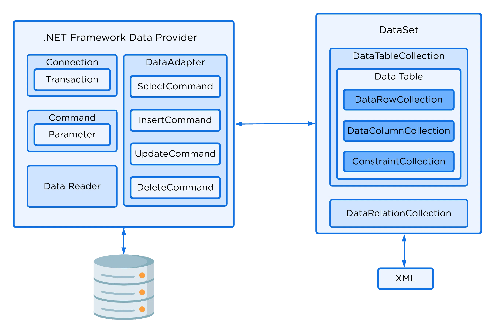

<div align="center">

**ADO.NET Architecture**

</div>


## Data Provider

Data Provider được sử dụng để kết nối đến cơ sở dữ liệu, thực thi các lệnh và truy vấn dữ liệu. Nó cung cấp các lớp như Connection, Command, DataReader và DataAdapter. 
> Mỗi cơ sở dữ liệu khác nhau có 1 Data Provider tương ứng. Ví dụ Data Provider cho Sql Server gồm các lớp SqlConnection, SqlCommand, SqlDataReader và SqlDataAdapter

## Data Providers Objects:
|Object|Description|
|------|-----------|
|Connection|Được sử dụng để khởi tạo kết nối tới nguồn dữ liệu cụ thể|
|Command|Được sử dụng để thực hiện truy vấn|
|DataReader|Được sử dụng để đọc dữ liệu từ nguồn dữ liệu. DbDataReader là lớp cha của tất cả DataReader object.|
|DataAdapter|Điền dữ liệu vào DataSet và cập nhật nguồn dữ liệu. DbDataAdapter là lớp cha của tất cả DataAdapter objects|

```csharp
string connectionString;
try
{
    // Creating Connection  
    using(SqlConnection con = new SqlConnection(connectionString)) 
    {
        // writing sql query  
        SqlCommand command = new SqlCommand("", con);  
        // Opening Connection  
        con.Open();
        
        // read data
        var dataReader = command.ExecuteReader(CommandBehavior.CloseConnection);
        // CommandBehavior.CloseConnection: đóng SqlDataReader sau khi đọc dữ liệu xong
        if (dataReader.HasRows)
        {
            while (dataReader.Read())
            {
                var id = dataReader.GetInt32(0);
                var contactName = dataReader.GetString(1);
                var alias = dataReader.GetString(2);
                Console.WriteLine($"[{id}] {contactName} ({alias})");
            }
        }

    } 
}
catch (Exception e)
{
    Console.WriteLine(e);
}
         
```

> Lưu Connection String vào File app.config:
> ```xml
> <connectionStrings>
>     <add name="ConnectionString"
>          connectionString="data source=.; database=student; integrated security=SSPI"
>          providerName="System.Data.SqlClient" />
> </connectionStrings>
> ```
> Đọc Connection String từ File app.config:
> ```csharp
> using System.Configuration;
> string connectionString = ConfigurationManager.ConnectionStrings["ConnectionString"].ConnectionString;
> ```


## DataSet

DataSet được sử dụng để truy cập dữ liệu từ bất kỳ nguồn dữ liệu nào một cách độc lập. DataSet gồm một hoặc nhiều đối tượng DataTable. 

```csharp
using (SqlConnection con = new SqlConnection(connectionString))  
{  
    SqlDataAdapter dataAdapter = new SqlDataAdapter("select * from student", con);  
    DataSet dataSet = new DataSet();  
    dataAdapter.Fill(dataSet);  
}  
```

> DataAdapter như một cầu nối giữa DataSet và nguồn dữ liệu để truy vấn dữ liệu. Nó được sử dụng để điền dữ liệu vào DataSet và cập nhật nguồn dữ liệu.


## Data Table

DataTable đại diện cho bảng trong cơ sở dữ liệu quan hệ. Nó có thể được sử dụng với DataSet. Khi tạo mới DataTable, nó chưa có cấu trúc bảng. Ta có thể tạo cấu trúc bảng bằng cách thêm các cột và ràng buộc vào bảng. Sau khi xác định cấu trúc bảng, ta có thể thêm các dòng vào bảng.

```csharp
// Creating data table instance
DataTable dataTable = new DataTable("Student");
// Add the DataColumn using all properties
DataColumn Id = new DataColumn("ID");
Id.DataType = typeof(int);
Id.Unique = true;
Id.AllowDBNull = false;
Id.Caption = "Student ID";
dataTable.Columns.Add(Id);
                
// Add the DataColumn few properties
DataColumn Name = new DataColumn("Name");
Name.MaxLength = 50;
Name.AllowDBNull = false;
dataTable.Columns.Add(Name);
                          
// Setting the Primary Key
dataTable.PrimaryKey = new DataColumn[] { Id };
                
// Add New DataRow by creating the DataRow object
DataRow row1 = dataTable.NewRow();
row1["Id"] = 101;
row1["Name"] = "Anurag";
dataTable.Rows.Add(row1);

// Delete a row
foreach (DataRow row in dt.Rows)
{
    if (Convert.ToInt32(row["Id"]) == 2)
    {
        row.Delete();
    }
}
dt.AcceptChanges();
```

```csharp
var dataTable = new DataTable();
using (var connection = new SqlConnection(connectionString)) {
	var command = connection.CreateCommand();
	command.CommandText = "SELECT * FROM CONTACTS";
	var dataAdapter = new SqlDataAdapter(command);
	dataAdapter.Fill(dataTable);
}
foreach (DataRow r in dataTable.Rows) {
	var id = (int)r["Id"];
	var contactName = (string)r["ContactName"];
	var alias = (string)r["Alias"];
}
```

## Data Relation

```cs
// Data Relation
DataTable tblTrinhDo = new DataTable("TrinhDo");
tblTrinhDo.Columns.Add(MaTrinhDo);
DataColumn TenTrinhDo = new DataColumn("TenTrinhDo");
tblTrinhDo.Columns.Add(TenTrinhDo);
tblTrinhDo.PrimaryKey = new DataColumn[] { MaTrinhDo };
```

## Data View

```cs
DataView dataView = dt.DefaultView;
dataView.Sort = "MaNV desc, HoTen";
dataView.RowFilter = "MaNV > 5";

// Insert a row
DataRowView newRow = dataView.AddNew();
newRow["MaNV"] = 40;
newRow["HoTen"] = "Chi Thanh";

// Update a row
foreach (var rowView in dataView)
{
    if (Convert.ToString(rowView["MaNV"] == "3"))
    {
        rowView["HoTen"] = "Ten chinh sua";
    }
}

// Delete a row
foreach (var rowView in dataView)
{
    if (Convert.ToInt32(rowView["MaNV"].ToString()) > 10)
    {
        rowView.Delete();
    }
}
for (int i = 0; i < dataView.Count; i++)
{
    System.Console.WriteLine(dataView[i]["MaNV"] + ": " + dataView[i]["HoTen"]);
}
```

## Stored Procedure
```cs
SqlCommand command = new SqlCommand();  
command.Connection = connection;
command.CommandText = "spGetData";
command.CommandType = CommandType.StoredProcedure;
SqlDataReader dataReader = command.ExecuteReader();

// Input parameters
SqlParameter param = new SqlParameter
{
    ParameterName = "@Id",
    SqlDbType = SqlDbType.Int,
    Value = 101,
    Direction = ParameterDirection.Input // ParameterDirection.Output
};
command.Parameters.Add(param);
```

## Ngăn chặn Sql Injection bằng SqlParameter 

```csharp
// Ở vị trí nào cần tham số thì viết chữ @ trước tên tham số
var query = "INSERT INTO [dbo].[Contacts] ([ContactName] VALUES (@ContactName)";
// Tạo các object SqlParameter để chứa tham số                
// Phần tên tham số của object phải trùng khớp với tên đã sử dụng trong query                
var contactNameParam = new SqlParameter("ContactName", contactName);
var birthDayParam = new SqlParameter() {
	DbType = DbType.Date,
	ParameterName = "DoB",
	Value = DateTime.Now
};
command.CommandText = query;
command.Parameters.Add(contactNameParam);
// Có thể trực tiếp thêm cặp tham số - giá trị mà không cần khai báo object riêng
command.Parameters.AddWithValue("LastName", lastName);

// cách khác
command.Parameters.Add("@ContactName", DbType.String);
command.Parameters["@ContactName"].Value = contactName;
```

# 1. Giới thiệu Entity Framework

## 1.1. Cấu trúc của Entity Framework

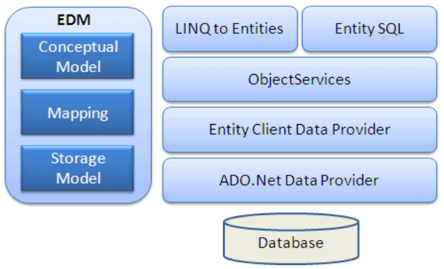

- EDM (Entity Data Model): Để sử dụng Entity Framework, chúng ta phải tạo mô hình dữ liệu khái niệm (Conceptual Data Model) gọi là EDM. EDM gồm ba phần chính:
  - Conceptual Model: chứa các Model Class và những quan hệ của nó. Phần này sẽ độc lập với lược đồ CSDL của bạn.
  - Storage Model: là Database Design Model gồm các bảng, views, stored procedures, những quan hệ của nó và các khóa.
  - Mapping: gồm có thông tìn về cách làm thế nào Conceptual Model nối với Storage Model
- LINQ to Entities: ngôn ngữ truy vấn dùng để viết các truy vấn tới Object Model. Nó trả về các thực thể được định nghĩa trong Conceptual Model.
- Entity SQL: là ngôn ngữ truy vấn khác giống LINQ to Entities.
- Object Service: một điểm vào chính cho việc cho việc truy cập dữ liệu từ CSDL và trả về. Object service có trách nhiệm trong việc cụ thể hóa quá trình chuyển đổi dữ liệu trả về từ một entity client data provider tới một entity object structure.
- Entity Client Data Provider: trách nhiệm chính của lớp này là chuyển đổi L2E hoặc Entity SQL thành truy vấn SQL. Nó giao tiếp với ADO.Net Data Provider, lần lượt gửi và nhận dữ liệu từ CSDL.
- ADO.Net Data Provider: Lớp này giao tiếp với CSDL bằng chuẩn ADO.Net.

## 1.2. Các cách tiếp cận Entity Framework

- Database First: Với phương pháp này, EDM sẽ được tạo từ lược cơ cơ sở dữ liệu. Phương pháp này phù hợp với các ứng dụng sử dụng một cơ sở dữ liệu đã tồn tại trước đó.
- Code First: Đây là phương pháp trong đó tất cả các Domain Model được viết dưới dạng các lớp. Những lớp này sẽ tạo nên EDM. Cơ sở dữ liệu sẽ được tạo từ những Model này. Phương pháp này phù hợp với các ứng dụng có các Domain Model Class được tạo trước.
- Model First: Phương pháp này rất giống với phương pháp Code First, nhưng chúng ta sử dụng Visual Entity Designer để thiết kế Model. Cơ sở dữ liệu và các lớp sẽ được tạo ra bởi mô hình khái niệm này.


# 2. Database First - Quản lí Enity Relationships

## 2.1. One-to-many Relationship

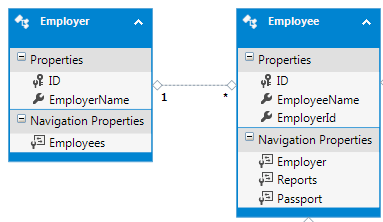

Chúng ta có thể thấy rằng Entity Framework đã tạo ra các Navigation Property trong các thực thể. Thực thể ở phía một của mối quan hệ sẽ có một Navigation Property thuộc kiểu Collection để chứa nhiều thực thể ở phía nhiều. Tương tự, thực thể ở phía nhiều của mối quan hệ sẽ có một Navigation Property cho phép truy cập vào thực thể liên quan đến nó ở phía một.

## 2.2. One-to-one Relationship

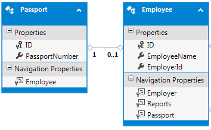

## 2.3. Many-to-many Relationship

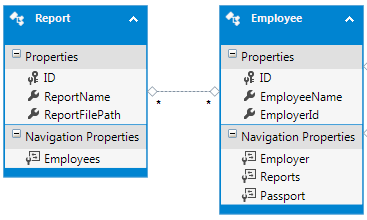

Entity Framework có khả năng nhận biết mối quan hệ many-to-many và loại bỏ bảng liên kết khi bảng liên kết chỉ có các cột khóa chính cho cả hai bảng.

Nếu chúng ta có các cột khác trong bảng liên kết, thì Entity Framework sẽ không thể nhận biết được mối quan hệ many-to-many và nó sẽ tạo tất cả các thực thể như bình thường. Do đó, chúng ta phải tự thực hiện việc kết nối các thực thể trong truy vấn đối tượng của chúng ta để đạt được kết quả mong muốn.


# 3. Database First - Model Validations

Có 2 cách để thực hiện model validations trong Entity Framework:
- Sử dụng partial class methods
- Sử dụng data annotations

## 3.1. Sử dụng partial class methods

```csharp
partial class Contact
{
    public string FirstName { get; set; }
    private string m_LastName;
    public string LastName
    {
        get
        {
            return m_LastName;
        }
        set
        {
            OnLastNameChanging(value);
            m_LastName = value;
        }
    }
    partial void OnLastNameChanging(string newValue);
}
```

Nếu chúng ta không cung cấp định nghĩa cho partial method trong bất kỳ partial class nào, the function call sẽ bị bỏ qua. Tuy nhiên, nếu chúng ta định nghĩa của partial method, nó sẽ được gọi mỗi khi method được gọi.


```csharp
partial class Contact
{
    public DateTime DateOfBirth { get; set; }
    partial void OnLastNameChanging(string newValue)
    {
        if (newValue.Length > 50)
        {
            throw new Exception("LastName - length exceeded");
        }
    }
}
```

> OnPropertyChanging sẽ được gọi trước khi giá trị của thuộc tính thay đổi. Điều này cho phép chúng ta có khả năng kiểm tra giá trị đề xuất trước khi nó được gán.

> OnPropertyChanged sẽ được gọi sau khi giá trị của thuộc tính đã thay đổi. Điều này hữu ích khi chúng ta cần thực hiện một số hành động sau khi thuộc tính của một thực thể đã thay đổi.


```csharp
partial class Person
{
    partial void OnEmailIDChanging(string value)
    {
        bool isEmail = Regex.IsMatch(value, @"^\w+@[a-zA-Z_]+?\.[a-zA-Z]{2,3}$", RegexOptions.IgnoreCase);
        if (isEmail == false)
        {
            throw new InvalidArgumentException("Invalid email address");
        }
    }
}
```

> Entity Framework will call this function whenever a new value is set for the EmailID property

Nếu không muốn ném ra exception trong trường hợp dữ liệu không hợp lệ, chúng ta sử dụng một method khác để thông báo về lỗi cho ứng dụng bằng cách implement **IValidatableObject** trong partial class

```csharp
partial class Person : IValidatableObject
{
    List<ValidationResult> validationErrors = new List<ValidationResult>();
    public IEnumerable<ValidationResult> Validate(ValidationContext validationContext)
    {
        return validationErrors;
    }

    partial void OnEmailIDChanging(string value)
    {
        validationErrors.Clear();
        bool isEmail = Regex.IsMatch(value, @"^\w+@[a-zA-Z_]+?\.[a-zA-Z]{2,3}$", RegexOptions.IgnoreCase);
        if (isEmail == false)
        {
            ValidationResult vResult = new ValidationResult("Invalid email address", new string[] { "EmailID" });
            validationErrors.Add(vResult);
        }
    }
}
```

> Validate method sẽ được gọi khi chúng ta gọi SaveChanges method trong DbContext class

## 3.2. Sử dụng Data Annotations

```csharp
[MetadataType(typeof(PersonMetaData))]
partial class Person
{

}

// all the data annotation attributes will be defined in here
class PersonMetaData
{
    [Required(ErrorMessage = "Phone number is required")]
    [StringLength(15, ErrorMessage = "Phone number length should be less than 15")]
    [RegularExpression(@"^[0-9]{0,15}$", ErrorMessage = "Phone Number should contain only numbers")]
    public string PhoneNumber { get; set; }

    [Required(ErrorMessage = "Email ID is required")]
    [StringLength(35, ErrorMessage = "eMail Length should be less than 35")]
    [RegularExpression(@"^\w+@[a-zA-Z_]+?\.[a-zA-Z]{2,3}$", ErrorMessage = "E Mail is not in proper format")]
    public string Email { get; set; }
}
```

### Trigger validations in non-data binding environments

#### Trường hợp 1: The data annotation attributes are in the entity class itself (Code First approach)

```csharp
Person person = new Person();
ValidationContext context = new ValidationContext(person);
List<ValidationResult> results = new List<ValidationResult>();
bool isValid = Validator.TryValidateObject(person, context, results); // return true if the validation is successful
// In case the validation fails, the validation errors will be found in the collection of ValidationResult
```

#### Trường hợp 2: The data annotation attributes are in another class associated with the entity class via the MetaDataType attribute

Chỉ cho TypeDescriptor biết class nào chứa data annotation attributes

```csharp
var descProvidor = new AssociatedMetadataTypeTypeDescriptionProvider(typeof(Person), typeof(PersonMetaData));
TypeDescriptor.AddProviderTransparent(descProvidor, typeof(Person));
```

### Implementing custom data annotation attribute

```csharp
public class UniqueEmailAttribute : ValidationAttribute
{
    protected override ValidationResult IsValid(object value, ValidationContext validationContext)
    {
        string email = value as string;
        if (email != null)
        {
            using (SampleDbEntities db = new SampleDbEntities())
            {
                var personWithEmailFound = db.People.Any(item => item.Email == email);
                if (personWithEmailFound == true)
                {
                    return new ValidationResult(this.ErrorMessage);
                }
            }
        }
        return ValidationResult.Success;
    }
}
```

> Lưu ý: Khi thực thể đang được cập nhật cũng có thể chứa email đang được kiểm tra, điều này có thể dẫn đến việc kiểm tra sai.
Để khắc phục tình huống trên, chúng ta cần phải kiểm tra và loại trừ thực thể đang được cập nhật khỏi quá trình kiểm tra xem email đã tồn tại hay chưa.
> ```csharp
> Person person = validationContext.ObjectInstance as Person;
> var personWithEmailFound = db.People.Any(item => item.Email == email && item.ID != person.ID);
> ```

# 4. Database First - Inheritance Relationships between Entities

Entity Framework cung cấp 3 cách để mô hình hóa miền đối tượng sử dụng quan hệ kế thừa:
- The Table per Type (TPT) inheritance
- The Table per Class Hierarchy (TPH) inheritance
- The Table per Concrete Class (TPC) inheritance

## 4.1. The Table per Type (TPT) inheritance 

> Mô hình thừa kế Table per Type (TPT) hữu ích khi cơ sở dữ liệu của chúng ta có các bảng liên quan đến nhau bằng mối quan hệ one-to-one. Mối quan hệ này được duy trì trong cơ sở dữ liệu bằng cách sử dụng khóa chính chung.

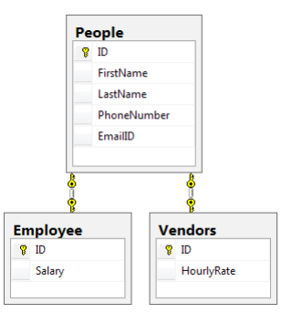

<details>
<summary>Để triển khai TPT inheritance, chúng ta cần làm những bước sau:</summary>

**1. Khởi tạo Entity Data Model mặc định**

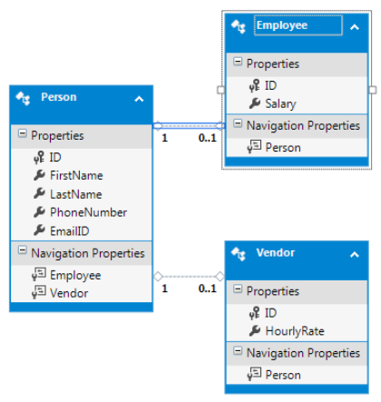

**2. Xóa relationships mặc định**

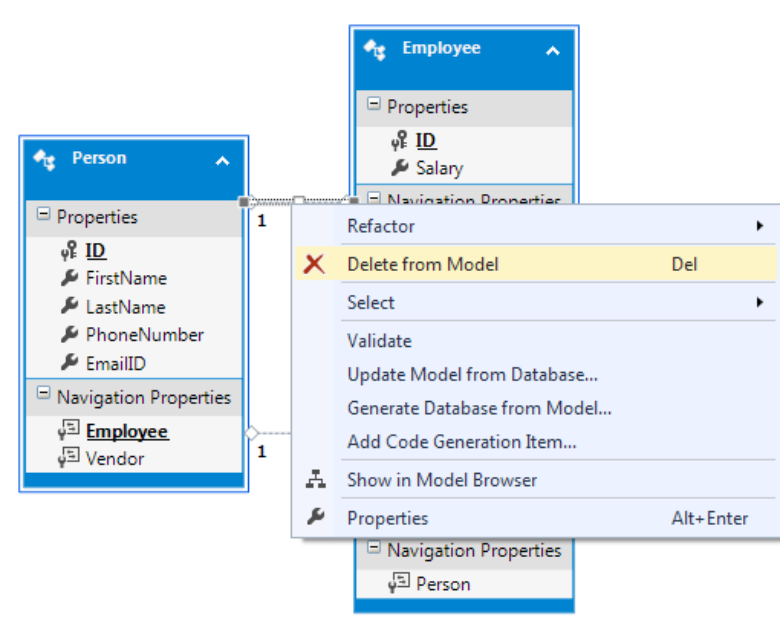

**3. Thêm inheritance relationship giữa các entity**

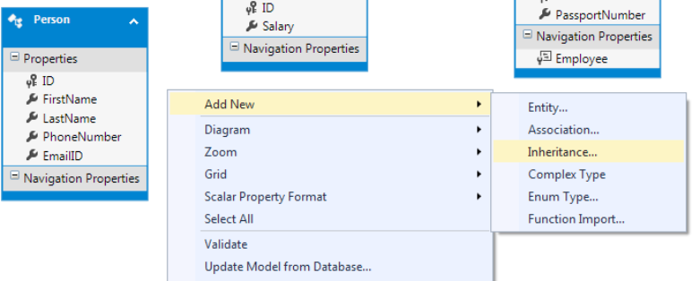
</details>

## 4.2. The Table per Class Hierarchy (TPH) inheritance

> Thừa kế Table per Class Hierarchy (TPH) được mô hình hóa bằng cách sử dụng một bảng cơ sở dữ liệu duy nhất cho tất cả các lớp thực thể trong cấu trúc thừa kế. Thừa kế TPH hữu ích trong các trường hợp mà tất cả thông tin về các thực thể liên quan được lưu trữ trong một bảng duy nhất.

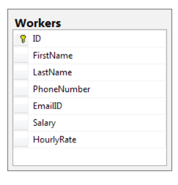

<details>
<summary>Để triển khai TPH inheritance, chúng ta cần làm những bước sau:</summary>

**1. Khởi tạo Entity Data Model mặc định**

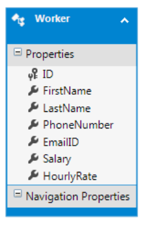

**2. Thêm Concrete Classes vào Entity Data Model**

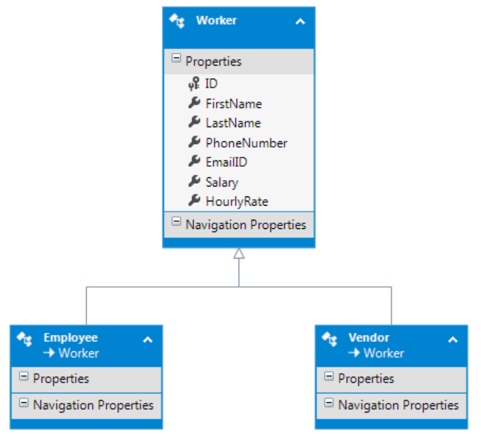


__Xóa các thuộc tính trong Base Class và thêm vào Concrete Class__


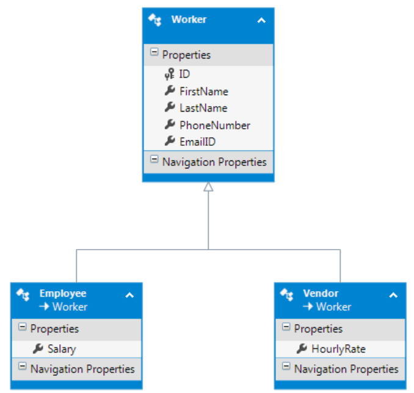

**3. Ánh xạ thuộc tính của các Concrete Class vào bảng và cột tương ứng**
Khi thuộc tính Salary của thực thể Employee là Not Null và thuộc tính HourlyRate là Null, thì thực thể Employee nên lưu giá trị của thuộc tính Salary vào cột Salary của bảng Workers.
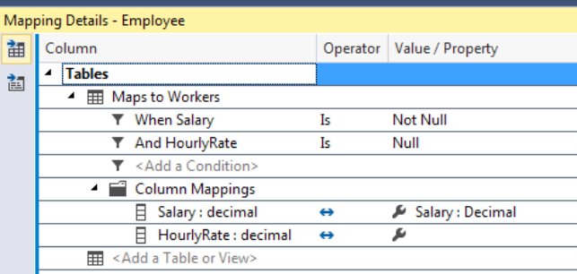

Đánh dấu thuộc tính Salary là "Nullable=false"
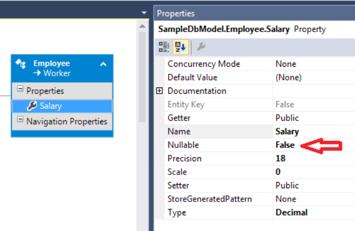

**4. Đặt Base Class là Abstract**

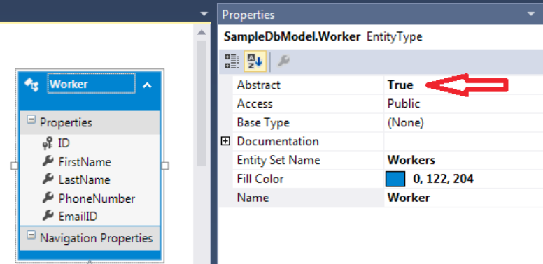
</details>

## 4.3. The Table per Concrete Class (TPC) inheritance

> Mô hình thừa kế Table per Concrete Class (TPC) có thể được sử dụng khi cơ sở dữ liệu chứa các bảng riêng biệt cho tất cả các thực thể và những bảng này có một số trường chung.

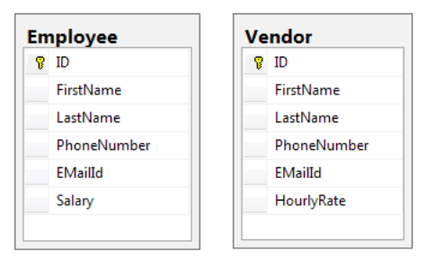

<details>
<summary>Để triển khai TPC inheritance, chúng ta cần làm những bước sau:</summary>

**1. Khởi tạo Entity Data Model mặc định**

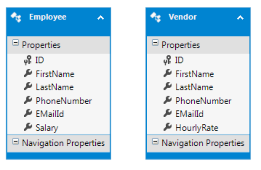

**2. Tạo Abstract Class**

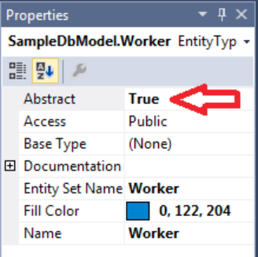

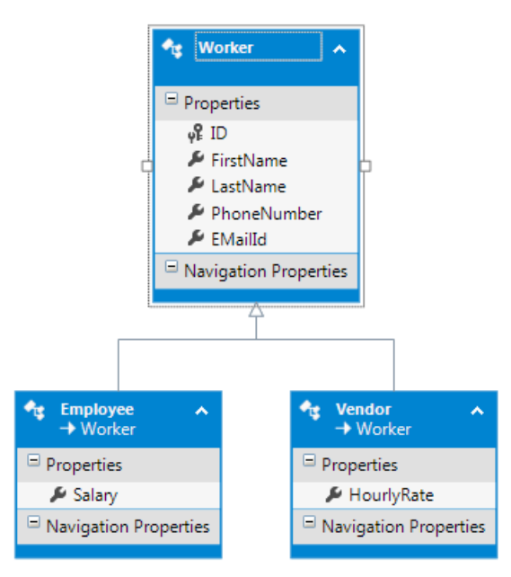

**3. Chỉnh sửa CDSL để đáp ứng sự thay đổi.**

Thay đổi SSDL để Entity Framework biết lớp Worker có khả năng lưu trữ dữ liệu trong hai bảng.

```csharp
<EntityContainer Name="todoDbModelStoreContainer">
    <EntitySet Name="Employee" EntityType="Self.Employee" Schema="dbo" store:Type="Tables" />
    <EntitySet Name="Vendor" EntityType="Self.Vendor" Schema="dbo" store:Type="Tables" />
</EntityContainer>
```

**4. Chỉ định ánh xạ để triển khai TPT inheritance**

Chúng ta cần thay đổi MSL để ánh xạ đúng thuộc tính vào các bảng tương ứng dựa trên kiểu thực sự của đối tượng.

Chúng ta đã chỉ định rằng nếu kiểu thực sự của đối tượng là Vendor, thì các thuộc tính sẽ được ánh xạ vào các cột trong bảng Vendor, và nếu loại thực sự của thực thể là Employee, các thuộc tính sẽ được ánh xạ vào bảng Employee.

```csharp
<EntityContainerMapping StorageEntityContainer="todoDbModelStoreContainer" CdmEntityContainer="SampleDbEntities">
    <EntitySetMapping Name="Workers">
    <EntityTypeMapping TypeName="IsTypeOf(SampleDbModel.Vendor)">
        <MappingFragment StoreEntitySet="Vendor">
        <ScalarProperty Name="HourlyRate" ColumnName="HourlyRate" />
        <ScalarProperty Name="EMailId" ColumnName="EMailId" />
        <ScalarProperty Name="PhoneNumber" ColumnName="PhoneNumber" />
        <ScalarProperty Name="LastName" ColumnName="LastName" />
        <ScalarProperty Name="FirstName" ColumnName="FirstName" />
        <ScalarProperty Name="ID" ColumnName="ID" />
        </MappingFragment>
    </EntityTypeMapping>
    <EntityTypeMapping TypeName="IsTypeOf(SampleDbModel.Employee)">
        <MappingFragment StoreEntitySet="Employee">
        <ScalarProperty Name="ID" ColumnName="ID" />
        <ScalarProperty Name="Salary" ColumnName="Salary" />
        <ScalarProperty Name="EMailId" ColumnName="EMailId" />
        <ScalarProperty Name="PhoneNumber" ColumnName="PhoneNumber" />
        <ScalarProperty Name="LastName" ColumnName="LastName" />
        <ScalarProperty Name="FirstName" ColumnName="FirstName" />
        </MappingFragment>
    </EntityTypeMapping>
    </EntitySetMapping>
</EntityContainerMapping>
```

</details>

## 4.4. Choosing the inheritance strategy

- TPT là lựa chọn tốt nhất nếu chúng ta có rất nhiều thuộc tính chung có thể nằm trong một lớp cơ sở và rất nhiều thuộc tính riêng cho các lớp con.

- TPH thường dẫn đến việc chúng ta có các bảng không chuẩn hóa và có các cột lặp lại. Chúng ta chỉ nên sử dụng nó khi số lượng thuộc tính trong các lớp con là rất ít, để số lượng cột lặp lại cũng ít đi.

- Chúng ta có thể sử dụng TPC nếu chúng ta có rất nhiều thuộc tính riêng trong các lớp con và chỉ có một số ít thuộc tính chung. Tuy nhiên, chúng ta sẽ có một số thuộc tính bị lặp lại trong tất cả các bảng. Ngoài ra, cách tiếp cận này có một số hạn chế như chúng ta không thể sử dụng cột tự động tăng trong cơ sở dữ liệu.

# 5. Database First - Views, Stored Procedures và Functions

## 5.1. Views

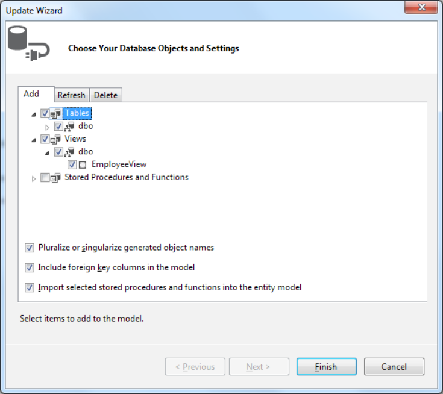

## 5.2. Stored Procedures

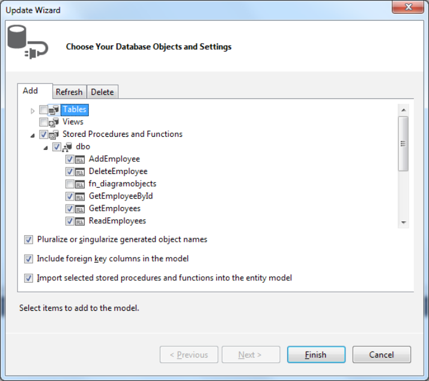

Có 2 cách dùng Stored Procedures:
- Chỉ ra những Procedures cần sử dụng và ánh xạ thuộc tính của thực thể với tham số của Procedure

<details>
<summary><b>Xem chi tiết</b></summary>

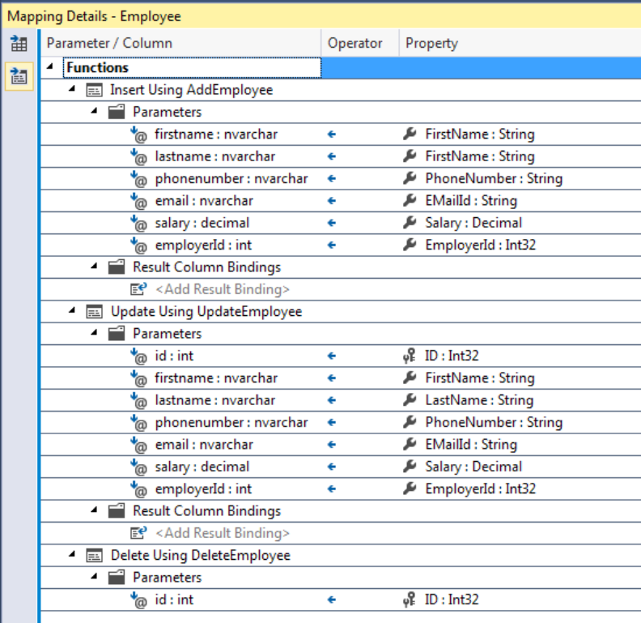

```csharp
using (SampleDbEntities db = new SampleDbEntities())
{
    Employee employee = new Employee();
    employee.FirstName = "test Employee";
    employee.LastName = "test lastname";
    employee.PhoneNumber = "1234567890";
    employee.EMailId = "test@test.com";
    employee.Salary = 50000;
    db.Employees.Add(employee);
    db.SaveChanges();
}
```

Khi đối tượng Employee này được thêm vào bằng cách sử dụng DbContext, Entity Framework sẽ sử dụng các ánh xạ để dùng Stored Procedure cần được sử dụng để chèn dữ liệu và ánh xạ các thuộc tính của đối tượng vào các tham số trong Procedure. Việc lưu các thay đổi sẽ thực hiện Stored Procedure đó với các giá trị tham số được cung cấp.

</details>

- Chúng ta có một Stored Procedure không thực hiện việc chèn, cập nhật hoặc xóa một thực thể, mà thay vào đó cung cấp một custom logic. Đối với trường hợp này, chúng ta có thể thực thi trực tiếp Stored Procedure bằng cách sử dụng đối tượng DbContext.

<details>
<summary><b>Xem chi tiết</b></summary>

Mở EDMX và nhấp chuột phải chọn Properties ở Procedure muốn sử dụng:

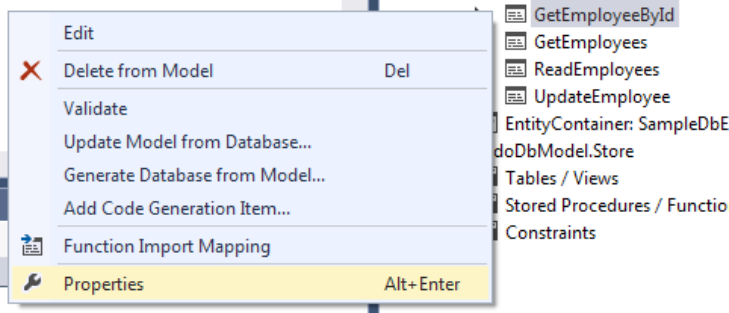

Chọn return type cho Procedure

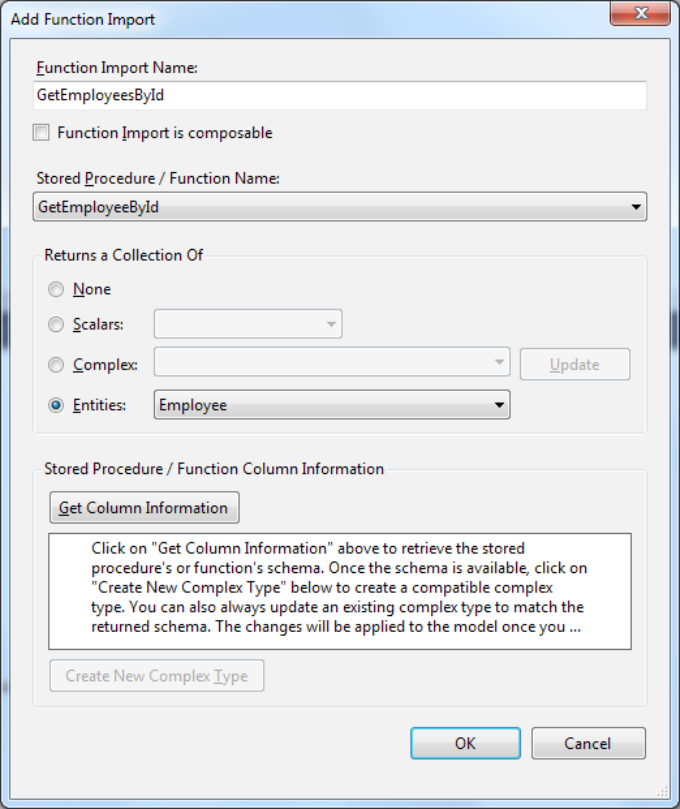

Stored Procedure sẽ như một hàm trên đối tượng DbContext, trả về ObjectResult<Employee>. Để thực thi Stored Procedure này, chỉ cần gọi hàm tương ứng với các tham số cần thiết.

```csharp
using (SampleDbEntities db = new SampleDbEntities())
{
    int id = 1;
    ObjectResult<Employee> employeeResult = db.GetEmployeeById(id);
}
```

> Nếu Stored Procedure trả về dữ liệu không phải là một thực thể trong mô hình dữ liệu khái niệm (CDM) thì cần tạo một kiểu phức tạp để chứa giá trị trả về.

</details>

## 5.3. Functions
### 5.3.1. Scalar Functions

Nếu muốn sử dụng scalar function, cần bọc chúng trong 1 Stored Procedure:

```sql
Create PROCEDURE dbo.sp_GetEmployerIdByEmployee @id int
AS
select dbo.GetEmployerIdForEmployee(@id);
RETURN
```

Stored Procedure này sẽ được thêm vào EDM như bình thường.
Return Type của Stored Procedure này phải giống Scalar Type của Function

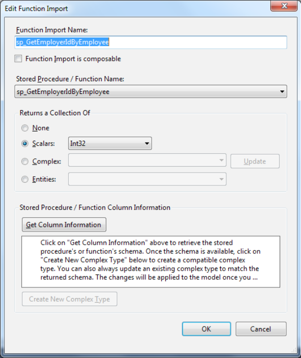

### 5.3.1. Table Valued Functions

<details>
<summary>Xem Function</summary>

```sql
Create FUNCTION dbo.GetEmployeeFromEmployerID(@id int)
RETURNS @table_variable TABLE (ID int, EmployeeName nvarchar(200), EmployerName nvarchar(200))
AS
    BEGIN
        INSERT INTO @table_variable
        SELECT
            employee.ID,
            employee.FirstName, Employer.EmployerName
        FROM
            Employee employee,
            Employer employer
            where
            employee.EmployerID = employer.ID
            and employer.ID = @id;
        RETURN;
    END
```

</details>


Return Type khớp với 1 Complex Type


Sử dụng giống như Stored Procedure:
```csharp
using (SampleDbEntities db = new SampleDbEntities())
{
    int id = 1;
    IQueryable<GetEmployeeFromEmployerID_Result> employerIdResult = db.GetEmployeeFromEmployerID(id);
}
```

# 6. Querying the Entity Data Model - LINQ to Entities

Cơ chế hoạt động:
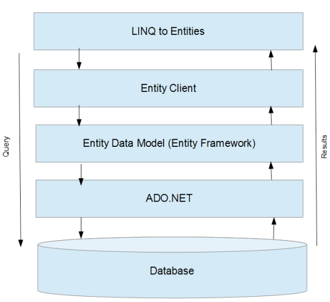


## 6.1. DbContext API

> - Lớp DbContext biểu diễn một phiên làm việc với cơ sở dữ liệu, cung cấp khả năng truy vấn, theo dõi object và lưu dữ liệu. Lớp này bộc lộ một phần tính năng cũng như đơn giản hóa cách sử dụng một số tính năng thông dụng của ObjectContext.
> - Lớp DbSet cung cấp các phép toán hoạt động trên các kiểu entity (Add, Remove, Attach, ...). DbSet kế thừa từ DbQuery để cung cấp thêm khả năng viết truy vấn trên tập hợp entity. DbSset bộc lộ và dơn giản hóa một số tính năng thông dụng của ObjectSet.
> - Lớp DbQuery cung cấp khả năng viết truy vấn trên tập hợp Entity. Đây là lớp cha của DbSet, và các tính năng của nó đã bộc lộ qua DbSet. Do đó, bạn không cần làm việc trực tiếp với DbQuery.
> - Change Tracking API: cho phép truy xuất tới các thông tin và phép toán của hệ thống theo dõi object do context quản lý. Ví dụ, khi object thay đổi giá trị, bạn có thể truy xuất giá trị gốc của nó hoặc giá trị hiện tại. Đây là tính năng đơn giản hóa của ObjectContext.ObjectStateManager.
> - Validation API: cung cấp khả năng kiểm tra dữ liệu tự động. Validation API khai thác tính năng kiểm tra dữ liệu của .NET 4. Đây là một tính năng riêng của DbContext API.
> - Code First Model Building: có khả năng đọc các class và file cấu hình để tạo model class, metadata và cơ sở dữ liệu. Đây cũng là tính năng riêng của DbContext API.

**Vai trò của DbContext**

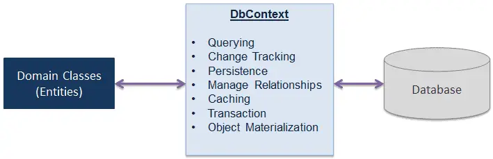

**Phương thức và thuộc tính của DbContext**

- Entry(): Lấy thông tin của entity để truy xuất các thông tin liên quan đến sự thay đổi của entity, hoặc thực hiện các thao tác đối với entity.
- SaveChanges(): Tạo và thực thi các truy vấn INSERT, UPDATE và DELETE đối với các entity có trạng thái tương ứng (Added, Modified, Deleted).
- Set(): Tạo object của DbSet<Tentity> dùng để truy vấn và lưu các biến của Tentity.
- OnModelCreating(): Phương thức virtual cho phép bạn ghi đè trong lớp context để thực hiện cấu hình cho cơ sở dữ liệu sử dụng fluent API.
- ChangeTracker: Property này cho phép truy xuất tới Change Tracker API, tức là truy xuất tới thông tin và hoạt động của các entity đang được context này theo dõi.
- Configuration: Truy xuất tới các thông tin cấu hình.
- Database: Truy xuất tới các thông tin và hoạt động của cơ sở dữ liệu.

**Lớp DbSet**

- Add(): Thêm entity object mới vào danh sách.
- AsNoTracking(): Đây là phương thức kế thừa từ DbQuery, trả về một danh sách entity nhưng các entity trong đó không được cached và track bởi context. Sử dụng phương thức này nếu cần các entity chỉ đọc để tăng hiệu suất truy vấn.
- Attach(): Gắn một entity đã có vào tập hợp. Nhiệm vụ của Attach đơn giản là báo cho Entity Framework biết rằng đây là một entity đã có sẵn, thay vì phải tải nó từ CSDL.
- Create(): Tạo một entity mới nhưng không được thêm vào danh sách quản lý của DbSet.
- Find(): Tìm một entity đang được theo dõi trong context.
- Include(): Yêu cầu tải thêm các entity có quan hệ (1-n, n-n, 1-1).
- Remove(): Đánh dấu xóa entity
- SqlQuery(): Chạy SQL

## 6.2. Querying data using LINQ to Entities

>  If we use IEnumerable, the query will be executed immediately. If we use IQueryable, the query execution will be deferred until the application requests the enumeration.
> Using IQueryable gives you a chance to create a complex LINQ query using multiple statements without executing the query at the database level. The query gets executed only when the final LINQ query gets enumerated

```csharp
using (SampleDatabaseEntities db = new SampleDatabaseEntities())
{
    // Query Syntax
    var employees = from employer in db.Employers
    where employer.ID == 4
    select employer.Employees;

    // Method Syntax
    var employees = db.Employers.Where(employer => employer.ID == 4).Select(employer => employer.Employees);
}
```

## 6.3. Filtering data 

```csharp
using (SampleDatabaseEntities db = new SampleDatabaseEntities())
{
    // Query Syntax
    var employees = from employee in db.Employees
    where employee.ID > 100 && employee.ID < 500
    select employee;

    // Method Syntax
    var employees = db.Employees.Where(employee => employee.ID > 100 && employee.ID < 500);
}
```
## 6.4. Projections

```csharp
using (SampleDatabaseEntities db = new SampleDatabaseEntities())
{
    // Query Syntax
    var employers = from employer in db.Employers
    select new
    {   
        EmployerName = employer.EmployerName,
        EmployeeList = employer.Employees
    };

    // Method Syntax
    var employeeList = db.Employers.Select(employer =>
        new 
        {
            EmployerName = employer.EmployerName,
            EmployeeList = employer.Employees
        }
    );
}

```

## 6.5. Grouping

```csharp
using (SampleDatabaseEntities db = new SampleDatabaseEntities())
{
    // Nhóm theo Employer_ID

    // Query Syntax
    var result = from employee in db.Employees 
    group employee by employee.Employer_ID
    into employeeGroup
    select new
    {
        EmployerID = employeeGroup.Key,
        EmployeeEntity = employeeGroup
    };

    // Method Syntax
    var result = db.Employees.GroupBy(employee => employee.Employer_ID)
            .Select(employeeGroup =>
            new
            {
                EmployerID = employeeGroup.Key,
                EmployeeEntity = employeeGroup
            }
    );
}

```

## 6.6. Ordering

```csharp
using (SampleDatabaseEntities db = new SampleDatabaseEntities())
{
    
    // Query Syntax
    var employees = from employee in db.Employees
    orderby employee.ID descending
    select employee;
    // Method Syntax
    var employees = db.Employees.OrderBy(employee => employee.ID);
    var employees = db.Employees.OrderByDescending(employee => employee.ID);
}

```

## 6.7. Aggregate operators

> Tất cả Aggregate functions chỉ có method syntax
```csharp
using (SampleDatabaseEntities db = new SampleDatabaseEntities())
{
    // Count
    int numberEmployees = (from employee in db.Employees
    where employee.Employer_ID == 4
    select employee).Count();

    // Sum
    int sumOfSalaries = db.Employees
                    .Where(employee => employee.Employer_ID == 4)
                    .Select(employee => employee.Salary)
                    .Sum();   
    

    // Min, Max, Average
}

```

## 6.8. Skip và Take

```csharp
using (SampleDatabaseEntities db = new SampleDatabaseEntities())
{
    // Skip: bỏ 1 vài bản ghi đầu từ kết quả
    var employees = db.Employees
                .OrderBy(employee => employee.ID)
                .Skip(10);

    // Take: giới hạn số bản ghi nhận được từ kết quả
    var employees = db.Employees
                .OrderBy(employee => employee.ID)
                .Take(10);

}

```

## 6.9. Join

> join và GroupJoin tương đương với LEFT OUTER JOIN trong SQL

```csharp
using (SampleDatabaseEntities db = new SampleDatabaseEntities())
{
    // Query Syntax
    var employersList = from employer in db.Employers
    join
    employee in db.Employees
    on
    employer.ID equals employee.Employer_ID into employeeGroup
    select new
    {
        EmployerName = employer.EmployerName,
        EmployeesList = employeeGroup
    };

    // Method Syntax
    var employersList = db.Employers.GroupJoin(
            db.Employees,
            employer => (Int32?)(employer.ID), 
            employee => employee.Employer_ID, 
            (employer, employeeGroup) => new {
                                    EmployerName = employer.EmployerName,
                                    EmployeesList = employeeGroup
                                }                          
    );    
}

```

## 6.10. Tìm kiếm

```csharp
using (SampleDatabaseEntities db = new SampleDatabaseEntities())
{
    // Method Syntax
    // Ném ra Exception nếu trả ra nhiều hơn 1 kết quả, 
    // Nếu không có kết quả, Single() ném ra Exception, còn SingleOrDefault() trả về null
    var employee = db.Employees.Where(employee => employee.ID == 100).Single();  

    // Tương tự Single() và SingleOrDefault(), tuy nhiên không ném Exception
    // nếu trả ra nhiều hơn 1 kết quả mà lấy ra kết quả đầu tiên
    var employee = db.Employees.Where(employee => employee.ID == 100).First(); 

    // Find tìm kiếm trong những object đã tải từ cơ sở dữ liệu 
    // hoặc những object đã gắn với context (nhưng chưa lưu vào cơ sở dữ liệu).
    // Nếu object chưa tải vào bộ nhớ, Find tìm kiếm trong cơ sở dữ liệu.
    // Chỉ truyền key cho Find
    var employee = db.Employees.Find(100); 
}
```

## 6.11. Local Data

> Trong mô hình lưu trữ dữ liệu cục bộ, dữ liệu tải từ bất kỳ truy vấn LINQ to Entities nào sẽ được lưu lại trong chương trình. Bạn có thể truy vấn trực tiếp các object này mà không cần tương tác với cơ sở dữ liệu.

> Context sẽ theo dõi tất cả các object (thêm mới, cập nhật, xóa). Kết quả các truy vấn dữ liệu cục bộ sẽ bao gồm cả các object cũ và object mới.

> Local data được lưu ở dạng ObservableCollection.

> Ngoài ra khi sử dụng Local Data bạn có thể tự mình theo dõi sự biến đổi của object thông qua các thông tin theo dõi (tracking) của context. Nó rất có ích nếu bạn cần thực hiện các thao tác khôi phục dữ liệu.

> Dữ liệu trong Local chỉ xuất hiện khi truy vấn được thực thi trên cơ sở dữ liệu. Do cơ chế deferred execution, nếu bạn không duyệt qua dữ liệu thì Local vẫn trống rỗng.

```csharp
using (SampleDatabaseEntities db = new SampleDatabaseEntities())
{
    var count = db.Employees.Local.Count;
}
```

#### Chủ động load data

```csharp
using (SampleDatabaseEntities db = new SampleDatabaseEntities())
{
    var result = db.Employees.Where(e => e.EmployeeID > 10);
    result.Load();
    var count = db.Employees.Local.Count;
}
```

## 6.12. Lazy Loading và Eager Loading

> **Lazy Loading** là cơ chế tải dữ liệu quan hệ tự động khi truy xuất đến các object có quan hệ

> **Lazy Loading** là quá trình mà không có thực thể nào liên quan đến truy vấn LINQ được tải từ cơ sở dữ liệu cho đến khi kết quả của truy vấn được liệt kê (foreach hoặc ToList())

> Nếu thực thể đã tải (T1) chứa Nativation Property của các thực thể khác (T2), thì các thực thể này (T2) sẽ không được tải cho đến khi Nativation Property được truy cập.

Bật/Tắt Lazy Loading khi dùng DB First hoặc Model First:

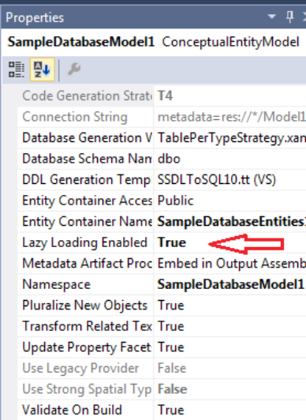

> Khi dùng Code First, Lazy Loading phụ thuộc vào Nativation Property. Nếu Nativation Property là virtual, thì Lazy Loading sẽ được bật, và ngược lại.
> Tắt Lazy Loading cho tất cả các thực thể
> ```csharp
> public partial class SampleDatabaseEntities : DbContext
> {
>     public SampleDatabaseEntities()
>     {
>         this.Configuration.LazyLoadingEnabled = false;
>     }
>     public DbSet<Employee> Employees { get; set; }
>     public DbSet<Employer> Employers { get; set; }
> }
> ```

> **Eager Loading** là quá trình cho phép chúng ta tải thực thể liên quan cùng với thực thể chính trong câu truy vấn. Để cài đặt Eager Loading cần sử dụng từ khóa "Include".
> ```csharp
> using System.Data.Entity;
> using (SampleDatabaseEntities db = new SampleDatabaseEntities())
> {
>     List<Employee> employeeList = db.Employees
>                               .Include(e => e.Employer); // hoặc Include("Employer")
>     // có thể tải nhiều Navigation Property cùng 1 lúc bằng cách nối đuôi Include()
>   
>     // Eager Loading qua nhiều cấp
>     var employeeList = db.Employees.Include(e => e.Employer.Company);
> }
> ```


### Explicit Loading

```csharp
this.Configuration.LazyLoadingEnabled = false;
var entry = context.Entry(db.Employee.FirstOrDefault(e => e.EmployeeID == 2));
entry.Collection("Companies").Load(); // dữ liệu là danh sách
entry.Reference(e => e.Employer).Load(); // dữ liệu là 1 object
// kiểm tra dữ liệu đã được load chưa
entry.Collection(e => e.Companies).IsLoaded
```

```csharp
var entry = context.Entry(course);
var query = entry.Collection(c => c.Students).Query();
var gryffindor = query.Where(s => s.Group == "Gryffindor");
gryffindor.Load();
```

> Phương thức Query giúp bạn thu được một truy vấn nhưng chỉ tác động trên collection navigation property của object chính. Từ đây bạn có thể viết thêm bất kỳ truy vấn LINQ to Entities để lọc lấy những object cần thiết. Phương thức Load giúp bạn chủ động yêu cầu tải dữ liệu.

> Một tình huống khác bạn có thể gặp là khi bạn chỉ muốn lấy một số thông tin thống kê từ danh sách object có quan hệ. Ví dụ, bạn chỉ muốn biết có bao nhiêu sinh viên tham gia vào khóa học chứ không cần toàn bộ danh sách sinh viên.
```csharp
static void ExplicitLoadingCollectionAggregation(UniversityContext context)
{
    context.Configuration.LazyLoadingEnabled = false;
    var course = context.Courses.FirstOrDefault(c => c.Name.Contains("Magic"));
    var entry = context.Entry(course);
    var query = entry.Collection(c => c.Students).Query();
    var count = query.Count();            
    ForegroundColor = ConsoleColor.Green;
    Write($"Course name: {course.Name.ToUpper()}");
    ForegroundColor = ConsoleColor.Yellow;
    WriteLine($" ({count} students enrolled)");
}
```

## 6.13. Cập nhật dữ liệu

### 6.13.1. Thêm bản ghi

> Nếu đối tượng thêm vào đã tồn tại trong cơ sở dữ liệu, chỉ giá trị Id được cập nhật trong bản ghi đó. Nếu bản ghi không tồn tại, một bản ghi mới sẽ được tạo ra.

### 6.13.2. Xóa bản ghi

#### Sử dụng Stub

> Stub là một object đại diện cho object thực (trong cơ sở dữ liệu) cần xóa nhưng không chứa đầy đủ thông tin của object thực. Stub chỉ yêu cầu duy nhất giá trị Id của object thực cần xóa.

```csharp
static void DeletingStub(UniversityContext context)
{
    var stub = new Course { Id = 20 };
    context.Courses.Attach(stub);
    context.Courses.Remove(stub);
    context.SaveChanges();
}
```

# 6.14. DbEntityEntry

```csharp
using (var dbCtx = new SchoolDBEntities())
{
    var student = dbCtx.Students.Find(1);
    student.StudentName = "Edited name";
    var entry = dbCtx.Entry(student);

    Console.WriteLine("Entity Name: {0}", entry.Entity.GetType().FullName); // Entity Name: Student

    Console.WriteLine("Entity State: {0}", entry.State ); // Entity State: Modified

    foreach (var propertyName in entry.CurrentValues.PropertyNames )
    {
        Console.WriteLine($"Property Name: {propertyName}"); // Property Name: StudentName
        var orgVal = entry.OriginalValues[propertyName];
        Console.WriteLine($"Original Value: {orgVal}"); // Original Value: First Student Name
        var curVal = entry.CurrentValues[propertyName];
        Console.WriteLine($"Current Value: {curVal}"); // Current Value: Edited name
    }

}
```

**Một số phương thức quan trọng**

- Collection(): Lấy ra một đối tượng đại diện cho Natigation Property Collection
- ComplexProperty(): Nhận một đối tượng thể hiện Complex Property của một thực thể.
- GetDatabaseValues(): Những truy vấn CSDL cho việc sao chép dữ liệu của những thực thể được theo dõi cũng như chúng hiện đang tồn tại trong CSDL. Thay đổi những giá trị trong mảng trả về sẽ không cập nhật những giá trị trong CSDL. Nếu thực thể không được tìm thấy trong CSDL thì sẽ trả về null.
- Property(): Lấy ra 1 đối tượng đại diện cho Scalar Property hoặc Complex Property
- Reference(): Lấy ra một đối tượng đại diện cho Natigation Property
- Reload(): Tải lại thực thể từ CSDL ghi đè bất kỳ giá trị thuộc tính nào với những giá trị từ CSDL. Thực thế này sẽ ở trong trạng thái Unchanged sau khi gọi phương thức này.


## 6.15. Change Tracking

### 6.15.1. Disconnected Scenario

> Thêm thực thể hoặc entity graph trong Disconnected và Connected là như nhau

```csharp
// Phương thức DbSet.Add() gắn toàn bộ entity graph tới context mới 
// và tự động áp dụng Added entity state tới tất cả những thực thể
// DbSet.Attach() gắn toàn bộ entity graph tới context mới với trạng thái thực thể Unchanged
Student disconnectedStudent = new Student() { Name = "Student 1" }; // là disconnected vì ở ngoài scope của context
disconnectedStudent.Address = new Address() { City = "HCM" };
using (var context = new SampleDbContext())
{
    // Thêm Student 
    context.Students.Add(disconnectedStudent);
    context.SaveChanges();

    // Cách sau là tương đương
    context.Entry(disconnectedStudent).State = EntityState.Added;
    context.SaveChanges();
}

// Cập nhật
using (var context1 = new SampleDbContext())
{
    var student = context1.Students.Find(2);
}

if (student != null) // ở ngoài scope của context
{
    student.Name = "New Name";
}

using (var context2 = new SampleDbContext())
{
    context2.Entry(student).State = EntityState.Modified;
    context2.SaveChanges();
}

// Xóa tương tự cập nhật
```

> Cập nhật entity graph trong trường hợp Disconnected có 2 cách

```csharp
Stardard disconnectedStardard = null;
using (var context = new SampleDbContext())
{
    context.Configuration.ProxyCreationEnabled = false;
    disconnectedStardard = context.Stardards.Find(2);
}

disconnectedStardard.Name = "New Name";

disconnectedStardard.Teachers[0].TeacherName = "New Teacher Name";
disconnectedStardard.Teachers.Add(new Teacher() { 
    Name = "A New Teacher",
    StardardId = disconnectedStardard.StardardId
});

using (var newContext = new SampleDbContext())
{
    newContext.Entry(disconnectedStardard).State = disconnectedStardard.StardardId == 0 ? EntityState.Added : EntityState.Modified;
    foreach (var t in disconnectedStardard.Teachers) {
        newContext.Entry(t).State = t.TeacherId == 0 ? EntityState.Added : EntityState.Modified;
    }
}
```


# 7. Entity Framework Code First - Domain Modeling and Managing Entity Relationships

Một vài lợi ích khi sử dụng cách tiếp cận Code First:
- Hỗ trợ Domain Driven Design
- Có thể bắt đầu xây ứng dụng mà không cần tạo Database trước
- Database có thể thay đổi mà không ảnh hưởng đến model

## 7.1. Triển khai Entity Framework Code First

```csharp
[Table("Employees")]
public class Employee
{
    [Key]
    public int ID { get; set; }
    [Column("FirstName")]
    public string FirstName { get; set; }
    public string LastName { get; set; }
    public string PhoneNumber { get; set; }
    public string EMailId { get; set; }
}
```

Tiếp theo, cần tạo DBContext Class:

```csharp
public class SampleDbEntities : DbContext
{
    public SampleDbEntities() : base("name=SampleDbEntities")
    {
    }
    public virtual DbSet<Employee> Employees { get; set; }
}
```

> Khi sử dụng DbContext để thao tác trên Model, trước tiên nó sẽ tìm kiếm connectionString có cùng tên với lớp DbContext. Sử dụng connectionString này, nó sẽ thực hiện các thao tác trên bảng "Employees". Thông tin liên quan đến bảng "Employees" sẽ được trích xuất bằng cách xem lớp "Employee" và sử dụng các quy ước và cấu hình của Entity Framework.

```xml
<connectionStrings>
    <add name="SampleDbEntities" connectionString="Data Source=(LocalDb)\v11.0;Initial Catalog=codeFirstSample;Integrated Security=SSPI;AttachDBFilename=|DataDirectory|\codeFirstSample.mdf" providerName="System.Data.SqlClient" />
</connectionStrings>
```

Bây giờ chúng ta có thể thực hiện CRUD trên Employee Model:
```csharp
using (SampleDbEntities db = new SampleDbEntities())
{
    Employee employee = new Employee();
    employee.FirstName = "test Employee";
    employee.LastName = "test lastname";
    employee.PhoneNumber = "1234567890";
    employee.EMailId = "test@test.com";
    db.Employees.Add(employee);
    db.SaveChanges();
}
```

## 7.2. Code First Conventions and Configurations

- Nếu có một thuộc tính có tên là "ID" trong Model Class, thuộc tính này sẽ được xem là khóa chính cho bảng đang được ánh xạ từ Class này. Nếu muốn sử dụng thuộc tính khác như là khóa chính, chúng ta cần thêm [Key] Attribute cho thuộc tính này bằng.
- Bảng được tạo sẽ là tên Model Class thêm s. Ví dụ bảng được tạo cho class Employee sẽ tên là Employees

Có 2 cách để tùy chỉnh cấu hình:
- Sử dụng Data Annotation
- Sử dụng Fluent API

### 7.2.1. Data Annotation

Một vài Attribute được dùng để ghi đề quy ước mặc định:

Thuộc namespace System.ComponentModel.DataAnnotations.Schema (dùng cho Class và Property):
- Table: Chỉ định tên của bảng mà lớp này ánh xạ tới.
- Column: Chỉ định tên của cột mà thuộc tính của lớp ánh xạ tới.
- ForeignKey: Chỉ định thuộc tính khóa ngoại cho 1 navigation property.
- Index: Chỉ định cột tương ứng cần có index.
- NotMapped: Chỉ định thuộc tính không được ánh xạ tới bất kỳ cột nào hoặc Class không được ánh xạ sang bảng nào.
- ComplexType: Đánh dấu thuộc tính là Complex Type.
- DatabaseGenerated: Chỉ định giá trị của cột tương ứng sẽ do Database sinh ra.

Thuộc namespace System.ComponentModel.DataAnnotations (chỉ dùng cho Property):
- Key: Chỉ định thuộc tính khóa chính.
- Required: Chỉ định cột tương ứng là NOT NULL.
- MaxLength: Chỉ định độ dài tối đa của cột kiểu văn bảng hoặc mảng byte.
- MinLength: Chỉ định độ dài tối thiểu của cột kiểu văn bảng hoặc mảng byte.
- StringLength: Chỉ định độ dài tối đa của cột kiểu văn bảng.
- Timestamp: Chỉ định kiểu dữ liệu của cột như là row version.
- ConcurrencyCheck: Chỉ định cột tương ứng phải được đưa vào optimistic concurrency check. 

```csharp
[Table("Product", Schema = "main")]
class Product {
    [Column("Product_Name", Order = 2)]
    public string ProductName { get; set; }
    [Column("Product_Type", TypeName = "char", Order = 3)]
    public string ProductType { get; set; }
    [Key]
    [Column("Product_Id", Order = 1)]
    public string ProductId { get; set; }
}
```

### 7.2.2. Fluent API

Lớp DbContext có phương thức OnModelCreating, có thể được sử dụng để cấu hình lớp ánh xạ đến database scheme.

```csharp
public class SampleDbEntities : DbContext
{
    public virtual DbSet<Employee> Employees { get; set; }
    protected override void OnModelCreating(DbModelBuilder modelBuilder)
    {
        // Configure domain classes using Fluent API here
        modelBuilder.Entity<Employee>().ToTable("Employees");
        modelBuilder.Entity<Employee>().HasKey(e => e.ID);
        modelBuilder.Entity<Employee>().Property(e => e.FirstName).HasColumnName("FirstName");
        base.OnModelCreating(modelBuilder);
    }
}
```

> Khi sử dụng các lớp POCO (Plain Old CLR Object) bên ngoài, nghĩa là các lớp được sử dụng ở trong class library thì chúng ta không thể thay đổi chúng, vì vậy không thể sử dụng Data Annotation để cung cấp thông tin ánh xạ. Trong những trường hợp này, cần phải sử dụng fluent API.

Các phương thức dùng trên Class Entity:
- HasIndex(): Chỉ định trường index.
- HasKey(): Chỉ định trường khóa chính.
- HasMany(): Chỉ định quan hệ 1-n hoặc n-n.
- HasOptional(): Chỉ định quan hệ 1-0..1 
- HasRequired(): Chỉ định quan hệ 1-1 
- Ignore(): Chỉ định Class không ánh xạ thành Table.
- Map(): Chỉ định cấu hình nâng cao liên quan tới cách Entity ánh xạ tới schema.
- MapToStoredProcedures(): Cấu hình để sử dụng INSERT, UPDATE, DELETE Stored Procedure.
- ToTable(): Chỉ định tên bảng tương ứng

Các phương thức dùng trên Property:
- IsRequired(): Chỉ định trường bắt buộc khi gọi SaveChanges()
- IsOptional(): Trường tương ứng có thể nhận giá trị null
- HasParameterName(): Tên tham số sử dụng trong stored procedure tương ứng của property
- HasDatabaseGeneratedOption(): Chỉ định cách sinh dữ liệu tự động của cột trong DB (computed, identity, none)
- HasColumnOrder(): Chỉ định thứ tự của cột tương ứng trong DB
- HasColumnType(): Chỉ định kiểu dữ liệu của cột tương ứng
- HasColumnName(): Chỉ định tên của cột tương ứng
- IsConcurrencyToken(): Chỉ định thuộc tính được dùng như 1 optimistic concurrency token 

### 7.2.3. EntityTypeConfiguration Class

Khi số lượng entity class tăng lên, hoặc số lượng property của mỗi class lớn thì việc viết toàn bộ code cấu hình vào một phương thức duy nhất rất khó bảo trì sau này.

```csharp
class PersonMap : EntityTypeConfiguration<Person>
{
    public PersonMap()
    {
        Property(p => p.FirstName).HasMaxLength(30);
        Property(p => p.LastName).HasMaxLength(30);
        Property(p => p.MiddleName).HasMaxLength(1)
                                .IsFixedLength()
                                .IsUnicode(false);
    }
}

protected override void OnModelCreating(DbModelBuilder modelBuilder)
{
    modelBuilder.Configurations.Add(new PersonMap());
}
```


## 7.3. Quản lí Entity relationships trong Code First

### 7.3.1. One-to-many Relationship

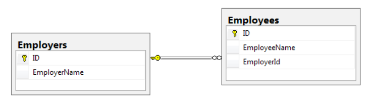

```csharp
[Table("Employees")]
public class Employee
{
    [Key]
    public int ID { get; set; }
    [Column("EmployeeName")]
    public string EmployeeName { get; set; }

    public virtual Employer Employer { get; set; }

    // nếu tự đặt tên khóa ngoại và đặt nó là NOT NULL thì thêm property này
    // quy ước tên của property này là <Navigation Property><PK class tham chiếu đến>
    // nếu không đặt tên theo quy ước thì được xem như 1 cột bình thường
    // sử dụng Data Annotation ForeignKey trong trường hợp này
    public int EmployerID { get; set; }
}

[Table("Employers")]
public class Employer
{
    public Employer()
    {
        Employees = new HashSet<Employee>();
    }

    [Key]
    public int ID { get; set; }
    [Column("EmployerName")]
    public string EmployerName { get; set; }

    public virtual ICollection<Employee> Employees { get; set; }
}
```

> Sử dụng Fluent API:
```csharp
public class SampleDbEntities : DbContext
{
    public virtual DbSet<Employee> Employees { get; set; }
    public virtual DbSet<Employer> Employers { get; set; }
    protected override void OnModelCreating(DbModelBuilder modelBuilder)
    {
        modelBuilder.Entity<Employee>()
                    .HasRequired<Employer>(employee => employee.Employer) // thuộc tính "Employer" là bắt buộc
                    .WithMany(employer => employer.Employees) // có mối quan hệ one-to-many với bảng "Employers"
                    .HasForeignKey(employer => employer.ID); // cột "ID" trong bảng "Employers" sẽ được sử dụng làm khóa ngoại
        base.OnModelCreating(modelBuilder);
    }
}
```

> Cascade Delete
> Trong quan hệ 1-n, nếu xóa bản ghi của phía một, thì tùy vào các bản ghi phía nhiều (N) có 2 trường hợp:
> Nếu khóa ngoại của N là NULL, N có thể tồn tại độc lập. Bạn có thể xóa bản ghi của phía một. Khi này các bản ghi phía nhiều còn sót lại được gọi là các orphaned record vì khóa ngoài của nó giờ không liên kết với bất kỳ bản ghi nào khác
> Nếu khóa ngoài của N là NOT NULL, N không thể tồn tại độc lập.Kết quả là bạn không thể xóa bản ghi phía 1 nếu vẫn còn bản ghi của phía nhiều liên kết với nó. Nghĩa là bạn phải xóa hết các bản ghi của phía nhiều trước khi xóa bản ghi liên kết tương ứng ở phía 1.
> Chế độ Cascade Delete: khi xóa bản ghi phía 1 sẽ đồng thời xóa tất cả bản ghi của phía nhiều liên kết với nó. Cascade Delete được sử dụng mặc định trong quan hệ 1-n
> ```csharp
> modelBuilder.Entity<Person>()
>    .HasMany<Email>(p => p.Emails)
>    .WithRequired(e => e.Owner)
>    .HasForeignKey(e => e.OwnerId)
>    .WillCascadeOnDelete();
> ```

### 7.3.2. One-to-one Relationship

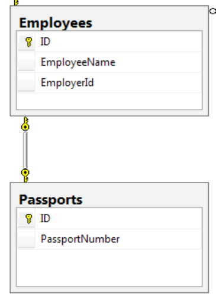

```csharp
[Table("Employees")]
public class Employee
{
    [Key]
    public int ID { get; set; }
    [Column("EmployeeName")]
    public string EmployeeName { get; set; }
    public virtual Passport Passport { get; set; }
}

[Table("Passports")]
public class Passport
{
    [Key, ForeignKey("Employee")]
    public int ID { get; set; }
    [Column("PassportNumber")]
    public string PassportNumber { get; set; }
    public virtual Employee Employee { get; set; }
}
```

> Sử dụng Fluent API:
```csharp
public class SampleDbEntities : DbContext
{
    public virtual DbSet<Employee> Employees { get; set; }
    public virtual DbSet<Passport> Passports { get; set; }
    protected override void OnModelCreating(DbModelBuilder modelBuilder)
    {

        modelBuilder.Entity<Passport>().HasKey(e => e.ID);

        modelBuilder.Entity<Passport>()
                    .Property(e => e.ID)
                    .HasDatabaseGeneratedOption(DatabaseGeneratedOption.None); // khóa tương ứng với ID không do DB tự động tạo

        modelBuilder.Entity<Passport>()
                    .HasRequired(e => e.Employee)
                    .WithRequiredDependent(s => s.Passport);

        base.OnModelCreating(modelBuilder);
    }
}
```

### 7.3.3. Many-to-many Relationship

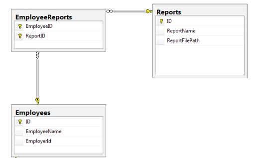

#### Không có Payload

```csharp
[Table("Employees")]
public class Employee
{
    public Employee()
    {
        Reports = new HashSet<Report>();
    }

    [Key]
    public int ID { get; set; }
    [Column("EmployeeName")]
    public string EmployeeName { get; set; }
    public virtual ICollection<Report> Reports { get; set; }
}

[Table("Reports")]
public class Report
{
    public Report()
    {
        Employees = new HashSet<Employee>();
    }

    [Key]
    public int ID { get; set; }
    [Column("ReportName")]
    public string ReportName { get; set; }
    public virtual Employee ReportFilePath { get; set; }
    public virtual ICollection<Employee> Employees { get; set; }
}
```

> Sử dụng Fluent API:
```csharp
public class SampleDbEntities : DbContext
{
    public virtual DbSet<Employee> Employees { get; set; }
    public virtual DbSet<Report> Reports { get; set; }
    protected override void OnModelCreating(DbModelBuilder modelBuilder)
    {
        modelBuilder.Entity<Employee>()
                    .HasMany<Report>(employee => employee.Reports)
                    .WithMany(report => report.Employees)
                    .Map(c =>
                        {
                            c.MapLeftKey("EmployeeID");
                            c.MapRightKey("ReportID");
                            c.ToTable("EmployeeReports");
                        });

        base.OnModelCreating(modelBuilder);
    }
}
```

#### Có Payload

```csharp
[Table("Employees")]
public class Employee
{
    public Employee()
    {
        Reports = new HashSet<Report>();
    }

    [Key]
    public int ID { get; set; }
    [Column("EmployeeName")]
    public string EmployeeName { get; set; }
    public virtual ICollection<EmployeeReport> Reports { get; set; }
}

[Table("Reports")]
public class Report
{
    public Report()
    {
        Employees = new HashSet<Employee>();
    }

    [Key]
    public int ID { get; set; }
    [Column("ReportName")]
    public string ReportName { get; set; }
    public virtual Employee ReportFilePath { get; set; }
    public virtual ICollection<EmployeeReport> Employees { get; set; }
}


// Thêm Class này
[Table("EmployeeReports")]
class EmployeeReport
{
    public int Id { get; set; }
    public DateTime Date { get; set; }
    public Employee Employee { get; set; }
    public Report Report { get; set; }
}
```

# 7.4. Inheritance với Entity Framework Code First 

## 7.4.1. TPT inheritance


```csharp
public class Person
{
    public int ID { get; set; }
    public string FirstName { get; set; }
    public string LastName { get; set; }
    public string PhoneNumber { get; set; }
    public string EMailId { get; set; }
}

[Table("Employee")]
public class Employee : Person
{
    public decimal Salary { get; set; }
}

[Table("Vendors")]
public class Vendor : Person
{
    public decimal HourlyRate { get; set; }
}
```

```csharp
public class SampleDbEntities : DbContext
{
    public virtual DbSet<Person> People { get; set; }

    // chỉ thêm Method này khi sử dụng Fluent API
    protected override void OnModelCreating(DbModelBuilder modelBuilder)
    {
        modelBuilder.Entity<Employee>()
                    .ToTable("Employee");
        modelBuilder.Entity<Vendor>()
                    .ToTable("Vendors");
    }
}
```

> Lớp DbContext chỉ chứa DbSet cho Person. Vì các domain models khác được kế thừa từ Person, chúng ta có thể thêm chúng vào DbSet này, và Entity Framework sẽ sử dụng đa hình để sử dụng domain model thực sự.


## 7.4.2. TPH inheritance


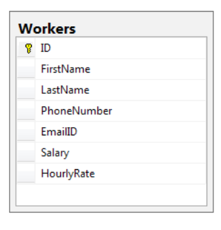

```csharp
public class Person
{
    public int ID { get; set; }
    public string FirstName { get; set; }
    public string LastName { get; set; }
    public string PhoneNumber { get; set; }
    public string EMailId { get; set; }
}

public class Employee : Person
{
    public decimal Salary { get; set; }
}

public class Vendor : Person
{
    public decimal HourlyRate { get; set; }
}
```

```csharp
public class SampleDbEntities : DbContext
{
    public virtual DbSet<Person> People { get; set; }
}
```

> Entity Framework đã thêm một cột có tên là "Discriminator" được sử dụng để xác định kiểu thực sự của bản ghi, tức là "Employee" hoặc "Vendor".


## 7.4.3. TPC inheritance

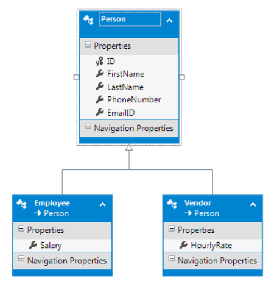

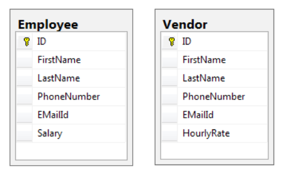

```csharp
public abstract class Person
{
    public int ID { get; set; }
    public string FirstName { get; set; }
    public string LastName { get; set; }
    public string PhoneNumber { get; set; }
    public string EMailId { get; set; }
}

public class Employee : Person
{
    public decimal Salary { get; set; }
}

public class Vendor : Person
{
    public decimal HourlyRate { get; set; }
}
```

```csharp
public class SampleDbEntities : DbContext
{
    public virtual DbSet<Person> People { get; set; }
    protected override void OnModelCreating(DbModelBuilder modelBuilder)
    {
        modelBuilder.Entity<Employee>()
                    .Map(m => {
                            m.MapInheritedProperties();
                            m.ToTable("Employee");
                        });
                        
        modelBuilder.Entity<Vendor>()
                    .Map(m => {
                            m.MapInheritedProperties();
                            m.ToTable("Vendors");
                        });
    }
}
```

> Entity Framework đã thêm một cột có tên là "Discriminator" được sử dụng để xác định kiểu thực sự của bản ghi, tức là "Employee" hoặc "Vendor".


## 7.4.4. Entity Splitting

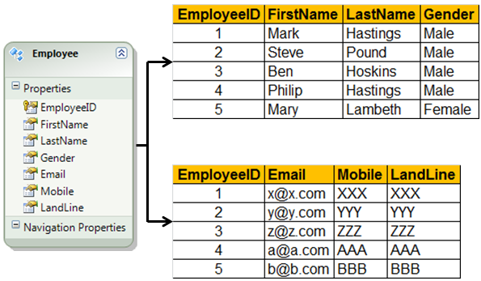

```csharp
public class Employee
{
    public int EmployeeID { get; set; }
    public string FirstName { get; set; }
    public string LastName { get; set; }
    public string Gender { get; set; }
    public string Email { get; set; }
    public string Mobile { get; set; }
    public string LandLine { get; set; }
}

public class EmployeeMap : EntityTypeConfiguration<Employee>
{
    public EmployeeMap()
    {
        Map(e =>
        {
            e.Properties(x => new { x.Email, x.Mobile, x.LandLine });
            e.ToTable("EmployeeContactDetails");
        });
        Map(e =>
        {
            e.Properties(x => new { x.FirstName, x.LastName, x.Gender });
            e.ToTable("Employees");
        });
    }
}

public class Context : DbContext 
{
    public Context() : base("ConnectionString")
    {
        var initializer = new DropCreateDatabaseAlways<Context>();
        Database.SetInitializer(initializer);
    }
    protected override void OnModelCreating(DbModelBuilder modelBuilder)
    {
        modelBuilder.Configurations.Add(new EmployeeMap());
    }
}
```

## 7.4.5. Table Splitting

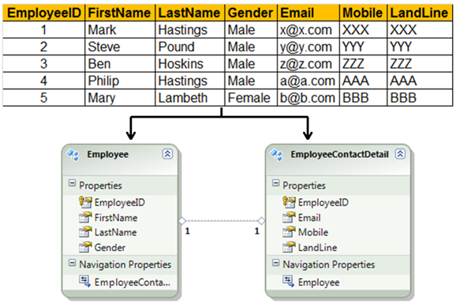

```csharp
public class Employee
{
    public int EmployeeID { get; set; }
    public string FirstName { get; set; }
    public string LastName { get; set; }
    public string Gender { get; set; }
    public virtual EmployeeContactDetail EmployeeContactDetail { get; set; }
}

public class EmployeeContactDetail
{
    public int EmployeeID { get; set; }
    public string Email { get; set; }
    public string Mobile { get; set; }
    public string LandLine { get; set; }
    public virtual Employee Employee { get; set; }
}

public class Context : DbContext 
{
    public Context() : base("ConnectionString")
    {
        var initializer = new DropCreateDatabaseAlways<Context>();
        Database.SetInitializer(initializer);
    }
    protected override void OnModelCreating(DbModelBuilder modelBuilder)
    {
        modelBuilder.Entity<Employee>()
                    .ToTable("Employees")
                    .HasRequired(e => e.EmployeeContactDetail)
                    .WithRequiredPrincipal(d => d.Employee);

        modelBuilder.Entity<EmployeeContactDetail>()
                    .ToTable("Employees");
        
    }
    public DbSet<Employee> Employees { get; set; }
    public DbSet<EmployeeContactDetail> EmployeeContactDetails { get; set; }
}
```

# 8. Entity Framework Code First – Managing Database Creation and Seeding Data

## 8.1. Quản lí Database connection

### Sử dụng configuration file

### Sử dụng kết nối có sẵn

```csharp
public class SampleDbEntities : DbContext
{
    public SampleDbEntities(DbConnection con) : base(con, contextOwnsConnection: false)
    {
        // if ontextOwnsConnection = true, then the context class 
        // will close the connection as soon as it goes out of scope.
    }
}
```

## 8.2. Quản lí Database initialization

Khi chúng ta chạy ứng dụng Entity Framework Code First lần đầu tiên, Entity Framework sẽ thực hiện các bước sau đây:

1. Kiểm tra lớp DbContext đang được sử dụng.
2. Tìm Connection String phải được sử dụng với lớp Context này.
3. Tìm các domain entities và trích xuất thông tin liên quan đến lược đồ CSDL.
4. Tạo Cơ sở dữ liệu
5. Chèn dữ liệu vào hệ thống

Khi mà thông tin về lược đồ CSDL được trích xuất, Entity Framework sẽ sử dụng các bộ khởi tạo cơ sở dữ liệu để đẩy thông tin lược đồ vào cơ sở dữ liệu. Có các chiến lược để khởi tạo cơ sở dữ liệu khác nhau, và chiến lược mặc định của Entity Framework là tạo cơ sở dữ liệu nếu nó chưa tồn tại, và sử dụng cơ sở dữ liệu hiện có nếu nó đã tồn tại. Tuy nhiên, có thể ghi đè hành vi mặc định này. Các chiến lược khởi tạo cơ sở dữ liệu gồm:

- CreateDatabaseIfcolorpanelxists: tạo cơ sở dữ liệu nếu nó chưa tồn tại, và nếu cơ sở dữ liệu đã tồn tại, thì nó sẽ sử dụng cơ sở dữ liệu hiện có. Nếu có sự không khớp trong thông tin được trích xuất từ các Domain Model và lược đồ cơ sở dữ liệu, một Exception sẽ được ném ra.

- DropCreateDatabaseAlways: xóa và tạo lại cơ sở dữ liệu mỗi khi ứng dụng được chạy. Điều này thường hữu ích trong giai đoạn đầu của chu kỳ phát triển khi chúng ta thường thiết kế các Domain Model. Điều này cũng hữu ích từ góc độ Unit Test.

- DropCreateDatabaseIfModelChanges: tạo cơ sở dữ liệu nếu chưa tồn tại và sử dụng cơ sở dữ liệu hiện có nếu đã tồn tại. Tuy nhiên, nếu có sự không khớp trong thông tin được trích xuất từ các Domain Model và lược đồ cơ sở dữ liệu, cơ sở dữ liệu sẽ bị xóa và tạo lại để phù hợp với Domain Model.

- MigrateDatabaseToLatestVersion: Entity Framework sẽ tự động cập nhật lược đồ cơ sở dữ liệu mỗi khi mô hình thực thể được cập nhật. Nó sẽ cập nhật lược đồ mà không làm mất dữ liệu hoặc thay đổi các đối tượng đã tồn tại trong cơ sở dữ liệu hiện có.

```csharp
public class SampleDbEntities : DbContext
{
    public SampleDbEntities() : base("name=AppConnection")
    {
        Database.SetInitializer<SampleDbEntities>(new DropCreateDatabaseIfModelChanges<SampleDbEntities>());
    }
}
```

Chủ động kích hoạt Initializer:
```csharp
var context = new MyDBContext();
context.Database.Initialize(false);
```

## 8.3. Seeding Database

```csharp
public class Employer
{
    public int ID { get; set; }
    public string EmployerName { get; set; }
}

public class MyCustomDropCreateDatabaseAlways : DropCreateDatabaseAlways<SampleDbEntities>
{
    protected override void Seed(SampleDbEntities context)
    {
        List<Employer> employers = new List<Employer>() {
            new Employer() { EmployerName = "Employer1" },
            new Employer() { EmployerName = "Employer2" },
            new Employer() { EmployerName = "Employer3" }
        }
        
        employers.ForEach(employer => context.Employers.Add(employer));
        //base.Seed(context);
        context.SaveChanges();
    }
}

public class SampleDbEntities : DbContext
{
    public virtual DbSet<Employer> Employers { get; set; }
    public SampleDbEntities()
    {
        Database.SetInitializer<SampleDbEntities>(new MyCustomDropCreateDatabaseAlways());
    }
}

// Application_Start
var context = new SampleDbEntities();
context.Database.Initialize(true);
```

# 9. Entity SQL (Không quan trọng)

> Có 2 cách để truy vấn bằng ESQL: Dùng ObjectQuery hoặc EntityCommand

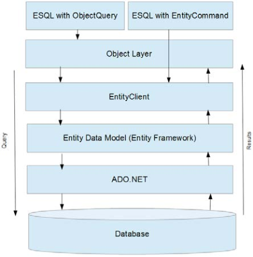

## 9.1. Entity Connection

```csharp
string connectionStringName = "SampleDatabaseEntities";
using (EntityConnection eConnection = new EntityConnection($"name={connectionStringName}")) 
{
    eConnection.Open();
    if (eConnection.State == System.Data.ConnectionState.Open)
    {
        // Connection is open
    }

}
```

## 9.2. Object Query

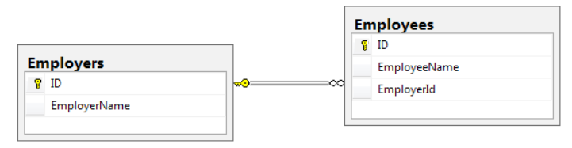

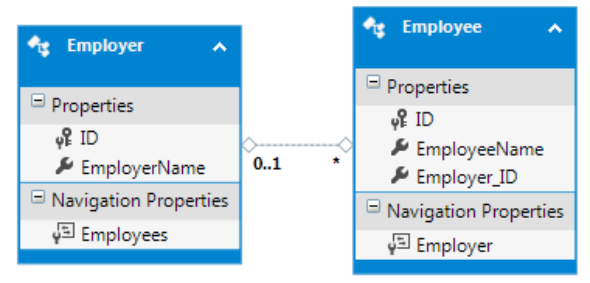

### 9.2.1. Truy vấn đơn giản

```csharp
using(SampleDatabaseEntities db = new SampleDatabaseEntities())
{
    string query = @"Select VALUE Employee from SampleDatabaseEntities.Employees as Employee";
    var adapter = (IObjectContextAdapter)db;
    var objContext = adapter.ObjectContext; 
    objContext.Connection.Open();
    ObjectQuery<Employee> objQuery = new ObjectQuery<Employee>(query, objContext);
    List<Employee> employees = objQuery.ToList();
}
```

### 9.2.2. Truyền tham số vào câu truy vấn

```csharp
// Lấy ra danh sách Employee với ID > 100 và < 500

ObjectParameter minValue = new ObjectParameter("minValue", 100);
ObjectParameter maxValue = new ObjectParameter("maxValue", 500);
using (SampleDatabaseEntities db = new SampleDatabaseEntities())
{
    string query = @"Select VALUE Employee 
                    from SampleDatabaseEntities.Employees as Employee 
                    WHERE Employee.ID > @minValue AND Employee.ID < @maxValue";
    var adapter = (IObjectContextAdapter)db;
    var objContext = adapter.ObjectContext;
    objContext.Connection.Open();
    ObjectQuery<Employee> objQuery = new ObjectQuery<Employee>(query, objContext);
    objQuery.Parameters.Add(minValue);
    objQuery.Parameters.Add(maxValue);
    List<Employee> employees = objQuery.ToList();
}
```

### 9.2.3. Sử dụng Navigation Properties

```csharp
// ViewModel chứa kết quả
class Result
{
    public string EmployeeName { get; set; }
    public string EmployerName { get; set; }
}

using (SampleDatabaseEntities db = new SampleDatabaseEntities())
{
    string query = @"Select Employee.EmployeeName as EmployeeName, Employee.Employer as Employer 
                    from SampleDatabaseEntities.Employees as Employee";
    var adapter = (IObjectContextAdapter)db;
    var objContext = adapter.ObjectContext;
    objContext.Connection.Open();
    ObjectQuery<DbDataRecord> objQuery = new ObjectQuery<DbDataRecord>(query, objContext); // sử dụng DbDataRecord
    List<Result> result = new List<Result>();
    foreach (DbDataRecord item in objQuery)
    {
        string employeeName = item[0] as string;
        string employerName = string.Empty;
        Employer employer = item[1] as Employer;
        if (employer != null)
        {
            employerName = employer.EmployerName;
        }

        result.Add(new Result()
        {
            EmployeeName = employeeName,
            EmployerName = employerName
        });
    }
}
```

### 9.2.4. Sử dụng Aggregate Functions

```csharp
// đếm số Employee làm việc cho Employer có ID = 4
using (SampleDatabaseEntities db = new SampleDatabaseEntities())
{
    string query = @"Select Count(Employee.ID) 
                    from SampleDatabaseEntities.Employees as Employee 
                    WHERE Employee.Employer_ID = 4";
    var adapter = (IObjectContextAdapter)db;
    var objContext = adapter.ObjectContext;
    objContext.Connection.Open();
    ObjectQuery<DbDataRecord> objQuery = new ObjectQuery<DbDataRecord>(query, objContext);
    foreach (DbDataRecord item in objQuery)
    {
        int? count = item[0] as int?;
    }
}
```

### 9.2.5. Sắp xếp

```csharp
using (SampleDatabaseEntities db = new SampleDatabaseEntities())
{
    string query = @"Select VALUE Employee 
                    from SampleDatabaseEntities.Employees as Employee 
                    ORDER BY Employee.ID DESC";
    var adapter = (IObjectContextAdapter)db;
    var objContext = adapter.ObjectContext;
    objContext.Connection.Open();
    ObjectQuery<Employee> objQuery = new ObjectQuery<Employee>(query, objContext);
    List<Employee> employees = objQuery.ToList();
}
```

### 9.2.6. Gom nhóm

```csharp
using (SampleDatabaseEntities db = new SampleDatabaseEntities())
{
    string query = @"Select Employer.ID, (  Select
                                            VALUE Employee
                                            from SampleDatabaseEntities.Employees as Employee
                                            where Employee.Employer_ID = Employer.ID) as Employee
    from SampleDatabaseEntities.Employers as Employer
    GROUP BY Employer.ID";
    var adapter = (IObjectContextAdapter)db;
    var objContext = adapter.ObjectContext;
    objContext.Connection.Open();
    ObjectQuery<DbDataRecord> objQuery = new ObjectQuery<DbDataRecord>(query, objContext);
    foreach (DbDataRecord item in objQuery)
    {
        int? employerId = item[0] as int?;
        IEnumerable<Employee> employeesList = item[1] as IEnumerable<Employee>;
    }
}
```

### 9.2.7. Skip và Limit

```csharp

// Skip
using (SampleDatabaseEntities db = new SampleDatabaseEntities())
{
    string query = @"Select VALUE Employee 
                    from SampleDatabaseEntities.Employees as Employee 
                    ORDER BY Employee.ID 
                    SKIP 10";
    var adapter = (IObjectContextAdapter)db;
    var objContext = adapter.ObjectContext;
    objContext.Connection.Open();
    ObjectQuery<Employee> objQuery = new ObjectQuery<Employee>(query, objContext);
    List<Employee> employees = objQuery.ToList();
}

// Limit
using (SampleDatabaseEntities db = new SampleDatabaseEntities())
{
    string query = @"Select VALUE Employee 
                    from SampleDatabaseEntities.Employees as Employee 
                    ORDER BY Employee.ID
                    LIMIT 10";
    var adapter = (IObjectContextAdapter)db;
    var objContext = adapter.ObjectContext;
    objContext.Connection.Open();
    ObjectQuery<Employee> objQuery = new ObjectQuery<Employee>(query, objContext);
    List<Employee> employees = objQuery.ToList();
}
```

## 9.3. Entity Command

### 9.3.1. Truy vấn đơn giản

```csharp
using (EntityConnection con = new EntityConnection("name=SampleDatabaseEntities"))
{
    string query = @"Select VALUE Employee 
                    from SampleDatabaseEntities.Employees as Employee";
    EntityCommand cmd = con.CreateCommand();
    cmd.CommandText = query;
    cmd.CommandType = System.Data.CommandType.Text;
    List<Employee> employees = new List<Employee>();
    con.Open();
    using (EntityDataReader reader = cmd.ExecuteReader(CommandBehavior.SequentialAccess))
    {
        while (reader.Read())
        {
            Employee employee = new Employee();
            employee.ID = (int)reader["ID"];
            employee.EmployeeName = reader["EmployeeName"] as string;
            employee.Employer_ID = reader["Employer_ID"] as int?;
            employees.Add(employee);
        }
    }
}
```

### 9.3.2. Truyền tham số vào câu truy vấn

```csharp
using (EntityConnection con = new EntityConnection("name=SampleDatabaseEntities"))
{
    string query = @"Select VALUE Employee 
                    from SampleDatabaseEntities.Employees as Employee 
                    WHERE Employee.ID > @minValue AND Employee.ID < @maxValue";
    EntityCommand cmd = con.CreateCommand();
    cmd.CommandText = query;
    cmd.CommandType = System.Data.CommandType.Text;
    EntityParameter minValue = new EntityParameter {ParameterName = "minValue", Value = 100 };
    EntityParameter maxValue = new EntityParameter {ParameterName = "maxValue", Value = 500 };
    cmd.Parameters.Add(minValue);
    cmd.Parameters.Add(maxValue);
    List<Employee> employees = new List<Employee>();
    con.Open();
    using (EntityDataReader reader = cmd.ExecuteReader(CommandBehavior.SequentialAccess))
    {
        while (reader.Read())
        {
            Employee employee = new Employee();
            employee.ID = (int)reader["ID"];
            employee.EmployeeName = reader["EmployeeName"] as string;
            employee.Employer_ID = reader["Employer_ID"] as int?;
            employees.Add(employee);
        }
    }
}
```

# 10. Mirgration

Khi sử dụng migration bạn có thể lựa chọn một trong 2 phương án:
- Migration tự động (automatic migration)
- Migration thủ công dùng lệnh (code-based migration)

## 10.1. Automatic Migration

> Không phải tự động chạy migration mỗi khi domain class thay đổi

- Mở cửa sổ Package Manager Console sau đó chọn Default project là project chứa lớp context.
- Gõ lệnh:
```c
enable-migrations –EnableAutomaticMigration:$true
```

```csharp
public Context() : base("StringConnection")
{
    var initializer = new MigrateDatabaseToLatestVersion<Context, Migrations.Configuration>();
    Database.SetInitializer(initializer);
}
```

Trong tình huống ở trên, bạn thêm property mới vào lớp Person. Migration dễ dàng cập nhật CSDL mà không làm mất dữ liệu cũ. Migration cũng hoạt động tương tự nếu bạn thêm domain class mới.
Tuy nhiên, nếu bạn xóa bỏ một vài property, thay đổi tên property, hoặc xóa domain class rồi chạy lại chương trình, migration sẽ báo lỗi
Để thay đổi điều này, sửa constructor của Configuration:
```csharp
public Configuration()
{
    AutomaticMigrationsEnabled = true;
    AutomaticMigrationDataLossAllowed = true;
}
```

## 10.2. Code-Based Migration

- Mở cửa sổ Package Manager Console sau đó chọn Default project là project chứa lớp context.
- Gõ lệnh:
```c
enable-migrations
```

```csharp
public Context() : base("StringConnection")
{
    var initializer = new MigrateDatabaseToLatestVersion<Context, Migrations.Configuration>();
    Database.SetInitializer(initializer);
}
```

#### Add Migration

```c
add-migration
```
> Tạo ra một class mới để giúp thực hiện cập nhật CSDL. Gọi lệnh này sau khi thực hiện các thay đổi trên các domain class (như thêm/sửa/xóa property và class). Đây là lệnh trung gian cần thực hiện trước khi yêu cầu cập nhật CSDL.

#### Update Database

```c
update-database
```


# 11. Quản lí Concurrency

## 11.1. ACID

> ACID là viết tắt của bốn từ Atomicity, Consistency, Isolation và Durability. Chúng được coi là bốn thuộc tính quan trọng của một hệ quản trị cơ sở dữ liệu khi xử lý bất kỳ transaction nào. Nếu thiếu một trong những thuộc tính này thì tính toàn vẹn của cơ sở dữ liệu khó có thể được đảm bảo.

### 11.1.1. Atomicity

Một transaction có nhiều thao tác thì hoặc là toàn bộ các thao tác hoặc là không một thao tác nào được hoàn thành.

### 11.1.2. Consistency

Một giao dịch hoặc là sẽ tạo ra một trạng thái mới và hợp lệ cho dữ liệu, hoặc trong trường hợp có lỗi sẽ chuyển toàn bộ dữ liệu về trạng thái trước khi thực thi giao dịch (tất cả dữ liệu ở trạng thái nhất quán).

### 11.1.3. Isolation

Một transaction đang thực thi đồng thời với transaction khác thì không bị ảnh hưởng bởi transaction khác    

### 11.1.4. Durability

Khi transaction thực hiện thành công thì mọi thay đổi của nó phải được lưu bền vững trong CSDL

## 11.2. Optimistic Concurrency

Trong optimistic concurrency, mỗi khi dữ liệu được yêu cầu từ cơ sở dữ liệu, dữ liệu được đọc và lưu trữ trong bộ nhớ ứng dụng. Không có lock tường minh nào được đặt trên cơ sở dữ liệu. Bởi vì trong phương pháp này không có khóa tường minh nào được đặt, nên phương pháp này có tính mở rộng và linh hoạt hơn so với pessimistic concurrency. Điều quan trọng cần lưu ý khi sử dụng optimistic concurrency là nếu có xung đột nào đó, thì xung đột đó sẽ phải được ứng dụng xử lý. Điều quan trọng nhất khi sử dụng optimistic concurrency là phải có một chiến lược xử lý xung đột trong ứng dụng của chúng ta và thông báo cho người dùng ứng dụng nếu các thay đổi của họ không được lưu trữ do xung đột. Optimistic concurrency về cơ bản có nghĩa là cho phép xung đột xảy ra và sau đó xử lý nó theo cách thích hợp.

Dưới đây là giải thích về các chiến lược giải quyết xung đột khác nhau được đề cập:

- Ignore the conflict/forcing updates: Ứng dụng cho phép tất cả người dùng thay đổi cùng một tập dữ liệu và cho phép tất cả các thay đổi được lưu vào cơ sở dữ liệu.
Điều này có nghĩa rằng cơ sở dữ liệu sẽ hiển thị các giá trị từ lần cập nhật cuối cùng.
- Partial Updates: Cho phép tất cả các thay đổi, nhưng chúng ta sẽ không cập nhật toàn bộ bản ghi, chỉ các cột mà người dùng cụ thể đã cập nhật. Điều này có nghĩa rằng nếu hai người dùng cố gắng cập nhật cùng một bản ghi nhưng ở các cột khác nhau, thì cả hai thay đổi đều sẽ thành công và các thay đổi từ cả hai người dùng sẽ được hiển thị.
- Warn/Ask the User: Khi một người dùng cố gắng cập nhật một bản ghi đã được cập nhật sau khi anh ta đã đọc nó, ứng dụng sẽ cảnh báo người dùng rằng dữ liệu đã bị thay đổi bởi người khác và hỏi xác nhận liệu họ vẫn muốn ghi đè dữ liệu hay trước tiên kiểm tra dữ liệu đã được cập nhật.
- Reject the Changes: Khi một người dùng cố gắng cập nhật một bản ghi đã được cập nhật sau khi anh ta đã đọc nó, ứng dụng sẽ thông báo cho người dùng biết rằng anh ta không được phép cập nhật dữ liệu vào thời điểm này vì đã có người khác cập nhật dữ liệu.

#### Entity Framework's default concurrency

```cs
// Lets fetch the employee details for a given ID value
public Employee GetEmployee(int id)
{
    Employee employee = null;
    using (SampleDatabaseEntities db = new SampleDatabaseEntities())
    {
        employee = db.Employees.Find(id);
    }
    return employee;
}
// Update the Employee data in the database
public void UpdateEmployee(Employee employee)
{
    using (SampleDatabaseEntities db = new SampleDatabaseEntities())
    {
        ((IObjectContextAdapter)db).ObjectContext.CreateObjectSet<Employee>().Attach(employee);
        ((IObjectContextAdapter)db).ObjectContext.ObjectStateManager.ChangeObjectState(employee, EntityState.Modified);
        db.SaveChanges();
    }
}
```

```cs
// 1. User1 retrieves the Employee data
Employee employee1 = GetEmployee(1);
// 2. User2 retrieves the Employee data
Employee employee2 = GetEmployee(1);
// 3. User1 tries to update the salary only
employee1.Salary = 100;
UpdateEmployee(employee1);
// 4. User2 tries to update the Name
employee2.EmployeeName = "New EmployeeName";
UpdateEmployee(employee2)
```

Database trước khi chạy đoạn code trên:
|Id|EmployeeName|salary|
|--|------------|------|
|1|Employee1|500|
|2|Employee2|200|

Database sau khi chạy đoạn code trên có đặt breakpoint ở dòng kế cuối:
|Id|EmployeeName|salary|
|--|------------|------|
|1|Employee1|100|
|2|Employee2|200|

Database sau khi chạy đoạn code trên xong:
|Id|EmployeeName|salary|
|--|------------|------|
|1|New EmployeeName|500|
|2|Employee2|200|


The last request will always win, and it will overwrite all the changes made by the previous requests


#### Designing applications to handle field level concurrency


Use when multiple users are trying to update separate fields


```cs
// Trả về model mới có giá trị của các property giống mới model cũ, trừ property cần cập nhật
public Employee GetUpdatedEmployee(int id, string employeeName, decimal? salaryValue)
{
    Employee employee = new Employee();
    employee.Id = id;
    employee.EmployeeName = employeeName;
    employee.Salary = salaryValue;
    return employee;
}
```

```cs
// Update the Employee data in the database field level checks
public void UpdateEmployeeEnhanced(Employee originalEmployeeData, Employee newEmployeeData)
{
    using (SampleDatabaseEntities db = new SampleDatabaseEntities())
    {
        // Lets get the latest snapshot of data from the database
        Employee employee = db.Employees.Find(originalEmployeeData.Id);
        // Now one by check for the properties updated by the user
        if (originalEmployeeData.EmployeeName != newEmployeeData.EmployeeName)
        {
            // Update the new value in the current database
            employee.EmployeeName = newEmployeeData.EmployeeName;
        }
        if (originalEmployeeData.Salary != newEmployeeData.Salary)
        {
            // Update the value in the current database snapshot
            employee.Salary = newEmployeeData.Salary;
        }
        db.SaveChanges();
    }
}
```

```cs
// 1. User1 retrieves the Employee data
Employee employee1 = GetEmployee(1);
// 2. User2 retrieves the Employee data
Employee employee2 = GetEmployee(1);
// 3. User1 tries to update the salary only by creating a new Employee Model
Employee newEmployeeData1 = GetUpdatedEmployee(employee2.Id, employee1.EmployeeName, 100);
UpdateEmployeeEnhanced(employee1, newEmployeeData1);
// 4. User2 tries to update the Name
Employee newEmployeeData2 = GetUpdatedEmployee(employee2.Id, "New EmployeeName", employee2.Salary); 
UpdateEmployeeEnhanced(employee1, newEmployeeData2);
```

#### Implementing field level concurrency


Use when multiple users are trying to update the same fields


- Set the Concurrency Mode property of the entity field to Fixed
- Catch the DbUpdateConcurrencyException exception thrown by Entity Framework

```cs
try
{
    // 1. User1 retrieves the Employee data
    Employee employee1 = GetEmployee(1);
    // 2. User2 retrieves the Employee data
    Employee employee2 = GetEmployee(1);
    // 3. User1 tries to update the salary only
    employee1.Salary = 100;
    UpdateEmployee(employee1);
    // 4. User2 tries to update the Name
    employee2.Salary = 200;
    UpdateEmployee(employee2);
}
catch (DbUpdateConcurrencyException ex)
{
    // Notify the user with the possible concurrency issue
    // and let him decide how to proceed further
}
```

#### Implementing RowVersion for concurrency

- Adding a rowversion (or TIMESTAMP) type column in the table
- Set the Concurrency Mode value for the RowVersion column to Fixed


Any time a user tries to update a record, which has been updated by someone else, the DbUpdateConcurrencyException will be thown


## 11.3. Pessimistic Concurrency

Khác với Optimistic Concurrency, mục tiêu của Pessimistic Concurrency là không bao giờ để xảy ra xung đột. Điều này được đạt được bằng cách đặt lock tường minh trên các bản ghi trước khi sử dụng chúng. Thường có hai loại lock:

- Read-only Lock
- Update Lock

Khi một Read-only Lock được đặt trên một bản ghi, ứng dụng chỉ có thể đọc bản ghi đó. Nếu ứng dụng muốn cập nhật các bản ghi, nó sẽ phải có được một Update Lock trên bản ghi đó. Nếu một Read-only Lock đã được đặt trên một bản ghi, bản ghi này vẫn có thể được sử dụng bởi các yêu cầu muốn Read-only Lock. Tuy nhiên, nếu yêu cầu cần một Update Lock, yêu cầu đó sẽ phải chờ cho đến khi tất cả các Read-only Lock được giải phóng. Tương tự, nếu một Update Lock đã được đặt trên bản ghi, không có yêu cầu nào khác có thể đặt một Lock trên bản ghi này, và yêu cầu đó sẽ phải chờ cho đến khi Update Lock hiện tại được giải phóng.


Entity Framework không hỗ trợ Pessimistic Concurrency


# 12. Quản lí giao dịch

> Nếu chỉ có một lớp DbContext, thì nên sử dụng quản lý giao dịch mặc định của Entity Framework.

> Nếu sử dụng nhiều đối tượng DbContext khác nhau, thì đặt các giao dịch trong scope của đối tượng TransactionScope là cách tốt nhất để quản lý các giao dịch.

```csharp
decimal amountToTransfer = 1000;
int accountId = 1;
using (TransactionScope ts = new TransactionScope(TransactionScopeOption.Required))
{
    SampleDatabaseEntities db1 = new SampleDatabaseEntities();
    SampleDatabaseEntities db2 = new SampleDatabaseEntities();
    SalaryAccount salaryAccount = db1.SalaryAccounts.Find(accountId);
    SavingAccount savingAccount = db2.SavingAccounts.Find(accountId);
   
    salaryAccount.Balance -= amountToTransfer;
    savingAccount.Balance += amountToTransfer;
    db1.SaveChanges();
    db2.SaveChanges();
    ts.Complete();
}
```

- Nếu muốn thực hiện các truy vấn thuần SQL, thì nên sử dụng phương thức Database.BeginTransaction() (phương thức này chỉ có trong Entity Framework 6)

```csharp
decimal amountToTransfer = 1000;
int accountId = 1;
using (SampleDatabaseEntities db = new SampleDatabaseEntities())
{
    using (DbContextTransaction tx = db.Database.BeginTransaction())
    {
        try
        {
            db.Database.ExecuteSqlCommand("Update SalaryAccount set Balance = Balance - @amountToDebit where id = @accountId",
                new SqlParameter("@amountToDebit", amountToTransfer),
                new SqlParameter("@accountId", accountId)
            );
            SavingAccount savingAccount = db.SavingAccounts.Find(accountId);
            savingAccount.Balance += amountToTransfer;
            db.SaveChanges(); // only affect the second operation but not commit the transaction
            tx.Commit(); 
        }
        catch {
            tx.Rollback();
        }
    }
}
```

- Nếu muốn sử dụng Entity Framework với bất kỳ ứng dụng cũ nào đòi hỏi SqlTransaction, thì chúng ta nên sử dụng phương thức Database.UseTransaction() có sẵn trong Entity Framework 6.

```csharp
// this function is being provided to us in a library that we cannot change
public bool DebitSalaryAccount(SqlConnection connection, SqlTransaction tx, int accountId, decimal amountToDebit)
{
    SqlCommand cmd = connection.CreateCommand();
    cmd.Transaction = tx;
    int result = 0;
    cmd.CommandType = CommandType.Text;
    cmd.CommandText = "Update SalaryAccount set Balance = Balance - @amountToDebit where id = @accountId";
    cmd.Parameters.Add(new SqlParameter("@amountToDebit", amountToDebit));
    cmd.Parameters.Add(new SqlParameter("@accountId", accountId));
    try
    {
        result = cmd.ExecuteNonQuery();
    }
    catch
    {
        throw;
    }
    return (result == 1);
}
```

```csharp
decimal amountToTransfer = 1000;
int accountId = 1;
using (SqlConnection connection = new SqlConnection(connectionString))
{
    connection.Open();
    using (SqlTransaction tx = connection.BeginTransaction())
    {
        try
        {
            bool result = DebitSalaryAccount(connection, tx, accountId, amountToTransfer);
            if (result == false)
            {
                throw new Exception("Unable to debit from account");
            }
            using (SampleDatabaseEntities db = new SampleDatabaseEntities(connection, contextOwnsConnection: false))
            {
                db.Database.UseTransaction(tx);
                SavingAccount savingAccount = db.SavingAccounts.
                Find(accountId);
                savingAccount.Balance += amountToTransfer;
                db.SaveChanges();
            }
            tx.Commit();
        }
        catch
        {
            tx.Rollback();
        }
    }
}
```

